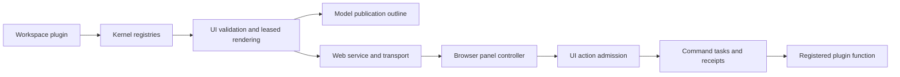

# Gene Harness design

This document describes the implemented runtime. The workspace UI panel is an
opt-in experiment; its authoring API may change. The
[README](../README.md) covers operation, [plugins](plugins.md) covers the
extension contract, and [web components](web-components.md) covers UI authoring.

## Principles

- The model acts only by writing Gene code. The only non-code action is a file
  edit, written as an apply-patch block.
- The value the code returns, an `Outcome`, steers the loop. `$println`
  output goes to the operator's console, never to the model.
- There is no authority code. Plugins and response code get the whole
  standard library. Run the process in an OS sandbox for isolation.
- A workspace is the project directory. It holds all Harness state and is
  owned by exactly one process.
- A workspace runs many sessions, loaded on demand and running in parallel.
  Heartbeats, schedules and crons start sessions of their own.
- History stays small and cache-friendly through elision, recall and
  compaction.

## Terms

| Term | Meaning |
| --- | --- |
| Workspace | The project directory; holds `.gene-harness/`; owned by one process |
| Session | A durable conversation: transcript plus history. Kind is interactive, heartbeat, scheduled or cron |
| Trigger | A durable definition that starts sessions without a user |
| Round | A request through its reply: one or more turns, started by a user or a trigger |
| Turn | One exchange: context, response, patch and evaluation, outcome. Numbered across the session |
| Request | What starts a turn: the prompt, the previous turn's outputs, or answers |
| Context | What the provider receives: instructions, history and the request |
| Response | The model's raw text for one turn: code plus raw blocks |
| Attachment, Patch | The raw blocks: named text, and one apply-patch edit |
| Outcome | The value the response code returns |
| Reply | Operator-facing text, progress or final |
| Output | A labeled item in the next request, such as `[57.tests]` |
| Transcript | The complete durable record shown to the operator |
| History | The transcript's model-facing view, after elision and compaction |
| Stub, Recall | The placeholder for elided content, and how to fetch it back |
| Console | `$print`/`$println` output; the operator sees it, the model never does |
| Plugin, Function | A durable extension, and the callables it gives response code |
| Command | An operator slash command that runs without the model |
| Input mode | Transient interpretation of operator input, such as the persistent REPL |
| UI view | A plugin's quoted component tree; a stateful view also declares browser-owned view state |
| UI action | An explicit registered-function call executed as a command task with a durable receipt |

## Workspace ownership

A workspace is the project directory. The process makes it its working
directory and stores all Harness state beneath `.gene-harness/`.

```text
.gene-harness/
  .gitignore              ignores the directory's own contents
  lock                    permanent flock target
  owner                   PID, entry and startup time
  config.gene             provider/model settings and budgets
  composition/            plugin generations and atomic CURRENT publication
  modules/                content-addressed plugin modules
  blobs/                  content-addressed recall, history and receipt bodies
  events/                 workspace and session streams
  sessions/index          session metadata projection
  triggers/               durable trigger definitions
  web_secret              persisted browser-session secret
  web_sessions            cookie records and expiries
  restart_notice          supervised restart handoff
  shutdown.gene           active rounds cancelled by process shutdown
```

Bootstrap acquires the workspace lock before opening state or activating
plugins. It writes owner atomically after acquiring the lock. A second process
fails with the owner details; a crash releases the kernel lock. The target
itself is not deleted. Shutdown flushes state and releases ownership last.

The CLI and web entry points are owners. There is one event store, Harness
runtime, composition and scheduler per workspace. Event publication is
serialized within that process. CURRENT publication remains atomic for crash
safety. There is no multi-writer merge, stream claim or publication lock.

## Sessions, rounds and turns

A session is a durable conversation with kind interactive, heartbeat, scheduled
or cron. Its index record contains id, title, kind, latest status, creation and
activity times, pinned/attention flags, trigger/occurrence identity, first
request and total turn count.

Listing filters and searches this projection without loading session streams.
Opening, submitting, answering and trigger admission load sessions on demand.
A loaded SessionState holds history, the current round, recall outputs,
console state, viewers and its idle timestamp. Sessions with no running round
or viewer unload after ten idle minutes, flushing first. Waiting questions can
remain durable while unloaded.
Per-session gates cover loading and round admission across parking I/O.
Concurrent retry answers resume once, and completion claims publish one
terminal receipt for each execution.

A round starts from a user or trigger request and contains one or more turns.
Its states are running, waiting, done, failed, cancelled and interrupted.
One session admits one round at a time; a busy submission fails. Different
sessions execute concurrently as root-lane fiber tasks.

Receipts retain request identity, submission sequence and digest. Retrying the
same submission returns its receipt; reusing an identity with different
content fails. The retained receipt window is bounded. A turn is numbered
across the session, rather than restarting the number at each round.

Crash recovery closes open turns synthetically. A running round becomes
interrupted and is never replayed. Waiting rounds retain their question
batches. A shutdown marker distinguishes admitted work deliberately cancelled
by stop from work interrupted by a crash.

## Code response pipeline

A turn builds instructions and history, invokes the provider, reads the raw
response, applies its patch, evaluates code, and interprets the final value.
The provider row is selected once from the turn's leased composition, so a
summary and main call use the same row. The loop owns every protocol record.
Its order is:

```text
request/prepare hook -> turn/request (full and settled next item)
turn/start -> prompt rows -> history/compact policy
  summary call, if needed: prepare -> model/request -> send -> model/result
prepare -> model/request -> send -> model/result
turn/response -> split, patch, evaluate, Outcome -> turn/end
```

`model/request` records the exact immutable value returned by the selected
provider row's `prepare`. The same value is passed to `send`; authentication
and transport details may be added afterward, but model-visible content may
not. Large strings in the prepared value are stored as content-addressed
blobs, so unchanged history parts share blobs across calls. The request record
is flushed before transport. Literal maps that resemble blob references are
escaped. Each logical call has one call id and one `model/result` per attempt.
The loop retries one reported timeout; each result records outcome, finality,
wall-clock time, elapsed timing and any provider usage. The successful main
result is linked from `turn/response`. Compaction summary calls use the same
path and are marked `history/summary`.

Provider errors, timeouts and cancellation produce results before the turn
ends. If a process stops with no final model result, recovery adds an
`interrupted` result with outcome unknown. Turn finalization is idempotent
across the loop, round controller and cold recovery. An error before model
dispatch writes a failed turn end with its stage and no invented model call.

Instructions come entirely from ordered `prompt` rows: the loop's response
grammar first, mounted plugin sections next, and dynamic workspace, session
and function information last. `gene_reference` contributes the Gene skill;
`plugin_admin` and `triggers` describe only functions they also contribute.
The web entry contributes a paragraph about its browser workflow.
`gene_reference` makes the `harness/web_components` chapter available in all
profiles, and `ui_experiment` contributes the configuration and preview
functions. CLI turns can author and preview UI plugins without a browser.
Pull-only chapters come from `docs` rows and are read with `doc`. Credentials
are private transport inputs.

A response contains zero or more Gene forms followed by raw blocks:

```text
response   := code? block*
code       := Gene forms; the value of the last form is the outcome
block      := attachment | patch
attachment := "<<<" name SP terminator NL line* terminator (NL | EOF)
patch      := "*** Begin Patch" NL ... "*** End Patch" (NL | EOF)   at most one
name       := [A-Za-z0-9_.-]+, unique within the response
terminator := a token without whitespace, never a whole line of the body
```

```text
<<<name END
body preserved byte for byte
END
```

A block starts only at the beginning of a line. The code is the text before
the first block-start line whose preceding text reads as complete Gene forms,
so `<<<` inside a Gene string does not start a block. Only blank lines may
separate blocks. An unterminated block, a duplicate attachment name, a second
patch, other text after the blocks, or unreadable code is a read error, which
the next request reports. Line 1 is the first line of the response, so a
reported line maps directly to the model's own text. A response without code
takes the patch result as its outcome.

Code accesses the body through attachment. A response may contain one V4A
apply-patch block. Edits are workspace-relative. Preflight resolves all anchors
and computes all new bodies before any write. Matching tries exact, trailing
whitespace-insensitive, then leading/trailing whitespace-insensitive context,
requiring a unique anchor.
EOF can terminate the final block. CRLF structure is accepted without changing
attachment bytes. Patch hunks accept blank context lines, an implicit first
hunk, and insertion after an anchor without removed lines.

Temporary siblings are staged, then renamed in order; deletes and moves
follow. A write failure attempts restoration from the in-memory originals.
Updates and rollback preserve file permissions; symlink updates replace the
target's content while retaining the link. Physical destination aliases are
checked before staging.
Restoration failure reports partial application and attention. Before staging,
turn/response durably records the affected file list. Recovery reports possible
partial application and removes leftover staging siblings. File edits in
different sessions use anchor failure as their conflict signal.

Patch failure skips code. Otherwise the forms execute in an Env whose bindings
are exactly:

| Group | Names |
| --- | --- |
| Loop | `Outcome`, `append_prompt` (rewritten to `append_prompt_at`), `attachment`, `recall` |
| Context | `session_id`, `workspace_root`, `doc` |
| Functions | every row of the leased `functions` registry, by name; the built-in plugin and trigger functions appear only while their plugins are active |

The whole standard library is reachable through `$`. Relative paths resolve
against the workspace root, which is the process's working directory.
Evaluation happens in `agents/eval_site`, a module that defines and imports
nothing else, so a response that defines `h` cannot collide with Harness
internals. Located reading preserves source lines and columns through
evaluation, so errors report `line L`.

Before evaluation, each `(append_prompt "label" value)` call site is rewritten
to record its line and its original form. The label must be a literal string
matching `[a-z0-9_]+`. `(attachment "name")` returns the attachment's exact
text, and `(recall "57.smoke")` returns the full body of an elided item from
this session. Unknown names and ids are errors.

| Last value | Effect |
| --- | --- |
| Outcome done + non-empty reply | Finish the round and display the reply |
| Outcome prompt | Continue with the prompt and appended outputs |
| Outcome questions | Persist the batch and wait |
| Plain value | Continue with a labeled result |
| Reader/runtime/patch error | Continue with a labeled diagnostic |

Done rejects prompt/questions and drops appended prompt items with a console
note. A continuing Outcome needs a prompt or appended output. Progress replies
do not finish a round.

Console printing is never a model request item. `$print` and `$println` in
response code, in the plugin functions it calls, and in tasks they spawn write
to the session's console sink through the task context. The CLI prints it
dimmed, prefixed with the session title when several rounds run. The browser
receives `console` messages, and the transcript records ignorable `console`
events capped at 256 KiB per turn with a truncation marker.

```gene
(type Outcome ^props {^done Bool? ^prompt Any? ^reply Str? ^questions Any?
                       ^attention Bool?})
```

`^^attention` flags the session for the operator. A round may take 24
turns, or 12 in a trigger session; reaching the limit fails the round and shows
the last request.

### Next request

A request is text with one item per output, in this order: patch result,
append_prompt items in call order, the Outcome's prompt, errors, answers.

```text
[57.patch] applied: src/report.gene +40 -0 (new)
[57.smoke] line 7: (append_prompt "smoke" (run_smoke "fixtures/orders.csv"))
ok 12 records
[57.result] line 9: Outcome ^prompt
report written; smoke output above
```

- Ids are `<turn>.<label>`. A repeated label gets a suffix, `smoke#2`.
- A header from code reads `line L: <form>`, with the form printed and cut to
  100 characters. An item appended by a plugin function reads `fn <name>`.
  An error header shows the failing line when it is known.
- A Str value is sent verbatim; any other value is printed as Gene data.

A round's first request is the user's prompt, preceded by the items of slash
commands attached since the previous user request, such as
`[c3.sh] /sh git status (exit 0)`. A trigger round's first request is the
trigger's request text prefixed with `[trigger <id> occurrence <occurrence>]`.

### Questions

A batch holds one to eight questions. Each has a unique `^id` and a non-empty
`^prompt`. `^choices` is optional; without it the answer is free text.
`^^multi` allows several choices, `^kind "confirm"` asks yes or no, and
`^recommended` must be one of the choices. Plugins add question kinds as rows
of the `interactions` registry, which validate both the question and its
answer.

The operator may answer any subset or dismiss the batch. Submission is final;
the round resumes with a new turn whose request carries
`[58.answers]` and the frozen answer map, such as
`#{^db "postgres" ^wipe unanswered}`.
Re-sending the same answers is accepted, and conflicting ones are rejected.
Batches are durable (`question/asked`, `question/answered`) and survive
restart. Cancelling the round cancels its questions.

## Execution lifetime and composition

The execution quantum makes ordinary CPU loops and native higher-order
callbacks cooperative. Fiber-aware process/HTTP/file operations park the
calling task. The HTTP host bounds a scheduler batch by elapsed time before
returning to socket polling. Budgets provide runaway protection.

Each turn owns its evaluation task in a Gene scope. Evaluation owns ordinary
tasks spawned by its code. Cancellation joins that work before ending the turn
and releasing its composition lease. A detached task holds no lease. Its
context is closed when the turn ends: append_prompt raises TurnClosed, while
printing remains visible as late console output. After session unload, late
output goes to the workspace event log.

A CompositionSnapshot contains immutable registries and live instances.
Every turn and command leases one snapshot; function bindings and PluginHost
lookups read that revision throughout its lifetime. Composition mutations
queued during a turn are published at its boundary. Publication persists the
new generation, reconciles Cordis into a candidate, publishes the snapshot,
then records composition/changed.

The profile is a set of built-in plugin defaults. The composition store has
at most one record per id: no record uses the profile default; a disabled
built-in record removes it; an enabled stored module replaces it; a disabled
stored record leaves the id inactive. Replacing a taken id requires
`^^replace`. `restore_plugin` drops a stored record only when the profile
has a default for that id. `doctor`, `enable`, `disable` and `restore` work
without activating plugins. A failed activation is quarantined and cannot
block inspection or repair of the workspace.
The composition checkpoint records the desired generation. A separate
`ACTIVE` marker advances only after that generation reconciles successfully;
valid pending plugins may remain pending until their dependencies appear.
Recovery commands do not advance it; `doctor` compares the two revisions and
reports a pending activation only when they differ. A workspace predating the
marker reports that activation history is unknown.

`register_plugin` validates and stores content-addressed source, then returns
`queued` inside a turn. That return is not an installation receipt. At the
boundary the loop sends `[N.plugins]` with the committed revision and active,
pending or quarantined state. A turn that queued a change cannot end with
`Outcome ^done`; its reply is shown as progress and the next turn receives the
publication result. Cancellation discards that turn's queued changes. A
committed plugin belongs to the workspace and loads again after restart, so
another session can use its functions without registering it again.

Replaced instances enter retirement. Cordis gives the host a retirement ticket;
the host retires the old generation only after its last snapshot lease ends.
Detached references can retain old callable code, but a disposed plugin
resource reports its own closed-resource error. Plugin state updates append
immediately; there are no turn transactions or staged state commits.

Plugins use the shared plugin_api contract. Other Harness modules are not
shared. Generated modules receive every standard-library namespace grant and
keep Cordis generations for module-graph reclamation. init is bounded and
failed entries are quarantined. Interface-v1 stored plugins require
re-registration. Plugins contribute functions, commands, prompt sections,
interaction kinds and triggers through an ordinary activation function.

## Plugin contract

A plugin is a Gene `mod` whose `init` receives an inert DescriptorContext and
returns a Plugin. `^activate` is the activation function itself and receives
the host; a plugin keeps the host for later callbacks.

```gene
(mod plugin
  (import ^from "src/plugin_api.gene" [Plugin PluginHost])
  (fn init [descriptor]
    (Plugin ^id "line_counter" ^provides [["functions" "count_lines"]]
      ^activate (fn [host]
        (host .PluginHost:contribute "functions"
          {^name "count_lines" ^doc "Count non-empty lines in a file."
           ^fn (fn [path : Str] : Int ...)})))))
```

| PluginHost message | Purpose |
| --- | --- |
| `registry_names`, `row_keys` | Inspect the leased registries |
| `create_registry`, `contribute`, `replace_contribution` | Add registries and rows |
| `resolve`, `provide`, `replace` | Seams |
| `subscribe`, `emit_event` | Observe the event bus; emit the plugin's own event types |
| `state`, `update_state` | Workspace state, or per-session state with `^session` |

The registries are `functions`, `commands`, `input_modes`, `prompt`, `docs`,
`providers`, `hooks`, `views`, `interactions`, `web_components`, `event_types`,
`subscriptions`, `seams` and `triggers`. A
`functions` row is `{^name ^fn ^doc}`. Names are unique across the workspace,
and the instructions list each with its `$runtime/signature` and doc. A
`prompt` row has `^name` and exactly one of `^text` or callable `^render`;
`docs` rows have `^name` and `^text` or `^path`. The core reserves command
names by owner: `core_commands` owns `/help`, `/run`, `/sh` and `/view`, while
the loop owns `/cancel`, `/stop` and `/restart`, and `repl` owns `/repl`.
`plugin_api` also exports
`append_prompt`, which forwards to the current turn and labels the item
`fn <name>`. Outside an open turn it raises TurnClosed.

`(register_plugin id source ^dependencies [...] ^!replace)` takes a quoted
`mod` form, or text such as an attachment that reads as one form. It
validates the source, preflights `init` under its bounded budget, stores
content-addressed module blobs, and queues the composition change for the turn
boundary. A failing `init` makes the call fail and stores nothing. An entry
whose activation fails, or a stored entry that no longer loads at boot, is
quarantined; `doctor`, `enable`, `disable` and `restore` repair it.

Model adapters are `providers` rows. The profile may pin one; otherwise the
environment, `config.gene`, then the lowest available `^auto` rank select it.
Each row reports cheap availability, configures public model settings,
prepares model-visible input as plain data, and sends one transport attempt.
The loop retries one HTTP timeout. A missing or unavailable selected provider
refuses round admission with `not_ready`; the same check runs before each
turn. The `triggers` host plugin requires the loop's `loop` seam. It starts
its scheduler only after the controller exists and stops when that seam goes.

Long-lived background work belongs in a plugin's activation effect scope,
not in a detached task from response code. Its console output goes to the
workspace log, and it cannot append to a turn.

## Hooks and observation

The loop leases ordered `hooks` rows by `^point` and `^name`. A
`request/prepare` listener receives the next request items and a `next`
callable. Calling `next` delegates to the following listener; returning
without it decides the value. The built-in `budget_advisory` contributes the
small item shown in the full request and omitted from its settled form.
`history/compact` takes the first valid policy; `history_basic` supplies the
75% trigger and 55% target. The baseline profile requires that hook, so
disabling it refuses a round at admission. A failed or timed-out listener is
skipped with a durable `trace` diagnostic. Hooks shape values before the loop records them;
they cannot alter or suppress `model/request`, `model/result` or `turn/end`.

Every appended workspace or session event is also published on the bus as a
`DurableRecord`, after the event writer releases its lock. A plugin imports
`DurableRecord` from `src/plugin_api.gene`, subscribes to that type and
selects exact records by its `name`, such as `turn/end` or `model/result`.
Subscriptions unwind with their owner. The web host uses one `HarnessEvent`
subscriber for durable transcript records and live round, command and
session changes. The CLI subscribes for console, progress and operator
notifications. Web snapshots that render plugin components run in tracked
tasks outside the bus callback, and shutdown drains them. Event observers
cannot rewrite the frozen persisted envelope.

## Transcript and history

The transcript is the complete durable record shown to the operator: requests,
response code/stubs, patch results, replies, questions, commands and console.
History is the model-facing view, with console excluded.

| Event | Kind | Records |
| --- | --- | --- |
| `round/state` | required | Receipt: id, initiator (`user` or `trigger:<id>`), state, turn range |
| `turn/start`, `turn/end` | required | Session turn number and round; one ending per started turn, including failure stage or synthetic interruption |
| `model/request` | required | Call id, wall-clock time, purpose, provider, effective public settings and the provider's prepared input, with shared blob refs |
| `model/result` | required | One transport attempt: call id, wall-clock and elapsed timing, attempt number, outcome, finality, raw output/error and reported usage |
| `turn/response` | required | Main response transcript view, with large blocks stubbed, patch file list and a link to the final model result |
| `turn/patch` | required | Patch result |
| `turn/request` | required | The next user or continuation item in full and settled forms; it is not the complete provider input |
| `question/asked`, `question/answered` | required | Batch and answers |
| `reply` | required | Text and final flag |
| `command` | required | Slash command record, output summary and attachment state |
| `session/state`, `composition/changed`, `plugin/state`, `lifecycle` | required | Session index records, composition generations, plugin state, lifecycle notes |
| `trigger/state`, `trigger/occurrence` | required | Trigger definitions and occurrence states |
| `history/summary` | required | A compaction summary |
| `console`, `trace` | ignorable | Bounded console text; diagnostics |

`events.catalog` is generated by the repository's
`tools/generate_harness_event_catalog.gene`; `--check` verifies it.

Output bodies larger than 16 KiB retain bounded head/tail text. Request items
share a 64 KiB aggregate limit. Bodies over 16 KiB settle to labeled stubs after
their first full context. The active round's initiating request is preserved,
including when its older intermediate messages are compacted. The latest
assistant response stays full through its following request, including failed
patches; older attachments and patches settle to stubs. Transcript events
always use the compact rendering.
Recall maps ids to verified content-addressed blobs and survives restart.
Loaded history is cached in the session. Older full request bodies are replaced
by their settled form in storage. Periodic idle blob collection retains the
latest references and the event store's fallback generations.

Settlement can change the previous full request and the assistant body from
the preceding turn; older message content remains stable. The
`budget_advisory` hook adds `[harness_budget]` to the full request only; its
settled form omits that item. Anthropic transport places cache checkpoints
on the last two assistant messages. Compaction is the exceptional operation
that rewrites old history.
The stable-prefix invariant compares serialized message-content bytes from
actual provider requests, excluding cache-control metadata. Moving those
checkpoints can change older wire JSON while preserving the content boundary:
all messages through the previous assistant response remain byte-identical,
and its following full request is the first content message that settles.

Tokens are estimated from bytes when no provider count is available. The
`history_basic` hook decides at 75% of the configured window; compaction first
keeps comments, append_prompt and Outcome lines with stubs. If more reduction
is required, one provider call
summarizes old whole rounds into a durable history/summary message. The newest
request is preserved; the policy target is below 55%.

Session collection removes its index entry and stream. Blob writers lease
the store through admission and receipt publication. Collection closes new
body-writer admission and runs at an idle opportunity, preserving every body
reachable from remaining workspace/session projections.

## Triggers

Heartbeat, one-shot and cron definitions are durable workspace records, also
mirrored beneath triggers/. Cron uses five fields and retained IANA timezone
rules; nonexistent civil minutes are skipped and a repeated minute selects
its earlier instant.

An occurrence id combines trigger id and scheduled epoch time. A new session id
is derived from that identity. The occurrence state machine is:

```text
due -> started -> finished
   `-> skipped
```

Due is durable before session creation. Started is published after admission
and before executing response work. Recovery detects an admission receipt even
if a crash preceded the started event. Existing due work is admitted in time
order when capacity and overlap permit. Admitted work is never re-executed.

Missed policy skips downtime or coalesces it into one due occurrence.
Overlap policy skips or retains one queued occurrence; further occurrences
are coalesced as skipped. The workspace trigger-session cap defaults to two.
The cap bounds unfinished trigger rounds, including waiting rounds. Waiting
questions therefore retain a slot until answered or expired.
continue_session reuses a previous occurrence's session when appropriate.

Trigger rounds have their own turn/running-time budgets. Waiting questions
default to a 24-hour deadline; expiry resumes with unanswered values and sets
attention. Failures, interruption and explicit Outcome attention also set
attention. User continuation of a trigger session uses user-round budgets.

Hourly retention applies each trigger's keep-count or age policy. Empty
heartbeats are collected first. Pinned, attention, running, waiting and viewed
sessions are preserved.
The scheduler indexes pending occurrences separately from terminal history.
It retains a configurable recent terminal window (default 256 per trigger)
and durable no-replay watermarks. Administrative CLI commands open this state
without executing a scheduler boot tick.

## Operator commands and shutdown

Slash commands are registered rows with name, usage, documentation, run and
raw_input. `core_commands` contributes the shared commands; the loop keeps
cancel, stop and restart available even if that plugin is disabled. The CLI
entry contributes `/new` and `/sessions`; the web entry does not. Unknown
commands report a closest match; a doubled initial slash escapes a literal
user prompt.

CommandContext carries session, raw arguments, command id and output sink.
CommandResult carries display value, status and attachment behavior. Command
tasks use the workspace directory, console routing and execution budgets.
Results marked for attachment wait for the next user request, never an
intermediate turn or a trigger request. File views attach a pointer.

The `repl` plugin contributes `/repl` and an `input_modes` row. A command
returning `CommandResult ^mode` enters the named mode. The host owns transient
mode state, an instance id, one running command and a closing transition.
Mode and round admission share the session gate. A stale instance refuses
input, and repeated client input ids return retained command receipts.
Mode inputs use ordinary command tasks and budgets; REPL activity never
attaches to model history. The browser Leave control closes a mode without
consulting its classifier.

REPL environments persist declarations across inputs using `$repl/eval` on
task frames. Plugin function bindings are forwarders that resolve from each
input's leased composition. No lease is held between inputs. Exit, EOF,
session unload/deletion, plugin row withdrawal/replacement and shutdown close
the environment. The last browser viewer leaving starts a 60-second grace
period. Close stops admission, cancels and joins evaluation, releases plugin
resources, clears host state and publishes ModeChanged. Imports are allowed;
relative paths resolve from the workspace working directory. A short retirement
lease keeps the old close callback alive during publication-driven cleanup.

The browser uses one Send/Eval/Stop action button. CLI Ctrl-C while the REPL
is open cancels its input or discards continuation lines. REPL state is never
restored after process restart.

Stop disables new rounds, commands and trigger starts, cancels running rounds,
and preserves pending questions/due occurrences. Cancellation receipts and a
shutdown marker become durable before cleanup. A five-second watchdog ends
uncooperative cleanup. Normal completion flushes and releases ownership.

The launcher restarts on exit 75; other exit statuses end supervision. Direct
gene run maps restart to stop. Browser cookies and the secret persist for
eight hours. Restart clients reconnect and receive a restarted notice.

## Plugin-driven UI

The native `ui/` modules define and render component data without depending on
HTTP or a browser. Both model publication feedback and browser render requests
use this layer. The web host owns the conversation, composer, questions,
navigation, cancellation and recovery controls.



### Components and browser state

Ordinary `web_components` rows add views to named slots or replace the welcome
and status summary. They return quoted Gene elements or equivalent inert
trees. Validation limits element and attribute names, nesting and encoded
size. The browser creates text and DOM nodes from this data.

The experiment extends that contract with `slot "panel"`, scalar `view_state`
defaults, a `state_version`, keyed forms and declared action functions. The
baseline's `ui_experiment` plugin always contributes `ui_configure` and
`ui_preview`; its persisted settings default to disabled. The board in
`experiments/ui/` is a separately installed workspace plugin.

Three kinds of state have separate owners:

| State | Owner and lifetime |
| --- | --- |
| Layout/theme and application data | Durable workspace plugin state |
| Filters, selection, drafts and original form arguments | Browser session storage, scoped by workspace, component and state version |
| Action submission identity and receipt | Browser pending record plus durable command record in the submitting session |

Snapshots and workspace invalidations carry stateful view descriptors without
rendered trees. A targeted request supplies the current view state, instance,
request sequence and view revision. The client rejects stale responses and
patches controls by key, preserving dirty values, focus and selection. A state
version change resets incompatible saved state. Workspace events currently
invalidate views conservatively; there is no dependency graph.

Rendering leases a composition snapshot, uses the existing one-second/32 MiB
budget, and rejects durable Harness writes in its context. Context errors,
including a missing session, are request errors; callback and tree-validation
failures are reported on the view. The last usable DOM remains visible while
actions are disabled. Retry view preserves drafts. Plugin code retains normal
Gene host authority; this read-only context is not OS isolation.

### Actions and publication feedback

A form or action button names an existing registered function and supplies
positional and named data. Admission checks the view/function revisions,
declared action and submission identity, then runs through the ordinary command
manager with its budget, output sink, cancellation and snapshot lease.
Duplicate input ids return retained receipts; conflicting payloads are refused.
The pending browser record retains its original session across tab changes and
reloads. Unknown outcomes require receipt lookup or explicit retry with the
same identity. They are never replayed automatically.

UI action blocks are durable but hidden from chat transcripts. Successful
actions add no model input; failures contribute one diagnostic to the original
session's next user request. Functions remain callable directly from model
turns, `/run` and the REPL. Application data revisions handle conflicting edits;
the runtime-owned `ui/state_lock` seam serializes a plugin's check-and-write
across sessions and plugin activations.

After successful plugin publication, `[N.ui]` contains outlines or errors only
for stateful views owned by the published plugins. Outlines fold simple text,
sample repeated table/list items and retain complete nodes within a 3 KiB
budget. Feedback has an eight-view/12 KiB total bound and explicit omission
markers. An explicit `ui_preview` returns the full validated tree or error for
the supplied state. Neither form of preview establishes browser usability.

### Recovery and experimental scope

`/ui/default` redirects to the host's standard interface for that page. The
safe flag travels on HTTP and WebSocket requests; the host omits plugin trees,
render callbacks, layout and themes. It preserves the selected session and
offers Return to workspace UI. Shared workspace settings are unchanged.

The current experiment supports one selected panel, a bounded theme, forms
and function actions. It introduces no compiled browser plugins, general
layout framework or API catalog. The [experiment guide](../experiments/ui/README.md)
and [evaluation record](../experiments/ui/RESULTS.md) track installation and
observed behavior. The [web client guide](web-client.md) defines protocol 6 and
recovery delivery; the [component chapter](web-components.md) defines authoring.

## Gene runtime support

The Harness relies on general runtime features, documented in
[docs/stdlib.md](../../../docs/stdlib.md) with spec coverage:

| Feature | Harness use |
| --- | --- |
| `$runtime/with_context`, `$runtime/context`; spawned tasks inherit the context | Current turn and session for plugin append_prompt and lookups |
| Task-context `^output` sink for `$print`/`$println` | Per-session console routing, including late output |
| `$parse/read_all ^^locs`, `$node/rebuild` | Response lines for headers and error locations |
| `$os/set_cwd` | The workspace becomes the working directory |
| Execution quantum, including callbacks run by native higher-order builtins | Parallel sessions stay responsive during CPU-bound code |
| Fiber-aware `$os/exec`, `$fs/read_text`, `$fs/write_text` | Blocking calls park the fiber instead of the lane |
| `$fs/try_lock` | Workspace ownership; the kernel releases it on exit |
| `$fs/rename`, `$fs/info` | Patch commits and file views |
| `$os/read_line_async`, `$io/flush_stdout` | A CLI that stays responsive while rounds run |
| Process groups for captured subprocesses | `/sh` cancellation stops the whole pipeline |
| `$os/exit` | The shutdown watchdog and supervised restart status |
| `$runtime/sandbox_namespaces` | The complete namespace grant for plugin generations |
| `$repl/eval`, persistent task frames | Operator REPL declarations and imports across inputs |
| Web-profile typed function fields and keyed DOM insertion | Panel controller callbacks and focus-preserving reconciliation |

## Implementation map

| Responsibility | Module |
| --- | --- |
| Workspace boot and lock | runtime/bootstrap, runtime/workspace_lock |
| Session index/load/unload/recovery | runtime/sessions |
| Round admission/receipts/cancellation | runtime/round_controller |
| Response grammar and evaluation | agents/response, agents/turn_eval |
| Outcomes and labeled items | agents/outcome |
| Turn loop, instructions and provider choice | agents/turn_loop, agents/instructions, agents/provider_selection |
| Elision/recall/compaction | agents/history |
| Composition snapshots and retirement | runtime/composition, runtime/cordis_adapter |
| Plugin contract and activation | plugin_api, kernel, storage/workspace |
| Patch preflight/commit/recovery | runtime/patch |
| Built-in contributions | builtin/gene_reference, builtin/plugin_admin, builtin/core_commands, builtin/triggers, builtin/provider_* |
| Commands, triggers and supervisor | runtime/commands, runtime/triggers, runtime/supervisor |
| Operator modes and persistent REPL | runtime/input_modes, runtime/repl_sessions, builtin/repl |
| Durable streams and catalog | storage/state, events.catalog |
| Bounded UTF-8 output shared by history, commands and UI | text |
| UI component contract and validation | ui/components |
| UI settings, descriptors and revision identity | ui/state |
| Leased UI rendering and publication orchestration | ui/views |
| Compact publication outlines | ui/outline |
| UI function admission and receipt lookup | ui/actions |
| Experimental UI configuration functions | builtin/ui_experiment |
| Browser session service and ordered delivery | web/session_service, web/push |
| HTTP lifecycle, authentication and wire contract | web/server, web/auth, web/contract |
| Browser page shell and styles | web/page, web/style |
| Conversation client and display | client/main, client/state, client/view, client/components |
| Panel data/storage, keyed DOM and requests/actions | client/ui/model, client/ui/tree, client/ui/controller |
| Informational site | website/page, website/content, website/style, client/website |

Native UI modules stay independent of browser transport. Component validation
and outline generation operate on data; runtime-dependent rendering and action
admission are separate modules. Browser tree reconciliation receives handlers
from its controller, so it does not depend on request or receipt handling.
Specs follow the same paths under `tests/unit/` and `tests/integration/`.

### Development constraints

The current Gene web builder flattens output modules by source basename.
Imported browser modules must therefore have distinct filenames even when
they live in different directories (`client/state.gene` and
`client/ui/model.gene`, for example). Preserving directory identity in web
output is a tooling improvement to pursue in Gene; it requires no language
syntax change. Compile `client/main.gene` after changing its import graph.
