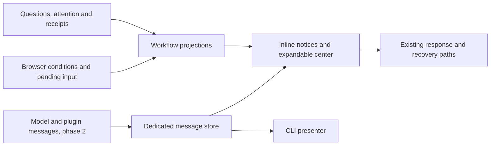

# Gene Harness notifications

Status: implemented and verified. Updated 2026-10-08.

## Implementation map

The implementation follows the phases below. `client/notices.gene` and
`client/confirmations.gene` own local presentation and decisions;
`question_editors.gene` and `notification_center.gene` project existing workflows.
`src/notifications/` provides the isolated producer store, source-scoped publisher
and frozen action admission. `client/producer_inbox.gene` and the CLI presenter
consume protocol 7 notification delivery. The public usage guides are
[overview](recipes/notifications.md), [publishing](recipes/notification-publishing.md)
and the [review notifier example](../examples/notifications/README.md).
The [verification record](notification-verification.md) maps the acceptance
criteria to automated tests and observed browser behavior.

## Purpose and scope

Give the operator a dependable way to notice something, expand its details and
take the next step. Serve both the normal Harness and customized plugin products,
with shared presentation and progressive discovery.

Build this in two phases:

1. **Client notices and workflow projections:** first ship keyed notices and a
   separate confirmation controller. Then add the expandable center with
   **answer-in-place for background conversations**, using existing APIs.
2. **Producer notification inbox:** add stored messages, a source-scoped publisher,
   dedicated delivery, acknowledgment and CLI support when the first phase is
   usable.

Phase 1 has two independently deliverable steps:

- **1A — notice manager:** independent slots/lifetimes and confirmation controls
  fix the current overwriting defect.
- **1B — interactive center:** answer a background conversation's question
  without leaving the current conversation. This requires reply drafts, pending
  submissions and recovery keyed by session and batch.

Both steps use existing storage and HTTP/WebSocket contracts. They need no new
notification database or plugin publisher. Phase 2 adds producer messages after
phase 1 is usable. Implementation and tooling should be Gene; no new Gene syntax
is proposed.

## Pre-implementation behavior

- [client/main.gene](../client/main.gene) writes feedback
  into one notice element. Copy, reconnect, errors and other messages replace it.
  Some command confirmations render their buttons into that same element.
- [client/ui/model.gene](../client/ui/model.gene) and
  [controller.gene](../client/ui/controller.gene) use a
  separate panel status element for saving, validation, rendering and recovery.
- Question batches, session attention and command/action receipts have existing
  owners. Browser pending submissions also retain their original identity in
  session storage.
- Question rendering uses one selected batch/input ID, with one stored pending
  reply under gene-harness/input-reply. Replies already include a session in
  their payload, but entry controls and reconnect recovery are selected-session
  oriented.
- Session-list and attention messages contain session-index metadata; they do
  not generally carry the full waiting question batch. Full session snapshots
  and question/round updates provide that content.
- The host has durable state/events, authenticated transport, ordered snapshots,
  plugin ownership and quoted UI validation.

Reuse these records. The notification UI must not create another question or
save-outcome lifecycle to keep synchronized.

## Presentation and authority

The UI can combine three sources, but only one needs a new store:

| Source | Authority | Presentation/lifetime |
| --- | --- | --- |
| Local feedback | Browser interaction, such as Copy | Short-lived, keyed feedback; no durable unread count |
| Workflow/condition projection | Connection state, pending submission, receipt, question batch, session attention | Present while its owner says it is relevant |
| Producer message, phase 2 | A published operator-facing message | Stored, expandable, clearable recent inbox item |

A question card exists while its question batch is pending. Its presence and
available responses come from that batch. An attention card derives from session
attention and uses the existing acknowledgment behavior. They are not stored
notification copies with independent response/state/expiry fields.

**Unknown outcomes require both client and server state.** A request may have
been sent without any receipt yet existing on the server. The projection must
retain the browser's original pending identity until normal receipt recovery
determines the outcome. Server receipt absence alone does not prove failure or
permit another mutation with a fresh identity.

Command confirmations currently include client-owned presentation of a command
result. Keep that confirmation as a separate decision object/controller until an
explicit choice handles it; a later notice must not destroy its buttons. Do not
claim all confirmations already have a durable question-batch owner.

Capture origin at admission: session, input/command/round, component and entity
where relevant. Keep that origin through awaits and tab switches, rather than
assigning a late result to the currently selected conversation.

## Recommended UI

### Compact entry point and expansion

A host-owned **Notifications** button opens/closes a center. Each item can expose
a **Details** button when useful. Preserve current conversation, panel selection,
drafts, expanded state and keyboard focus. Closing the center or collapsing
details changes the view; it does not complete pending work.

In phase 1B, the center combines local notices, existing attention/session records
and loaded/open-tab snapshots. Answer-in-place is the selected behavior for
background questions, rather than requiring a conversation switch.

Use cached question data when fresh. When details are missing, fetch the original
session through the existing snapshot endpoint as the card is expanded or the
operator starts answering. Do not fetch every transcript when opening the center.
A session-list/attention entry alone is not evidence that its question content is
loaded. Show loading/unavailable states and retain Open conversation as a fallback.

The center's retrieval and response paths leave the selected conversation, its
composer draft and panel selection unchanged.

The center becomes the main attention presentation. The sidebar's Needs attention
entry is a shortcut/filtered view of the same items. Group by origin so a pending
question or failed operation is not counted again as an unrelated attention
notification for the same session.

Separate the indicators:

- **Needs attention / Needs response:** derived from current workflow state.
  These remain meaningful after the operator has looked at the center.
- **New messages:** phase-2 producer messages beyond the opened watermark.
  Local progress and projected questions do not add another unread counter.

The active conversation keeps its normal question form and field validation.
The center reuses that question rendering/validation behavior for another
session, with controls scoped to the original session and batch. It can expose
simple responses directly and expand a batch form for text or multiple choices.

```text
Notifications · 2 need attention, 1 new message       [Close]

! Save outcome unknown                           Repair desk
  The original save has not been confirmed.
  [Resolve original save] [Details ▸]

? Publish the reviewed edition?                  Needs response
  Choose what should happen next.
  [Approve] [Decline] [Details ▸]

✓ Edition review finished                        Harbor Desk
  Two stories still need copy review.
  [Open conversation] [Details ▸] [Clear]
```

Use **Clear** for removing informational messages from the normal list and
**Clear messages** for the bulk action. Do not reuse Dismiss all for notification
hiding. A condition may have **Hide popup** if suppression is appropriate, but
its indicator and recovery controls remain available while it is active.

### Feedback near the action

Saving/Saved, validation and unknown outcomes remain near the originating form
or composer. Independent keyed slots prevent Copied/Saved from replacing an
unresolved error. Routine successes can time out; errors and decisions cannot
vanish on a short timer.

Inline notices and the center show the same item/projection. Do not make two
copies with independent close controls. Limit compact overlays so they do not
cover the composer.

Stable keys use source + scope + logical condition identity, not message text.
Update progress and repeated reconnect attempts in place; reset suppression
after a condition genuinely resolves and recurs. Two sources may use the same
local key without colliding.

## Pending questions have no generic hide control

Question cards derive their pending state, responses and identity from the
owning workflow. There is no notification hide/clear operation for them, no
auto-dismiss timer and no notification retention rule that can remove them.

They can still collapse, and the drawer can close. Keep Needs response visible;
unrelated conversations and work remain usable. Do not infer a pending workflow
from punctuation or from a producer message merely sounding like a question.

Use **Answer**, **Yes/No**, **Approve/Decline**, or **Open question** through the
existing response path. Preserve the workflow's explicit Skip, Cancel or
**Dismiss all** action where supported. Today Dismiss all handles the batch by
recording unanswered responses; it is not a cosmetic hide operation. Generic
Clear messages has no effect on that batch.

The first phase does not introduce mandatory-answer semantics or remove existing
question choices. A non-closable notification means the pending card cannot be
hidden independently of its workflow. An explicit workflow dismissal can handle
it without inventing an answer.

A response submission remains pending while in flight or uncertain. Let accepted
answers/cancellation and the actual owner's state determine when the projection
disappears. Original batch/instance identity and existing idempotency checks reject
stale or duplicate answers. Do not maintain a separate stored notification
`response`, `dismissible` or `state` flag.

Plugin-defined questions must use a real decision workflow with a resolution/
recovery path; posting an untracked question-shaped message does not create one.

### Answer-in-place state and recovery

Use (session_id, batch_id) as the identity for each question editor and pending
reply. Scope control keys/IDs by that identity so two cards cannot share a
question field accidentally. Keep answer drafts and submitting/error state per
batch; the selected conversation's single input ID is not the center's state.

Persist pending replies by session and batch rather than overwriting one global
storage slot. Capture the original session, batch and normalized payload before
sending. Reuse the existing answers endpoint, batch validation and idempotency;
do not construct a late reply from client/selected or whichever card is now open.

On reload/reconnect, recover every saved pending reply against its original
session. Check that session's current data and use the existing receipt/answer
path. Keep uncertain outcomes pending and retry the same payload/identity when
appropriate. Do not discard a reply merely because its session is not selected.

A response completion updates only its matching card and editor instance. A
newer batch or an updated owner state cannot receive an old response. If the
current conversation form and center show the same batch, they share its draft
and pending state rather than becoming two independent reply controllers.

The first implementation can serialize network submissions while retaining
multiple independent pending records. Parallel replies are not required for
answer-in-place; losing another batch's pending payload is unacceptable.

### Background question freshness

Question and round updates reach viewers of their session. A fetched card for an
unsubscribed background session must also use the workspace-level session/list
event as an invalidation signal. On that event, mark cached background question
data stale. Do not rely only on comparing status/revision: a session can return
to waiting with a new batch, and runtime round updates do not consistently bump
the session's metadata revision.

Refresh expanded/active cards on demand through the existing snapshot endpoint;
collapsed cards can refresh when expanded or used. Coalesce repeated invalidations
without fetching every transcript. Show a checking/unavailable state while data
is stale, and update or remove the card from the fresh owning workflow state.

Track fetch generations and process epochs. Discard a fetch result if a newer
invalidation occurred after it started; an older response must not restore a
handled question. Invalidation does not erase drafts or uncertain replies:
retain those under their original session/batch identity until recovery confirms
the outcome. Existing server batch checks remain the final guard against stale
answers.

## Actions and richer details

Begin with host recovery/navigation and the existing question/confirmation
controls in phase 1. In phase 2 allow producer messages to declare:

| Action | Behavior |
| --- | --- |
| Open a reference | Navigate to an original conversation, receipt, artifact or plugin entity |
| Draft a prompt | Fill the composer with explicit saved context; the operator chooses when to send |
| Run a registered function | Use normal admission, declared arguments, receipts and cancellation |
| Submit an operator command | Use normal command semantics and receipts |

Actions run only after an explicit click. Contextual prompts include actual
record IDs/revisions. An arriving item must not change panel selection. Opening
an entity may apply a validated scalar view-state patch on the user's click.

Freeze function/publication identity on action handles. Replacement/disable
refuses stale actions and offers navigation/recovery instead of silently binding
old buttons to new code.

For unknown outcomes, Resolve/Retry uses the original submission identity.
Clearing or suppressing a notification neither confirms nor cancels the work.

Details may contain bounded explanatory text, diagnostics, lists/tables, progress,
links and declared actions, using the existing safe quoted UI vocabulary. Keep
editable forms in their workflow views initially. No raw HTML, inline scripts,
persistent browser callbacks or per-notification dynamic render callbacks.
Host-owned outer controls and plain summaries remain usable if rich content fails.

## Phase-2 producer records and acknowledgment

Store only producer-published messages that have a reason to outlive local
feedback. Core pending questions, attention and save state are projections.
A useful plugin message can summarize a domain milestone and link its evidence;
it should not copy the whole job/round record.

Provisional producer record:

| Field | Purpose |
| --- | --- |
| `id`, `revision`, `sequence` | Host identity, update revision and meaningful-publication position |
| `source`, `key` | Host-stamped publisher and optional local deduplication key |
| `scope`, `origin` | Workspace/session scope and references to the originating work |
| `severity`, `title`, `summary` | Compact operator-facing content |
| `detail`, `actions` | Optional frozen rich detail and declarative buttons |
| `created_at`, `updated_at`, `expires_at` | Host timestamps/ordinary message retention |
| `cleared_revision` | Operator clearing of a specific published revision |

There is no stored `kind`, `dismissible`, `response` or workflow `state`.
All producer entries use the message lifecycle; the presentation layer knows
the other sources are workflow projections.

Use one **opened-through sequence** for the current single operator. Opening the
center acknowledges producer messages through the snapshot's watermark,
including older/offscreen messages. This is center-level acknowledgment;
per-item visibility tracking is outside the initial scope.

New meaningful publications beyond that watermark remain new until the next
open/explicit acknowledgment. Progress ticks and cosmetic detail changes do not
renew the count. Clearing records the revision being cleared; a later meaningful
occurrence can resurface while an old snapshot cannot restore the cleared one.

Acknowledging producer messages does not answer questions or clear session
attention. Opening the conversation uses its existing attention acknowledgment.
Pending workflow indicators always derive from their owners, irrespective of
the watermark. Per-user acknowledgment belongs to a later account model.

## Storage, progress and delivery isolation

The current [ui_data_revision](../src/ui/state.gene) includes
the workspace/workspace stream's next sequence.
[session_service.gene](../src/web/session_service.gene)
broadcasts ui/state for workspace plugin/state records. These facts make using
ordinary plugin state for notifications expensive.

A non-plugin notification event does not automatically broadcast ui/state today,
but an unrelated write to that stream still changes the revision observed by
later snapshots. Do not equate every durable write with an immediate rerender,
and do not rely on the absence of an immediate broadcast as isolation.

Phase 2 needs a dedicated notification stream/state and revision/invalidation
path, independent of board data. Posting, clearing and acknowledgment must not
rerender unrelated panels. Establish this before putting notifications in the
shared stream or using plugin-state updates to store them.

Send frequent progress over the existing live connection and derive it from the
job/receipt where possible. Persist meaningful milestones or necessary job
checkpoints, not a notification write per percentage tick. Isolated storage can
support durable updates; the current invalidation coupling is the issue.

On reconnect, hydrate producer messages plus workflow projections through their
respective authoritative snapshots. Merge by identity/revision/epoch; do not
replay old transient toasts. Notification updates for background sessions must
reach workspace viewers, carrying their original session reference.

## Shared API and CLI, phase 2

Expose a source-scoped publisher through the shared SDK, with a thin model/
operator adapter. Proposed names remain `PluginHost:notify` and
`notification_post`, plus listing/updating/clearing helpers. They are not needed
or introduced in phase 1.

```gene
(notification_post
  {^key "edition-review"
   ^scope "workspace"
   ^severity "warning"
   ^title "Two stories need copy review"
   ^summary "The review is complete; two saved stories still have blockers."
   ^actions [{^id "review" ^label "Draft an edition review"
              ^prompt "Review Harbor Desk readiness using its saved stories. Explain blockers without changing review flags."}]})
```

The host stamps source/identity and limits producer edits to that source.
Publishing returns an identity/result and reports storage failure honestly. A
notification failure after a committed business save cannot turn that save's
receipt into a false failure. Render callbacks remain read-only.

All plugins follow progressive discovery: concise descriptions, tags and owned
doc references; a small notifications overview with focused recipes; plugin
policy in its usage chapter. Do not inject full manuals into initial prompts.
Notification events do not automatically enter model history.

The shared service is independent of the browser. When the publisher API exists:

- An attached CLI operator receives a concise line with message identity, source,
  severity and summary, using a presenter/subscription rather than printing in
  the publisher itself.
- A command lists recent messages and can show details/clear messages through
  the same service. Question answering remains on its existing CLI path.
- Trigger/headless producers store messages without requiring a viewer. Offline
  publications are available when a CLI or browser operator reconnects.

## Integration and recovery



The center is host-owned and independent of experimental panel enablement/layout.
Use host theme tokens plus text/icons for severity. /ui/default keeps host
summaries, question/recovery controls and references, while suppressing custom
plugin rich content/renderers.

Plugin retirement invalidates owned action handles. Producer messages may remain
as evidence with their original source. Projections follow actual workflow
state; do not fabricate an answered question because a handler was retired.
Show recovery/cancellation when applicable.

Keep projection adapters, keyed client presentation, publisher validation/store,
transport and CLI delivery in small separate modules. Change the shared web
contract/version deliberately in phase 2 when delivery requires it.

## Acceptance by phase

### Phase 1A — keyed notices and confirmations

1. Copied/Saved cannot replace connection/storage/save problems or confirmation
   controls. Independent updates preserve keys, expanded state and focus.
2. Save errors/unknown outcomes retain their original session/component/entity,
   even after switching tabs or selecting another job.
3. Resolve/Retry reuses original pending identities and existing receipts, with
   no duplicate mutation.
4. Separate confirmation controls remain until an explicit workflow choice
   handles them; unrelated feedback cannot remove their buttons.
5. Reload/reconnect reconstructs conditions from existing snapshots and pending
   storage, without a notification database or replaying transient toasts.
6. Existing authentication, cancellation, recovery and /ui/default remain usable.

### Phase 1B — interactive center and question projections

1. Answer a background conversation's question from the center without changing
   the selected conversation, its composer draft or panel selection.
2. Recover an uncertain background reply after reload for the correct session
   and batch, even while another conversation remains selected.
3. Two question batches retain independent drafts/pending payloads. One reply
   finishing or failing cannot clear the other; stale/duplicate replies cannot
   answer a newer batch.
4. A card with missing question content loads it on demand through existing
   snapshot APIs, with loading/stale/error handling and no eager transcript sweep.
5. Pending question cards have no generic X/Clear/timeout path. Explicit workflow
   Answer/Skip/Dismiss all/Cancel remains functional and controls their lifetime.
6. Closing the center/collapsing details permits unrelated work; Needs response
   remains until the owner is handled. Attention is not counted twice.
7. Current-conversation and center controls for the same batch share draft and
   pending state and use the same original response identity.
8. Keyboard focus, announcements, long text, theme contrast and narrow screens
   pass browser checks. Ordinary feedback uses polite announcements; actionable
   failures use urgency sparingly. Auto-dismiss pauses during interaction.
9. /ui/default retains host question/recovery controls; the notice manager remains
   independently useful before the interactive center is shipped.
10. Another browser tab or the CLI answers a background question. The center
    invalidates its cached card on session/list and refreshes or removes it
    without switching the current conversation.
11. A delayed snapshot arriving after a newer invalidation cannot restore the
    old question; drafts and uncertain replies retain their original identities.

### Phase 2 — producer messages

1. Two publishers using the same local key remain independent; meaningful keyed
   updates preserve item identity and can resurface after an earlier clear.
2. Background messages reach the center without replacing the current session
   or interrupting typing.
3. Opened watermark and clearing are consistent across reload/restart/two tabs;
   stale snapshots cannot restore older cleared revisions.
4. Publish/progress/clear/acknowledgment does not invalidate unrelated boards.
   High-frequency progress does not create durable notification churn.
5. Declared prompt/navigation/function actions follow normal paths with original
   context; replaced/disabled action handles are refused.
6. An attached CLI receives one-line messages and its list/detail command works;
   a producer without a viewer still records a message.
7. A model discovers the API/recipes and builds a plugin example without the
   full contract in its initial request.

Defer OS push, sound, email/chat delivery, per-user routing, dynamic notification
render callbacks and extensive rule/preference editors. Evaluate phase 1 before
committing to the larger inbox implementation. Preserve the expandable center
and non-closable pending questions throughout.
