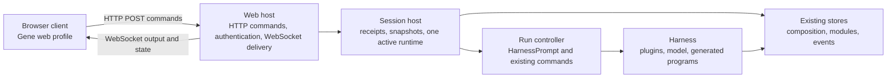
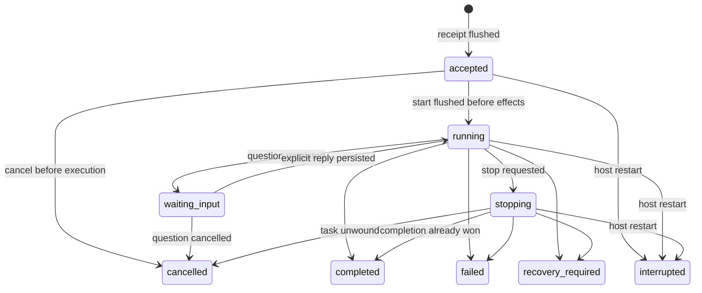

# Gene Harness — browser client design

Status: implemented for the local, single-operator release. This document extends the
[implemented design](design.md). It specifies the first browser client without
changing the Harness composition, capability, or recovery contracts.

## 1. First release

The first release is a local browser client for one operator and one configured
workspace. Its main workflow is to create or reopen a session, send a prompt,
watch the agent's progress and results, stop a run, and reconnect without
accidentally submitting the prompt twice.

The browser is a client of a native Gene process. That process runs the model,
commands, generated Gene programs, plugins, and stores. The browser never
receives model credentials or a live Harness object.

First-release scope:

- session list, creation, renaming, and retained conversation history;
- multiline chat input, existing slash commands, and command discovery;
- live progress at output-block granularity, final answers, and expandable
  Gene code/results;
- stop, refresh, reconnect, and interrupted-run recovery;
- read-only workspace, provider/model, and plugin status.

Deferred: remote access and multiple users; simultaneous runs in different
sessions; graphical plugin installation or capability editing; uploads and a
file editor; full token-by-token rendered answers;
arbitrary plugin-supplied HTML or browser code.

Existing commands such as `/build` still work through the normal prompt path.
Leaving graphical administration out does not remove commands from the agent.

## 2. Starting point

| Existing implementation | Consequence for the browser design |
|---|---|
| `src/profiles/web.gene` binds `MemFs`, `HtmlRender`, and the offline command agent | The existing `web` profile is a deployment example, not an HTTP host or a chat client. Keep its meaning. |
| `src/main.gene` owns boot, shutdown, and the terminal's blocking read | A browser needs a separate host driver; an HTTP request must not impersonate stdin. |
| `HarnessView` has `show_prompt` and `handle_line` | Preserve terminal and recording behavior; do not make sockets implement a terminal polling loop. |
| `ask` calls `HarnessPrompt`, emits its final output, and flushes state | Keep one execution path for terminal and browser, with structured run outcomes added below the drivers. |
| `HarnessLog` exposes only `kind` and `text`; hydration drops durable envelope IDs | It is insufficient as a reconnect protocol or a source of stable message IDs. |
| `events.catalog` has text events and composition turn events | Add explicit session/run projections; do not infer run status from printed text. |
| The model client validates completed provider responses | Codex output-text deltas are provisional raw previews; only complete validated Gene envelopes execute. |
| `net/http` supports request tasks and WebSockets; `ws_send` can drop queued frames | Push ordered output/state messages; a dropped frame closes that peer so reconnect restores a snapshot. |
| Gene's web profile supports DOM/HTTP interop but excludes runtime eval and VM capabilities | Author the client in Gene's web subset; keep execution in the native process. |

## 3. Module ownership

The **session host** owns session identity, opening/closing a runtime, admission,
run receipts, cancellation, and immutable presentation snapshots. HTTP handlers
use this small interface:

| Operation | Contract |
|---|---|
| `list_sessions`, `create_session`, `rename_session` | Operate on server-owned IDs and durable metadata, never browser-supplied paths. |
| `snapshot(session_id, cursor, limit)` | Return committed presentation records, active-run state, bounded provisional output, and fresh cursors. |
| `submit(session_id, request_id, submission_seq, text)` | Admit at most one execution; persist its receipt before returning. |
| `cancel(session_id, run_id)` | Request cooperative cancellation of exactly that run; repeated requests are harmless. |
| `status` | Return safe workspace/runtime summaries and command names/docs without serializing plugin objects or state. |

The **run controller** owns one submitted prompt through the shared execution
path. It reports structured outcomes where they originate. It must not recover
an error status by parsing an `"error:"` prefix returned by today's `ask`.
Keep `ask`'s string-returning compatibility interface for existing callers.

The **web host** validates transport input and converts snapshots to JSON. It
does not implement commands, invoke arbitrary registry callbacks, or manage
plugin lifetimes itself. It remains available when a plugin is quarantined.

The **browser client** owns selection, drafts, rendering, and connection state.
It applies snapshots to a deterministic client state model. Server-confirmed
records, provisional output, and unsent drafts are distinct states.

## 4. Session and execution model

A **session** is a durable conversation and its session-scoped plugin state. A
**run** is one admitted prompt, potentially containing several model rounds and
composition turns. A **turn** retains the existing meaning: one staged
composition/registry transaction. Finishing one turn does not finish the run.

One web host owns one configured workspace and at most one active Harness
runtime. It admits at most one run globally. This preserves the current
one-session-per-runtime model; adding HTTP concurrency does not make concurrent
mutation of one Harness safe.

The UI may browse other sessions while a run continues. Submitting to another
session while busy returns a typed conflict. When idle, changing the execution
session shuts down and flushes the old runtime, then reconstructs the requested
session through the existing phased boot path. Never change `h/event_stream`
on a live runtime or share one model-history cell between sessions.

Refresh published store generations before activating a session and when
serving durable snapshots. External CLI commits can change inactive-session
history or desired composition without sending this host a notification.
Reconcile a changed composition at an idle admission boundary, never by swapping
the running prompt's registry underneath it.

Multiple browser tabs may observe the same host. The server arbitrates
submissions; disabling a button is only a convenience. Session creation and
renaming use the same serialized host command path and may report busy while
the runtime is executing. There is no implicit prompt queue in this release.

Execution tasks belong to a host-owned supervisor, not to the request handler
or WebSocket connection. Returning an HTTP response, refreshing, closing a tab,
or losing the socket does not cancel the run. Handlers return quickly and read
published snapshots; they never inspect a transaction's staging cells.

The host holds an exclusive lifetime claim for its active session and releases
it after shutdown/flush. A second writer using that session must refuse to
execute; event-store CAS alone cannot prevent duplicate external effects before
flush. Add claim handling to both browser and CLI boot. Other-session CLI
replicas retain existing workspace CAS semantics; a conflict is surfaced, never
resolved by replaying the losing model/tool call.

### Run states

`completed` means the run settled and its final output/state flushed. A command
can still report a domain-level refusal or an unsuccessful result. `failed`
means execution failed; `recovery_required` means cleanup or reconciliation
needs attention. Preserve these distinctions in the structured outcome.

Stop requests cancellation; it does not undo earlier committed turns or host
effects. Keep “Stopping…” until the task has actually unwound. Cancellation of
synchronous work may wait for a safe point or its existing execution limit.
Cold recovery preserves waiting-input runs and closes executing unfinished runs as interrupted, then repairs inner turn
records. It never restarts a model or tool call automatically.

## 5. Durable records and safe submission

Use the existing event store and projection checkpoints. Do not introduce a
parallel browser database for sessions, transcripts, or run receipts.

Add versioned, core-owned session metadata and run lifecycle records. Session
metadata belongs in a core workspace projection; run receipts, user messages,
and run outcomes belong to the session stream. Core owns these projections;
they are not arbitrary plugin state or browser-authored recovery envelopes.

Each session has a monotonically increasing `submission_seq`. A snapshot
returns the next admissible value. Submission carries that value, a browser
`request_id`, and the exact prompt text:

1. Validate input and resolve duplicate receipts, then check the session claim,
   busy state, and next admissible sequence.
2. In one serialized core operation, append the run receipt and user message,
   advance the sequence, and flush before acknowledging admission.
3. Persist `running` before invoking the model or command.
4. On settlement, flush the outcome, final transcript records, and plugin state
   before reporting a durable terminal status.

A duplicate sequence with the same request ID and payload returns the original
receipt. A different payload or request ID conflicts. If the old receipt has
aged out of retention, a sequence below the durable high-water mark returns
`receipt_expired` and cannot execute again. Check duplicate receipts before the
busy check so a retry can recover its accepted run.

The client retries an uncertain submission only with the same sequence,
request ID, and text. A user-requested retry of a settled/interrupted run is a
new submission. This prevents accidental duplicate admission; it does not
promise exactly-once external effects across process failure.

Preserve the request ID, sequence, and text of an uncertain submission in the
tab's session storage until resolved. Refresh must recover the receipt before
the composer offers to send that text as new work.

### Transcript and compatibility

Version the `message`/`output` payloads to carry `run_id`, a stable `block_id`,
role, phase, and optional round alongside `text`. Phases distinguish narration,
Gene code, execution results, and final answers. Assign these fields at their
sources; do not parse `== Round … ==` or `-- Result --` to reconstruct them.
Existing text remains the terminal/recording fallback.

Read existing version-1 text events as legacy records with unknown role/run
where necessary. New readers support both versions, and the catalog generator
must support the added schemas/version readers. New required run/projection
records are an explicit forward-format change: older binaries must refuse an
unsupported home rather than silently lose admission/recovery state.

The public transcript is an allowlisted projection. Never send raw
`plugin/state`, model request payloads, credential errors, or arbitrary event
envelopes to the browser. A session list/title is metadata; it is not another
model conversation or a reason to call the model.

Completed model replies are an explicit part of the transcript: an `output`
record with phase `raw_response` and the model round records the returned text
before envelope parsing. This includes malformed replies and final response
envelopes. The browser presents each as a collapsed disclosure labelled with
its step, with inert text and a copy action. It retains the open/closed choice
by block ID across transcript refreshes and preview-to-durable replacement;
switching sessions or reloading starts collapsed. Existing transcript storage,
retention, and display limits apply, including the visible truncation notice.
These records contain model output text, not HTTP headers or request bodies.

Normal browser conversations use the model-backed profile. Every nonempty
prompt without a leading slash reaches its model loop, even a bare word that
matches a command name. A slash, after trimming leading whitespace, selects
registered functionality such as `/help`; unknown slash commands stay local.
The opt-in offline profile is labelled as a command-only demo in the browser
and startup output, and is not the documented default launch path.

## 6. Live output and reconnect

Durable envelope sequences are the replay cursor. Log array indexes and
WebSocket connection handles are not identities. JSON encodes sequence and
revision counters as decimal strings to avoid browser number precision loss.

Some current `HarnessLog` output is published before an event-store flush.
Expose it only as **provisional** output with stable block IDs and a host epoch.
Do not advance a durable cursor for it. A snapshot includes bounded provisional
blocks for the current run; once their records flush, the client replaces them
with committed blocks of the same ID. A crash may discard provisional output.
Committed output appears once, including the final answer emitted by `ask`.

Protocol 2 pushes `record`, `records`, `run`, and `session` messages directly.
`record` is a provisional output block; `records` promotes committed blocks by
stable ID and advances the durable cursor. `run` carries the public receipt,
next submission sequence, session metadata, and authoritative host busy state.
POST acknowledges admission and never overwrites a newer pushed completion.
The client tracks outstanding admission by session and request ID.

Each connection starts with `status`, `sessions`, an optional selected-session
`snapshot`, and `ready`. Frames carry a host epoch and a per-connection sequence
encoded as a decimal string. A gap, queue overflow, disconnect, or session switch
opens a new stream and restores its snapshot; old-socket callbacks are ignored.
There is no connected-client polling. HTTP remains available for initial
authentication, disconnection recovery, session-list pagination, and older
history. Native WebSocket ping/pong maintains idle connections, and expired
browser credentials close their streams. A missing initial `ready` or an
explicit `resync` also reconnects. Changes made by other processes are picked
up by snapshot/history reads on focus or reconnect; they do not emit this
host's in-memory push events.

Codex deltas update a provisional raw-response block. The complete validated raw
reply uses the same block ID and is persisted once; an interrupted partial
response is never executable and can be discarded during recovery.

Snapshots distinguish a committed stream cursor from a provisional snapshot
revision. The server captures each snapshot consistently on its owning lane;
the client discards stale responses after switching sessions. Reconnect starts
with the latest bounded snapshot and then resumes direct updates. A cursor older than retained history
returns an explicit reset with the earliest available cursor; the UI shows that
older history is unavailable. Recovery does not reconstruct discarded history.

Transport bounds: 64 KiB prompt text, at most 200 committed records and
1 MiB per history response, and a 1 MiB provisional-output window. Pagination
must make progress even for a large permitted event; oversized display blocks
are explicitly truncated/chunked with stable IDs. No unbounded per-tab queues.

## 7. Browser experience

Desktop uses a session sidebar, a conversation column, and an optional status
drawer. Small screens collapse the sidebar and drawer without hiding the
composer or Stop action.

- **Session sidebar:** New session, filter by title, title/last activity, and a
  running or interrupted indicator. Session selection is reflected in the URL.
- **Conversation:** user messages and agent answers; collapsible narration,
  Gene code, raw responses, and results grouped by run and step; a clear
  final/failed/cancelled/interrupted state for each retained run.
  Code can be copied but is not executed by the browser.
- **Composer:** multiline input; Enter sends, Shift+Enter inserts a newline;
  preserve input-method composition; show an unsent/sending state until the
  receipt arrives. `/` offers commands from safe registry metadata and preserves
  existing command semantics. Stop targets the active run by ID.
  Command suggestions filter by the typed slash prefix and close when arguments
  begin or Escape is pressed. “Edit and retry” restores a failed or stopped
  run's input for editing and does not submit automatically.
- **Status drawer:** workspace label, profile/model, connection state, run
  state, and plugin readiness/errors. Show desired/active revisions only when
  the selected runtime supplies them. Link to the existing recovery workflow
  when execution is unavailable.

Initialize selected-session drafts on direct URL loads as well as navigation.
Keep per-session drafts in browser session storage and erase a draft only after
admission is confirmed. Reconnect never submits a draft. The server remains the
source of conversation history. Do not force-scroll a reader who has moved up;
offer a “New output” jump instead. Use semantic controls, visible focus,
keyboard access, and restrained live announcements rather than announcing each
progress block.

Assistant narration and answers support a restricted Markdown subset: headings,
flat ordered/unordered lists, pipe tables, fenced code, inline code/emphasis,
and links. User input, command output, raw replies, and Gene source retain literal
text. The renderer creates DOM nodes and never injects source HTML. Links accept
HTTP(S), mailto, and fragment URLs; unsupported syntax remains text. This is not
a full CommonMark implementation.

### Gene syntax highlighting design

Highlight execution blocks whose phase is `code`, raw Gene reply envelopes
(`raw_response`, including streaming previews), and Markdown fences explicitly
labelled `gene` (case-insensitive). Keep prose, inline code, unlabelled/other
language fences, and arbitrary execution/tool output as literal plain text.

`client/highlight.gene` owns a forgiving lexical scanner and a shared `code_view`
DOM renderer. Use the current reader in `src/gene/reader.nim` as the syntax
reference; the editor grammar is a useful palette reference but can lag reader
changes. Distinguish comments, strings/characters/regexes, numeric literals,
properties/annotations, keywords/operators, callable heads/built-ins, types,
and punctuation. String bodies, including interpolation, share one color.
Recognize nested `#< ... >#` comments and the `#_` datum marker; this is lexical
coloring, not semantic analysis of the discarded form. Unknown syntax keeps
its literal spelling; unfinished strings/comments extend to the available end.

Build text-bearing spans through `$dom/render`; never parse/evaluate source or
insert HTML. Token concatenation must reproduce the input exactly, including
Unicode, escapes, spaces and newlines. Copy continues to use the original
transcript string. Highlighting adds no persisted data or transport fields.

Use a restrained light palette on the existing code surfaces: purple keywords,
green strings, blue callables, warm numeric literals, teal properties/types,
and muted comments/punctuation. Text colors must reach 4.5:1 contrast on both
code backgrounds. Preserve selection, monospace layout, keyboard disclosure
controls and narrow-screen overflow. Forced-color mode uses system text colors.

Scan iteratively with bounded lookahead and no recursive parsing or regex
dependency. Highlight disclosure contents only when opened; subsequent renders
honor the existing expansion state. Limit coloring to blocks of at most 64 Ki
UTF-16 code units and at most 4,096 tokens. Larger blocks, or the remainder after
the token limit, remain fully visible as plain text. This bounds highlighting
work without truncating source or changing the existing display limits.

Verify by compiling the actual web import graph and operating an isolated local
client: execution source, raw/partial replies and Gene Markdown fences receive
colors; plain output stays plain; malicious HTML remains inert; copy and
disclosure state survive live updates; reloaded history highlights when opened
and retains the existing collapsed-by-default behavior; multiline and Unicode
text are unchanged; large/incomplete inputs render without errors. Use compiler
builds and direct browser checks in keeping with this package's development workflow.

Snapshots and live run messages include the public pending `input` request while
a run is `waiting_input`. A dedicated form renders text, select (including
multiple selection), or confirm. Ordinary prompt submission is disabled until
the question is answered or cancelled. The waiting run holds no task or session
execution slot. An unconfirmed submitted answer is saved and resolved on reconnect.

Snapshots include `runs`, the public projection of the existing bounded receipt
history (128 runs). Live run updates merge into that history. Outcome markers
therefore survive subsequent runs and reloads while their receipts are retained.
Direct code parse/evaluation failures use a typed `CommandError`, produce a
failed receipt with `outcome: "code_error"`, and remain ordinary recoverable
command failures. A successful program returning an error-looking string is
still successful. The UI displays “Code error” without inspecting output text.

New sessions carry provisional automatic titles. Slash commands leave them
provisional; the first ordinary prompt supplies at most eight words/64 UTF-8
bytes plus an ellipsis. Explicit renaming always ends automatic title selection.

## 8. HTTP interface and local access

Use same-origin JSON HTTP for commands and snapshots, and a same-origin
WebSocket for server-to-client delivery. HTTP paths retain their `/api/v1`
names; WebSocket payloads use protocol version 3.

| Method/path | Behavior |
|---|---|
| `GET /about/` | The Gene Harness website, rendered once at startup from `src/website`. It needs no browser session and reads no workspace records; `GET /about` redirects here. |
| `POST /api/v1/auth/exchange` | Exchange a one-use launcher token for a local browser session. |
| `GET /api/v1/status` | Safe workspace, connection, and runtime status. |
| `GET /api/v1/sessions` | Paginated session summaries. |
| `POST /api/v1/sessions` | Create an empty session with a server-owned ID. |
| `PATCH /api/v1/sessions/{id}` | Rename a session using a metadata revision precondition. |
| `GET /api/v1/sessions/{id}/snapshot` | History page/update, active run, next submission sequence, and provisional output. |
| `POST /api/v1/sessions/{id}/input` | Reply with `{input_id, value, cancelled}`; validate and resume the same waiting run, with reply deduplication. |
| `POST /api/v1/sessions/{id}/runs` | Submit `{request_id, submission_seq, text}`; return a durable receipt, normally HTTP 202. |
| `GET /api/v1/sessions/{id}/runs/{run_id}` | Resolve an uncertain submission's current outcome when its receipt is retained. |
| `POST /api/v1/sessions/{id}/runs/{run_id}/cancel` | Idempotently request stop. |
| `GET /api/v1/events?session=<id>` | Authenticated WebSocket upgrade, initial snapshot and live output/state. |

Errors have a stable `code`, safe `message`, and relevant current state. Use
400 for invalid requests, 401/403 for access refusal, 404 for missing IDs, 409
for busy/revision/idempotency conflicts, 410 for expired receipts, and 413 for
oversized input. A rejected request does not consume a submission sequence.
HTTP acceptance and run completion are separate facts.

Bind loopback by default and serve bundled client assets from the same origin.
The launcher prints a one-use bootstrap URL whose token is in the fragment;
the client exchanges it and removes the fragment. Use an expiring HttpOnly,
SameSite=Strict browser cookie, validate the expected Host and Origin, and
require a session-bound CSRF token on mutations. Authenticate snapshots and
WebSocket upgrades as well as writes. Never place credentials in query strings,
access logs, transcript records, or browser storage.

Credentials, provider configuration, workspace roots, and capability grants
remain launcher-owned. First release has no credential-entry form, arbitrary
filesystem-path parameter, generic eval endpoint, or proxy to model endpoints.
Static serving uses a fixed asset allowlist. Remote binding requires a later
authenticated/TLS deployment design and is outside this launch mode.

## 9. Implementation direction

Author browser logic in Gene, compiled through the existing web profile. Use
the Todo app as the DOM/HTTP pattern and Miclone as the separate-client and
WebSocket pattern. The client uses Gene browser bindings for HTTP results, tab storage, history,
clipboard, and DOM operations. No JavaScript application or bootstrap is
authored: `web/load` compiles and publishes the Gene import graph and generates
its mount script. The native VM remains on the server.

The `browser` profile uses the chat providers and command registry
without the terminal driver. Tests select deterministic offline providers
through the same seams. `web`, `cli`, and `chat` retain their existing meanings.
The HTTP host is a launcher-owned module, not a generated plugin that can
replace its own recovery or authentication interface.

File ownership:

| File/module | Responsibility |
|---|---|
| `src/runtime/session_host.gene` | Session claims, shared boot/shutdown, admission, immutable snapshots. |
| `src/runtime/run_controller.gene` | Driver-independent run lifecycle, structured results, cancellation. |
| `src/storage/state.gene`, `events.catalog`, catalog generator | Session/run core projections, retained receipts, text-event version readers. |
| `src/web/server.gene`, `src/web/push.gene` | Native entry point, authentication, HTTP routing, static assets, ordered WebSocket delivery. |
| `src/web/contract.gene` | Small portable wire data definitions/validation shared by native and web code where supported. |
| `src/profiles/browser.gene` | Headless model-backed profile composition. |
| `client/main.gene`, `client/state.gene`, `client/view.gene`, `src/web/style.gene` | Browser startup/transport, client state, accessible rendering, responsive layout. |
| `client/highlight.gene`, `client/markdown.gene` | Bounded Gene lexical coloring, safe code DOM, and restricted Markdown. |

`bootstrap.gene` shares boot/shutdown behavior with the terminal entry;
recovery commands open a runtime without descriptor or profile activation. The browser profile initially uses the same
`new_harness` composition implementation as the CLI. Switching to Cordis is a
separate decision; preserve the existing Cordis tests and status distinctions.

## 10. Delivery and acceptance

The implementation follows four slices:

1. **Session/run interface:** core projections, claims, structured outcomes,
   deduplication, and recovery; deterministic recording/command tests, with
   terminal compatibility preserved.
2. **Local web host:** authenticated HTTP, snapshots, durable receipts,
   host-owned task lifecycle, and pushed output/state; test with a real HTTP
   client and an offline agent.
3. **Browser workflow:** session navigation, composer, transcript, code/results,
   status, Stop, and reconnect; compile client modules and test in a browser.
4. **Persistence and failure cases:** retention gaps, multi-tab contention,
   process interruption, conflicts, and compatibility with existing homes.

The release is complete when these observations hold:

- A fresh local launch opens an authenticated client, creates a session, and
  completes a deterministic prompt without a provider credential.
- The same interface can run the configured model and existing `/build`/tool
  commands, with no browser-specific execution path.
- Refreshing during a run preserves its identity and reconnects to output;
  dropping the submission response and retrying never starts another run.
- Two tabs racing a submission produce one accepted run and an explicit
  conflict; an expired receipt can never become new execution.
- Stop settles as cancelled or the outcome that already won. Previously
  committed composition changes remain visible.
- Killing the host during a model round or between composition commit and
  reconciliation restores an interrupted/recovery state without replaying work.
- Session switching restores the correct conversation/provider state and
  shuts down the previous runtime. A competing writer cannot claim that session.
- Output appears once after provisional-to-durable replacement; dropped socket
  hints, retention resets, and old history remain understandable.
- Malicious text/HTML is inert; unauthorized/cross-origin requests cannot read
  history or admit work; raw plugin state and provider credentials stay private.
- Existing CLI, recording view, module registration, capability, and Cordis
  integration tests continue to pass. New lifecycle logic is tested through
  the session/run interface, not duplicated per transport.

## Development workflow

The user moved the former Harness scenarios to `tmp/gene-harness-tests` and
requested that app development skip test suites. The package no longer declares
a test target. The acceptance cases above remain the behavioral contract; they
do not assert that an automated suite was run. Current development uses compiler
builds and direct operation of the local client.

The client retains at most 600 rendered transcript records and fetches earlier
pages on demand. Reading older pages preserves the scroll position and offers a
return to the latest output. Session/run core projections upgrade the event
manifest to format 2; text-event readers accept both versions 1 and 2.
