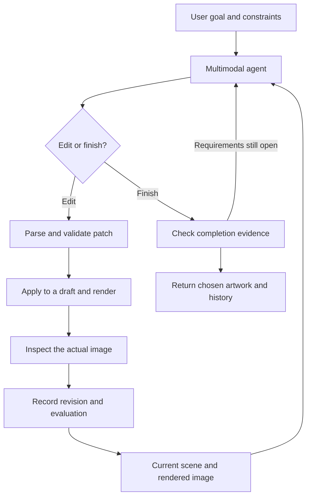
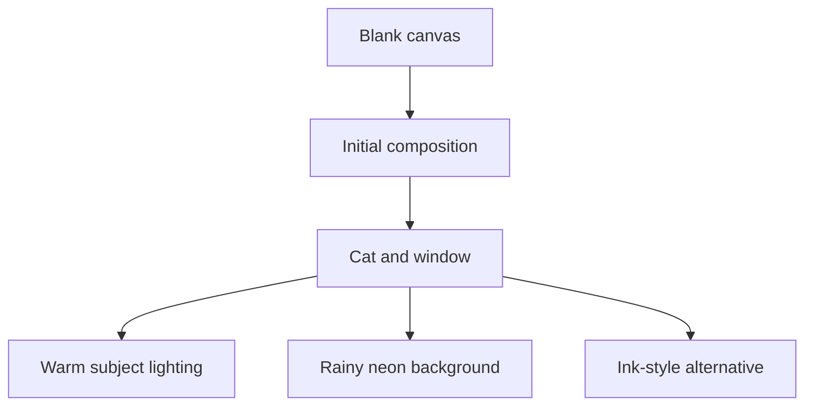

# Imagination: a Gene example project for versioned visual creation

**Status:** implementation design for the first release, version 0.3  
**Primary medium:** a structured SVG scene, converted through PDF to PNG for visual feedback  
**Core abstraction:** `Evolution[T]`, a proposed Gene type for inspectable, branching creation  
**First application:** an autonomous drawing agent that observes and edits its own work  
**Follow-on:** merge, restoration, adaptive replay, and other media are designed in [follow-on.md](follow-on.md) and do not gate this release

## 1. Purpose

Imagination turns a creative request into a sequence of observable, editable states. A user supplies a goal through the web frontend or CLI. A multimodal model writes a small drawing patch in Gene notation. The application applies the patch to the current scene, serializes SVG, converts it to a single-page PDF, rasterizes that PDF into a clean PNG, sends the actual PNG back to the model, and repeats until the result satisfies the goal or an explicit limit stops the run.

Every useful intermediate state remains available. The user can inspect it, continue from it in another direction, and compare alternatives. Restoring selected objects from another version and asking the AI to combine two directions build on the same history; they are designed in the [follow-on document](follow-on.md) and are not part of the first release.

The project demonstrates three Gene ideas together:

1. One node representation can describe artwork, edits, goals, observations, and history.
2. A small, validated interpreter can give an AI precise access to a persistent creative state.
3. Creation history can be a first-class value with domain-aware operations rather than a copy of a source-control program.

The architecture is reusable for documents, music, slides, UI, video, and 3D scenes. This example implements SVG first so that edits, identity, and replay have concrete semantics.

## 2. Scope and decisions

| Area | Decision for the first usable example |
| --- | --- |
| Artwork | Illustrations, posters, icons, diagrams, and stylized scenes built from SVG primitives |
| Authoritative state | A Gene scene tree with stable object IDs and explicit properties |
| Image output | Canonical SVG, single-page PDF, clean observation PNG, and thumbnail |
| Drawing | The model creates and modifies geometry; the renderer draws it |
| Agent | One multimodal model plans, draws, and critiques; each decision reviews the newest render |
| History | A Gene `Evolution` type with immutable revisions and named lines of development |
| Merge, restoration, adaptive replay | Not in the first release; designed in [follow-on.md](follow-on.md) |
| Storage | A self-contained project directory with a transactional index and immutable blobs |
| Interface | A web frontend written in Gene's web profile, with prompt input, live previews, history, branching, and comparison; the CLI shares its backend |
| Conversion dependencies | librsvg `rsvg-convert` for SVG to PDF; Poppler `pdftocairo` for PDF to PNG, crops, and thumbnails |
| Other media | Deferred to the follow-on design; SVG is the only medium in the first release |

The SVG backend does not promise photorealism. It does not interpret “add a cat” as a hidden diffusion call. The AI must construct the cat using groups, paths, shapes, and colors. A later generative-image adapter can have different guarantees without weakening this backend's precision.

The application does not need Git commands, repositories, working-tree tracking, packfiles, or Git-compatible hashes. Project source code may live in an ordinary repository; the user's creative history is owned by `Evolution`.

## 3. Relationship to Gene

### 3.1 Representation and execution boundary

Use Gene's node structure throughout:

```gene
(head ^property value child1 child2)
```

The examples in this document are **serialized domain data**, read by a Gene parser. Their heads are schema tags, not arbitrary functions to execute. Strings containing IDs are intentional: `"cat"` is an object ID; a bare `#cat` would conflict with Gene's comment syntax.

`Evolution`, `Revision`, `Draft`, and the other records in this design are ordinary Gene types declared by this example. The `[T]` in signatures is descriptive notation for the scene type, not a request for generic type syntax. The first release has one medium, so the history engine works on the SVG scene type directly; extract a `Media` protocol when a second medium exists (see [follow-on.md](follow-on.md)).

Keep application code idiomatic for this checkout: types, protocols, pattern matching, and the standard-library namespaces listed in section 3.3. Do not add language keywords or VM features for the example. Where the standard library lacks something the example needs, add it to the standard library instead of working around it, as the repository's `AGENTS.md` asks.

**Never evaluate model output as Gene code.** Parse one domain response, validate it, and dispatch only registered drawing operations. Homoiconicity gives the application a common representation; it does not give model-supplied nodes access to file I/O, imports, networking, macros, or `eval`.

### 3.2 Why a special type is useful

An `Evolution` value is an artwork together with its alternatives and provenance. It is not just a log attached to an otherwise mutable canvas. The public API should make revision-aware access natural:

```text
Evolution.create(media, initial_value, goal) -> Evolution
Evolution.value(revision_id) -> immutable T
Evolution.begin(revision_id) -> Draft[T]
Evolution.publish(draft, line?, expected_head?, review, decision) -> Publication[T]
Evolution.fork(revision_id, name, goal_delta) -> Line
Evolution.compare(left, right) -> Diff[T]
Evolution.replay_exact(path) -> ReplayReport
```

These signatures specify application behavior, not executable Gene syntax; expose equivalent names from the example's `evolution` module. Merge, restoration, and adaptive replay add operations in the follow-on design.

`Publication` contains the saved revision, whether a chosen line advanced, and any stale-head conflict. Publication always places a usable candidate on a trial reference; an accepted candidate advances the working reference in the same transaction when its expected head still matches.

### 3.3 Platform in this checkout

The example runs on this repository's Gene and follows the layout of `examples/gene-harness`. These pieces were checked on 2026-10-02:

| Need | Provided by | Status |
| --- | --- | --- |
| Scene, patch, review, and history records as data | The Gene reader | The examples in sections 5–10 parse and print back unchanged |
| Strict reading of model output | Reader options `rejectDuplicateProps` and `maxDepth` | Present in the reader; by default a duplicate property silently keeps the last value. Confirm that `$parse/read_all` exposes both, or expose them |
| Digests | `$crypto/sha256` | Available |
| Index and atomic references | `$db/sqlite` | Available |
| Renderer processes | `$os/exec` with captured, cancellable subprocesses | Available |
| Artifact files | `$fs` text and byte I/O (`read_bytes`, `write_bytes`) | Available; confirm atomic rename and flush for section 12.2 |
| HTTP API and model transport | `$net/http` server and client | Available |
| Live progress | WebSockets through `ws_accept` | Available. The standard library has no server-sent events |
| Browser client | Web profile with `$web/load` and `$web/script` | Available; `examples/gene-harness/client` is the precedent |
| Image payload for the model | Base64 encoding | Not exposed to Gene code; add it to the standard library |
| Multimodal model adapter | New code in this example | The `gene-harness` provider adapters send text only |
| SVG elements in the client DOM | Not needed | `$dom` documents no SVG element creation; section 14.2 avoids it |

Make the two additions (base64 and the image-capable adapter) and the two confirmations (strict parse options and atomic file publication) before the milestone that first needs them (section 16).

## 4. The creative loop



An iteration is a meaningful change such as establishing composition, adding a subject, correcting its silhouette, or refining contrast. It may contain several related primitive operations. It should not contain an uncontrolled rewrite of the entire project.

Separate four things explicitly:

| Item | Meaning |
| --- | --- |
| Goal | What the user wants, including literal requirements and preferences |
| Observation | What the model reports seeing in a particular rendered artifact |
| Patch | Precisely executable changes to an identified scene revision |
| Evaluation | Whether the resulting artifact satisfies requirements and what remains open |

An observation is a concise report, not private chain-of-thought. Save short explanations and decisions that help the user understand the work.

## 5. Core data model

### 5.1 `Evolution[T]`

An evolution contains a media descriptor, a revision DAG, named development lines, goals, and a selected revision. Revisions are immutable; line heads and the user's selection are mutable references.

```gene
(evolution
  ^schema 1
  ^id "evolution-01"
  ^media "svg-scene/v1"
  ^root "r000"
  ^selected "r004"
  (line ^id "main" ^head "r004" ^goal "goal-01")
  (line ^id "watercolor" ^head "r003b" ^goal "goal-02")
  (line ^id "run-07-trials" ^head "r004-trial" ^goal "goal-01"))
```

The serialized value can reference separately stored revisions. A development line is a name pointing to a revision plus its active goal/policy. A fork records its origin without changing the originating line.

Operationally, `Evolution` is a typed handle to one owned history; assigning the handle does not fork it. `Revision` and scene snapshots are immutable values. A fork creates a new line in the same history; an explicit clone creates another history with new history identity. Revision identity is the pair of history ID and revision ID. Scene-content equality is a separate comparison of media identity and canonical snapshot bytes.

### 5.2 `Revision[T]`

Each revision records these layers:

| Layer | Required information |
| --- | --- |
| Materialized state | Complete validated scene snapshot and its content digest |
| Rendered state | SVG, PDF, clean observation PNG, thumbnail, renderer profile, and artifact digests |
| Change | Canonical patch, actual structural diff, and resolved operation effects |
| Meaning | User intent, current goal reference, short plan, and concise explanation |
| Evidence | Post-edit visual evaluation tied to the exact image digest |
| Provenance | Parent IDs, actor, run ID, model configuration reference, and creation time |

```gene
(revision
  ^schema 1
  ^id "r004"
  ^parents ["r003a"]
  ^kind "edit"
  ^goal "goal-01"
  ^scene "sha256:SCENE_DIGEST"
  ^patch "sha256:PATCH_DIGEST"
  ^render "sha256:ARTIFACT_BUNDLE_DIGEST"
  ^evaluation "sha256:EVALUATION_DIGEST"
  ^quality "accepted"
  ^actor "agent"
  ^run "run-07"
  ^created_at "2026-10-02T17:00:00Z"
  (intent "Make the cat readable against the dark city.")
  (summary "Added a warm outline and reduced skyline contrast."))
```

The digest strings above are placeholders, not valid stored hashes. Real artifacts use full digests. Revision IDs are independently generated opaque IDs; they need not be content hashes. Multiple revisions can share one scene digest while carrying different provenance.

A root has no parents and an ordinary edit has one. `^parents` is a list so that the follow-on merge design can add two-parent revisions without a schema migration; the first release never creates one.

The root stores the initial scene and clean render with an empty creation patch and structural review. Its visual goal checks begin as `unknown`, so the blank root cannot complete a drawing request. Reserve a candidate revision ID before evaluation so the evaluation can bind to that ID; the ID remains unpublished until the storage transaction succeeds.

### 5.3 `Draft[T]` and attempts

A draft is an isolated mutable candidate based on an immutable revision. Model changes never mutate a stored scene. After validation, rendering, and evaluation, publish a new revision or retain a diagnostic attempt.

- A valid, rendered candidate is saved as a revision even when its quality is rejected. Keep it on the run's trial line so users can see the experiment.
- The chosen working line advances only to an accepted candidate, using compare-and-swap on its expected head.
- Invalid patches and render failures are `RunEvent` records with error data. They are not usable scene revisions.
- A rendered candidate is held until the next agent decision reviews it (section 10). If that review never arrives, because the run was cancelled, ran out of budget, or the model call failed, the candidate is published as a trial revision with `quality = "unreviewed"`; it cannot finish an autonomous run.

Do not rewrite an immutable revision to change its evaluation later. Store additional review events separately, each bound to that revision and artifact digest.

### 5.4 Immutability and identity rules

1. An existing revision never changes its scene, parents, patch, or original evaluation.
2. Appending requires all parents to exist; no operation can introduce an ancestry cycle.
3. Stored scenes are deeply immutable or exposed only as defensive copies.
4. IDs identify the same authored object across revisions; labels and appearances may change.
5. Deleting an object removes it from that scene, not from historical snapshots.
6. A genuinely new replacement receives a new ID and may record `derived_from` provenance.
7. Failed or cancelled runs preserve every already published revision.
8. Selecting, comparing, or exporting a revision does not alter it.

## 6. Goals, constraints, and creative intent

Convert the initial request to a visible goal record. Keep the original text. Distinguish explicit requirements from the agent's interpretation so the latter cannot quietly replace the former.

```gene
(goal
  ^id "goal-01"
  ^request "A cat at a window overlooking a rainy city at night."
  (requirement ^id "subject" ^strength "hard" ^check "visual"
    "Exactly one recognizable cat, sitting near the window.")
  (requirement ^id "window" ^strength "hard" ^check "visual"
    "A window separates the indoor subject from the city.")
  (requirement ^id "setting" ^strength "hard" ^check "visual"
    "The outdoor scene reads as a rainy city at night.")
  (requirement ^id "mood" ^strength "soft" ^check "visual"
    "Quiet and contemplative.")
  (requirement ^id "medium" ^strength "hard" ^check "structural"
    "All visible content uses the supported SVG subset.")
  (preference ^source "agent_interpretation"
    "Use a cool city palette and warm indoor accents."))
```

Literal text requirements also store exact strings and structural checks on text nodes. Visual evidence is still needed for readability, clipping, and overlap. Presence of a node labeled `cat` does not prove that a cat is visible.

Intent attached to a patch answers “what improvement is this meant to achieve?” It cannot authorize changes to protected objects or hard requirements. It is also what a later reviewer, or the follow-on merge design, uses to understand why an edit was made.

A goal change creates a new immutable goal record with its predecessor and user instruction. Preserve the old goal. The effective goal for an agent run is pinned at run start; steering changes the run at a safe iteration boundary.

Support locks as part of the active policy:

```gene
(policy
  (lock ^target "cat" ^scope "identity")
  (lock ^target "title" ^scope "text")
  (limit ^name "max_iterations" ^value 12))
```

`identity` prevents removal, replacement, or reassignment of the object's semantic identity; ordinary geometry edits remain possible. `geometry`, `appearance`, `text`, and `subtree` locks protect the corresponding fields. Enforce them in the interpreter, including indirect changes through ancestors, shared paint resources, or reparenting. A lock is not merely a sentence in a prompt.

## 7. Authoritative SVG scene

### 7.1 Scene structure

The Gene scene is the source of truth. SVG XML is a derived artifact. Do not maintain an independent semantic scene and XML DOM that can drift apart.

```gene
(scene
  ^schema 1
  ^width 1024
  ^height 1024
  ^view_box [0 0 1024 1024]
  ^background "#111827"
  (defs)
  (g ^id "city" ^label "Night skyline" ^role "background"
    (rect ^id "building-01" ^x 80 ^y 160 ^width 200 ^height 520
      ^fill "#25324a"))
  (g ^id "window" ^label "Window frame"
    (rect ^id "frame" ^x 60 ^y 80 ^width 900 ^height 750
      ^fill "none" ^stroke "#d6c6a8" ^stroke_width 24))
  (g ^id "cat" ^label "Sitting cat" ^role "subject"
    ^translate [350 700] ^scale [1 1] ^rotate 0 ^pivot [0 0]
    (ellipse ^id "cat-body" ^cx 0 ^cy 0 ^rx 70 ^ry 110
      ^fill "#c8894b")
    (path ^id "cat-head" ^fill "#d99d5d"
      (M -50 -75) (L -48 -165) (L -15 -140)
      (L 15 -140) (L 48 -165) (L 50 -75) (Z))))
```

This is a schema example, not a claim that the pictured cat already meets the goal. The model must inspect its render.

Only `defs` and renderable top-level children occur under `scene`. SVG-only attributes are normalized into snake_case schema keys and mapped to XML names by the serializer. Labels, roles, intent, and provenance remain semantic fields; emit only optional safe `data-*` metadata, never treat them as drawing instructions.

Every renderable node and every reusable definition has an ID. A semantic object is usually a `g` with named children. The background is an explicit scene field, serialized as a reserved first rectangle. Its generated XML ID is outside the user-ID namespace.

### 7.2 Geometry, coordinates, and paint order

- The canvas origin is the top left; x increases rightward and y downward.
- Canvas coordinates use `view_box` user units. Default output dimensions are 1024 by 1024 pixels; the default view box matches them.
- Primitive geometry is in the local coordinate system of its parent.
- Child order is paint order: later children paint on top. No separate numeric z-index exists.
- A node has decomposed `translate`, `rotate`, `scale`, and `pivot` fields with defaults `[0 0]`, `0`, `[1 1]`, `[0 0]`.
- The local matrix is `T(translate) · T(pivot) · R(rotate) · S(scale) · T(-pivot)`. World matrices multiply ancestors in order. Rotation uses degrees with the SVG y-down convention.
- Setting a transform field replaces that field. A movement sugar changes translation in **parent-local** units. World-space movement requires an explicit conversion through the inverse ancestor matrix.
- Reparenting specifies either `preserve_local` or `preserve_world`. The latter is allowed only if the resulting matrix can be represented without shear in the decomposed transform schema; otherwise return a precise error. General affine matrices can be added in a later schema version.
- Default scale components must be positive. Zero, nonfinite numbers, and singular transforms are invalid. Mirroring is a future explicit operation.

The application provides local bounds, transformed world bounds, and optional raster-visible bounds. They are derived facts, not model-written scene properties. Geometric bounds can overestimate clipped or occluded content; do not claim they prove visibility.

### 7.3 Supported SVG subset

| Feature | Initial support |
| --- | --- |
| Structure | `svg` generated by the serializer, `g`, `defs` |
| Shapes | `rect`, `circle`, `ellipse`, `line`, `polyline`, `polygon`, `path` |
| Paths | Typed `M`, `L`, `C`, `Q`, `Z` commands with absolute local coordinates |
| Paint | Hex colors, `none`, opacity, fill/stroke opacity, stroke width, line cap/join, fill rule |
| Text | One line per `text` node, explicit baseline, bundled font ID, size, weight, anchor |
| Gradients | Linear/radial definitions with explicit user-space coordinates and ordered stops |
| Clipping | `clipPath` definitions referenced by ID; reference graph must be acyclic |
| Effects | A constrained Gaussian blur definition after basic rendering is stable |
| Deferred | Animation, embedded images, external resources, CSS selectors, patterns, arbitrary filters, `use`, and `foreignObject` |

Gradient stops are child values, each with an ID, offset in `[0,1]`, color, and opacity. Blur effects use bounded explicit filter regions. Clip definitions and paint references use schema fields such as `fill_ref` or `clip_ref`; the serializer produces local fragment URLs. A color and its corresponding reference cannot both be set.

Specify per-element attribute allowlists in `scene_schema.gene`. Reject unknown fields, unknown heads, duplicate properties, duplicate IDs, malformed path arity, dangling references, children of noncontainer elements, and nonfinite numbers. Escape all XML and text content. Never concatenate model-authored XML fragments into an SVG.

Do not accept scripts, event handlers, arbitrary URLs, entities, or document-type declarations. Render in a resource-bounded process without network access. These restrictions are part of the executable scene format, not an extra product approval step.

### 7.4 Canonicalization and rendering

Canonical Gene serialization must be versioned. Preserve child order; sort property names; normalize finite numeric values and `-0`; write strings with one specified escaping scheme. Use locale-independent round-trippable number formatting rather than silently rounding geometry. Reject NaN and infinity. Semantic fields remain in the scene digest even if they do not affect pixels.

SVG serialization is likewise deterministic: fixed namespace, fixed root attributes, stable element/attribute ordering, and no timestamps. Model-generated scenes do not use inherited CSS; primitive paint and typography values are explicit so hidden cascades do not complicate diffs.

The default renderer profile is `rsvg-pdf-poppler/v1`: `rsvg-convert` converts canonical SVG into PDF, and Poppler rasterizes its first and only page to PNG. Pin both executables and relevant native dependencies. Bundle fonts, record their hashes, isolate font discovery, and fail on missing required fonts rather than accepting system-font substitution. Record output size, color space, transparency handling, conversion flags, and engine versions.

An optional `inkscape-pdf-poppler/v1` profile uses Inkscape for the SVG-to-PDF stage. `rsvg-convert` can also render SVG directly to PNG for diagnostic comparison without adding another executable. Switching profiles is explicit; never silently fall back to another renderer while keeping the old profile identity.

Replaying a stored scene reproduces the same canonical SVG exactly. Pixel-identical PNG replay is required only within the same pinned render profile. Generated PDF bytes may contain varying metadata and are not required to be byte-identical across repeated conversions. Store the original PDF with its digest and identify rendered inputs by their actual artifact digests. A renderer upgrade creates new render artifacts and a new profile; it does not silently rewrite the old evidence.

### 7.5 SVG to PDF to PNG: purpose and quality

PNG is the model's visual observation format. Its pixels reveal what was actually drawn: positioning, clipping, overlap, typography, and contrast. Sending SVG source alone only lets the model reason about instructions; it does not close the visual feedback loop.

The PDF intermediate supplies a printable vector artifact and access to a mature PDF rasterizer. It is **not inherently a quality improvement** over direct SVG rasterization. That is an engineering judgment based on the two-stage pipeline, not a guarantee made by the tools. Export can outline text and rasterize unsupported effects before Poppler sees them; quality depends on the exporter, supported SVG subset, fonts, antialiasing, and final pixel dimensions. Compare the same fixtures at the same resolution before claiming one profile is better.

Keep the original scene and SVG authoritative. The PDF is a derived artifact, not a new editable scene. Ordinary vector geometry can remain vector until the PNG stage; rasterized PDF effects cannot regain detail simply by requesting a larger final PNG.

### 7.6 Rendering dependencies and installation

| Dependency | Role | Required for default pipeline? |
| --- | --- | --- |
| librsvg `rsvg-convert` | SVG-to-PDF conversion and text shaping; direct SVG-to-PNG for comparison | Yes |
| Poppler `pdftocairo` | PDF-to-PNG rasterization with explicit dimensions and antialiasing; detail crops and thumbnails | Yes |
| Poppler `pdfinfo` | Verify page count and PDF page geometry | Yes |
| Poppler `pdffonts` | Verify that the PDF embeds only bundled fonts | Yes when artwork contains text |
| Bundled font files and isolated font configuration | Stable text layout and glyph availability | Yes when artwork contains text |
| Inkscape executable | Alternate SVG-to-PDF stage under a separate profile | Optional |
| Poppler `pdftoppm` | Alternative PDF rasterizer under a separate profile | Optional |

The default conversion requires no diffusion model or GPU. Invoke the native tools from Gene through a bounded process adapter. Their installation supplies their native dependencies; the application does not need ImageMagick, Ghostscript, or ReportLab for this route. It needs no image-processing helper either: `pdftocairo` renders crops and thumbnails from the stored PDF, and Gene reads a PNG's width and height from its file header.

Typical installation commands:

```bash
# macOS with Homebrew
brew install librsvg poppler

# Ubuntu/Debian
sudo apt-get update
sudo apt-get install -y librsvg2-bin poppler-utils
```

These are setup instructions for the eventual implementation, not commands the application runs automatically. Fonts are project dependencies and must be bundled and resolved explicitly on both platforms.

Font isolation needs care on macOS. There `rsvg-convert` selects fonts through CoreText by default and ignores `FONTCONFIG_FILE`. Run it with `PANGOCAIRO_BACKEND=fc` and a project `fonts.conf` that lists only the bundled font directory. In a check on 2026-10-02 (librsvg 2.60.0, pango 1.56.3), that combination embedded the bundled font and never reached a system font; without it, a family that was not installed was silently replaced by a system font. After every conversion, run `pdffonts` and reject a PDF whose embedded fonts are not all in the bundled set. Validate each text node's font ID against the bundled registry before rendering, so the fallback is never exercised.

Add `imagination doctor` to check configured paths, tool versions/required flags, font isolation, a one-page conversion fixture, the PNG header check, and multimodal image transport. Save successful version/fixture results in the project render-profile manifest. Missing dependencies produce an actionable setup error before a drawing run starts.

### 7.7 Conversion commands and renderer contract

For an illustrative 1024-by-1024 canvas, the default adapter invokes the equivalent of:

```bash
PANGOCAIRO_BACKEND=fc FONTCONFIG_FILE=fonts.conf \
  rsvg-convert -f pdf -o scene.pdf scene.svg

pdfinfo scene.pdf
pdffonts scene.pdf

pdftocairo -png -singlefile -f 1 -l 1 \
  -scale-to-x 1024 -scale-to-y 1024 \
  -antialias good \
  scene.pdf observation
```

The profile names `-antialias good`, which produced the same bytes as Poppler's default in the implementation check. `-antialias best` was rejected: with Poppler 25.05.0 and cairo 1.18.4 it corrupted TrueType glyphs in the observation PNG while shapes looked correct (see [implementation.md](implementation.md)).

The PNG is `observation.png`; `-singlefile` avoids a page-number suffix. The examples are human-readable commands. The implementation uses fixed executable paths and argv arrays, a unique staging directory, a controlled font environment, no shell interpolation, bounded subprocesses, and checked exit codes. PDF conversion remains a server operation, not work performed by the frontend browser.

`rsvg-convert` exports the whole SVG page, including whitespace. Do not crop to drawing bounds: that changes the frame the model is evaluating. Require one PDF page and an aspect ratio matching the canvas. SVG dimensions are explicit CSS pixels; their conversion into PDF points is verified (an 800-by-600 canvas became a 600-by-450-point page in the check recorded in section 7.9), while the final PNG dimensions are requested directly. PNG clarity is governed by pixel dimensions rather than a DPI metadata label.

The PDF embeds subsets of the bundled fonts, so its text stays text, and the scene's editable text nodes and canonical SVG are unchanged. `pdffonts` lists the embedded fonts; reject the conversion if any is outside the bundled set. If outlined text is required, use the Inkscape profile with `--export-text-to-path`.

Filter effects such as blur can be rasterized inside the PDF, and a larger final PNG cannot recover their detail. Check the blur fixtures at the largest supported observation size before enabling a 2048-pixel profile, under limits on decoded filter-surface size and process memory. Do not drop filters to make a failed conversion appear successful.

Default observation PNGs are opaque, with the scene background explicitly painted. For transparent artwork, save an RGBA PNG using a dedicated profile (`pdftocairo -transp`) and also produce the model's viewing PNG against a named matte color. Record both artifacts and the matte; evaluation binds to the image actually submitted to the model. Do not depend on a provider's unspecified alpha handling.

### 7.8 Artifact bundle and model handoff

`ArtifactBundle` contains canonical SVG, the exact generated PDF, the clean observation PNG, its width/height and digest, a thumbnail, optional detail crops, and a render manifest. The manifest records scene digest, profile/configuration digest, executable versions, font hashes, canvas/PDF geometry, every conversion stage's status, and artifact digests.

Use a default 1024-pixel longest edge for full-image observation, preserving aspect ratio. Allow an explicitly configured 2048-pixel profile for small text or fine detail when supported by the model adapter. Never stretch a rectangular canvas into a square. Calculate positive integer output dimensions once, record the rounding rule, and verify the decoded PNG dimensions. Record the view-box-to-PNG transform, including any `preserveAspectRatio` letterboxing, so detail crop coordinates map correctly. Exact pixel differences are compared only under the same profile and dimensions.

The model adapter reads the saved PNG bytes and submits them as `image/png` through the provider's image-capable API (binary upload or an encoded image payload). A local path or browser URL is not visual input unless the provider explicitly supports and can retrieve that resource. Record the original artifact digest and any preprocessing performed by the adapter. Do not send a browser screenshot with controls, selection handles, or revision thumbnails as the artwork observation.

For detail inspection, provide the full clean image plus a crop with its source artifact digest, canvas-space rectangle, and pixel mapping. Render crops and the thumbnail with `pdftocairo` from the stored PDF: `-x -y -W -H` selects a region and `-scale-to` sets the thumbnail size. Each is a separately identified artifact that records its region, resolution, and render profile. The frontend's “Model view” displays the submitted source image and adapter transformation details; provider-internal resizing may still be outside application control.

### 7.9 Rendering verification

Before accepting the pipeline for the supported SVG subset, verify text, thin strokes, gradients, transparency/matte handling, clipping, transforms, and blur. Compare PDF-derived PNGs against direct SVG export at identical sizes. Inspect visible appearance as well as page/dimension checks; a valid PDF file does not prove faithful artwork.

Two small fixtures were checked on 2026-10-02 with librsvg 2.60.0 and Poppler 25.05.0 on macOS. The first had a gradient, a clipped shape, a blur, and a stroked path on an 800-by-600 canvas; the second had one line of text in a bundled font. Each produced a one-page PDF and a PNG of the requested size with the expected appearance, and `pdftocairo` produced a 300-by-300 crop and a 160-pixel thumbnail from the same PDF. This confirms the command route in that environment; it does not establish universal quality superiority or replace the project's full regression fixtures. An earlier revision exercised the Inkscape route (Inkscape 1.2.2, Poppler 24.02.0) on another machine; that route is now the alternate profile. Pin tested deployment versions.

## 8. Drawing language and interpreter

### 8.1 Patch envelope

The model emits a patch against one exact revision. A patch is an atomic transaction: either every operation succeeds or no scene change is published.

```gene
(patch
  ^schema 1
  ^id "patch-07"
  ^base "r003a"
  ^goal "goal-01"
  (intent "Strengthen the subject without changing the composition.")
  (set ^target "cat-body" ^field ["fill"] ^value "#db9b60")
  (move ^target "cat" ^delta [-24 0] ^space "parent")
  (scale_by ^target "cat" ^factor [1.08 1.08])
  (set ^target "city" ^field ["opacity"] ^value 0.8))
```

The image and its authoritative revision are a pair. Do not apply a patch to a newer scene because the names happen to match. Reject a stale base and request a refreshed proposal or preserve it as a separate historical experiment.

A patch has `base` referencing a stored revision. The follow-on merge design adds a second base form for application-issued drafts.

### 8.2 Operations

| Operation | Required inputs | Semantics |
| --- | --- | --- |
| `add` | parent, placement, one complete node | Insert a new validated subtree; every ID must be new |
| `remove` | target | Remove the target subtree; fail on remaining incoming resource references |
| `set` | target, field path, value | Replace a permitted attribute or semantic field with a typed value |
| `unset` | target, field path | Remove an optional property; required fields and IDs cannot be removed |
| `replace_geometry` | target, geometry | Replace a primitive's geometry, preserving ID, kind, and semantic identity |
| `move` | target, delta, space | Resolve a translation change; default space is parent-local |
| `scale_by` | target, factor | Multiply decomposed scale components; pivot stays fixed |
| `rotate_by` | target, degrees | Add to decomposed rotation; pivot stays fixed |
| `reparent` | target, parent, placement, mode | Move a subtree; reject cycles and unrepresentable transforms |
| `order` | target, placement | Change sibling paint order using stable neighbor IDs |
| `set_canvas` | one permitted canvas field, value | Change dimensions, view box, or background explicitly |

Placement is exactly one of `first`, `last`, `before <sibling-id>`, or `after <sibling-id>`. The neighbor must belong to the requested parent. `set` cannot modify `id`, node kind, parent, child list, or arbitrary fields. Field paths are arrays of property names and optional component indices, such as `["translate" 0]`; do not evaluate them as Gene selectors.

Path command sequences are one atomic geometry field for the first implementation. Concurrent edits to different control points of the same path are therefore a conflict rather than an unsafe index-based merge. Finer topology-aware path merging can be added later.

`replace_geometry` cannot turn an ellipse into a path or silently substitute a different semantic subject. A shape-kind change is an explicit removal/addition with a new ID and provenance. Replacing a semantic object's internal primitives can preserve the group's identity while assigning new IDs to the replacement children.

Example addition:

```gene
(add ^parent "cat" ^placement (last)
  (path ^id "run07-rim" ^fill "none" ^stroke "#ffd49a"
    ^stroke_width 4 ^opacity 0.7
    (M -50 -75) (Q -90 -5 -60 80)))
```

Object IDs supplied by the model must use an allocated project/run prefix for new objects. Reserve the prefix before the model call. Existing objects keep their existing IDs. The application validates uniqueness across the project allocation registry, so two independent forks cannot accidentally create the same identity. Friendly labels can repeat.

Exact replay reuses the original patch's allocation record instead of allocating again. It is a runtime mechanism, passes the same scene, lock, reference, and transaction checks, and is not accepted in model responses. The follow-on design adds `attach_snapshot` for restoration and merge.

### 8.3 Normalized effects

Resolve convenience operations into absolute effects at application time. For example, a movement stores the before/after translation and coordinate conversion used. A normalized patch is applicable to its exact base; it is not automatically portable to another geometry.

For every operation, record:

```gene
(effect
  ^operation_index 1
  ^target "cat"
  ^field ["translate"]
  ^before [350 700]
  ^after [326 700])
```

The first release records the target, field, and before/after values. The read and write dependency footprints that merge and adaptive replay need are specified in the follow-on design; they can be computed later, because every revision keeps its original operations and its complete base snapshot.

Store both the original operation and its normalized effect. The original expresses intent useful for adaptive replay; the normalized effect supports exact replay and verification. Also compute an actual before/after structural diff to detect unexpected implementation behavior.

### 8.4 Interpreter sequence

1. Parse exactly one allowed node, with limits on bytes, nesting, children, and string length. Reject executable reader extensions and duplicate properties.
2. Validate the envelope, revision, goal, operation count, and new-ID allocation prefix.
3. Obtain an isolated draft from the exact base snapshot.
4. Apply operations in order, resolving each against the current draft. Later operations may reference nodes added earlier in the same transaction.
5. Validate field types and locks before each write. Validate the complete scene, all references, and resource limits after the batch.
6. Canonicalize, compute the scene digest and structural diff, serialize SVG, and rasterize.
7. Store the artifact bundle and hold the candidate for review by the next agent decision (section 10).
8. When the review arrives, publish the immutable revision and atomically advance only the permitted line references. If no review arrives, publish the candidate as an unreviewed trial.

A batch may temporarily have unresolved references that are repaired before step 5 finishes. It cannot bypass locks or read a missing object. Removing referenced resources requires removing or changing their consumers in the same batch.

Return typed errors with operation index, target, field, and expected condition. Do not partially publish a batch or ask the model to infer a failure from a generic error string.

## 9. Multimodal agent protocol

### 9.1 Input package

Every drawing decision receives:

- Original user request, effective goal, active locks, and iteration/cost limits.
- The working head's revision ID, image digest, and full PNG, rendered without inspection labels or UI overlays.
- When a rendered candidate is awaiting review, its candidate ID, image digest, and full PNG, labeled as the candidate. The candidate is then the newest image; otherwise the working head is.
- A bounded summary of the newest scene listing IDs, kinds, roles, positions, important text, and resources.
- Relevant scene subtrees when more geometry is needed.
- The previous patch and evaluation, unresolved issues, and a short history summary.
- The operation schema and the allocated prefix for new IDs.

For a large scene, retrieve subtrees by ID through an application-controlled inspection request or include them in the next input. Inspection is read-only and does not create an artwork revision. Use full canonical scene text while it fits; switch to bounded summaries before overflowing context.

The model must receive actual pixels through the configured provider's supported multimodal transport, not only the SVG source or a filename. An adapter incapable of sending images fails startup validation. When output is larger than the standard preview, inspect requested detail crops as well as the full composition.

An optional labeled inspection image can help map pixels to IDs. It is a separate artifact clearly identified as an overlay and can never replace the clean image used to judge the artwork.

### 9.2 Output package

```gene
(agent_response
  ^schema 1
  ^observed_revision "r003a"
  ^observed_image "sha256:IMAGE_DIGEST"
  ^action "edit"
  (review
    (check ^requirement "subject" ^result "partial"
      ^evidence "One sitting cat is present, but its silhouette blends into the skyline.")
    (check ^requirement "window" ^result "pass"
      ^evidence "The frame separates the interior from the city.")
    (issue ^target "cat" ^severity "major"
      "The cat silhouette blends into the skyline."))
  (plan "Increase subject contrast with a small geometry-preserving edit.")
  (patch
    ^schema 1 ^id "patch-07" ^base "r003a" ^goal "goal-01"
    (intent "Keep the night mood while making the cat readable.")
    (set ^target "cat-body" ^field ["fill"] ^value "#db9b60")))
```

Allow a small discriminated union:

| Action | Payload | Runtime behavior |
| --- | --- | --- |
| `edit` | Review, concise plan, patch | Validate and render a candidate |
| `inspect` | Object IDs or crop rectangles | Return bounded scene/crop data; no artwork mutation |
| `done` | Review, summary | Independently enforce completion rules |
| `blocked` | Concrete issue and remaining requirements | Stop with the best available revision and an honest status |

Only one action appears in a response. `observed_revision` and `observed_image` name the newest image in the input and must match it. Reject unknown nodes and surplus executable content. If structured model output is available, it may transport this union, but the canonical saved representation remains Gene data.

Every response carries a `review` of the newest image: one check per requirement, in the form shown in section 10.1, plus any issues. The application turns it into the evaluation record for that image, so an ordinary iteration needs one model call. The review may be omitted only when the input states that the newest image already has a stored review. The example above abbreviates the checks.

The patch's `base` must be the working head as it stands after the application applies its acceptance policy to the reviewed candidate: the candidate if it was accepted, the previous head if it was not. Both images are in the input, so either base has been observed. A patch written against the other revision is discarded with feedback; it is never applied to a different scene.

### 9.3 Prompt contract

The application prompt should say, in substance:

> You are drawing through the supplied operation schema. Inspect the newest clean image and report a check for every requirement, citing what is visible. State the issues relevant to the next decision. Prefer a small coherent edit. Preserve stable IDs, protected fields, and already satisfied requirements. Produce one valid response node. Labels and intent do not prove visual success. Request inspection when information is missing. Finish only when the current rendered image satisfies every hard requirement. If the medium or budget prevents completion, report that limitation.

Keep the operation reference machine-generated from the same schema used by the interpreter. Prompts, validation, and documentation should not maintain three divergent lists of allowed fields.

### 9.4 Provider boundary

Define a narrow injected adapter:

```text
VisionAgent.decide(input_bundle, response_schema, budget) -> AgentResponse
VisionAgent.evaluate(image_bundle, goal, prior_evaluation?) -> Evaluation
```

`decide` returns the review of the newest image together with the next action. `evaluate` is for a final review when a `done` response lacks complete checks, for re-reviewing a saved artifact, and for an optional independent evaluator. One configured multimodal model may implement both. An independent evaluator is an optional quality improvement, not a requirement. Never imply that two calls to the same model constitute independent verification.

The adapter owns authentication, image transport, bounded retries, timeouts, and usage accounting. Gene owns the creative loop, state, and validation. Use host bridges for transport or rasterization where needed; they must not own a second hidden history or mutate scenes behind Gene's back.

## 10. Evaluation, acceptance, and stopping

### 10.1 Evaluation record

```gene
(evaluation
  ^schema 1
  ^revision "r004"
  ^image "sha256:IMAGE_DIGEST"
  ^goal "goal-01"
  ^render_profile "inkscape-pdf-poppler/v1"
  ^structural_valid true
  (check ^requirement "subject" ^result "pass"
    ^evidence "One sitting cat is visible in the foreground.")
  (check ^requirement "window" ^result "pass"
    ^evidence "The frame separates the interior from the city.")
  (check ^requirement "setting" ^result "pass"
    ^evidence "Dark buildings and diagonal rain marks read as a rainy night.")
  (check ^requirement "medium" ^result "pass"
    ^evidence "The scene passes svg-scene/v1 validation.")
  (check ^requirement "mood" ^result "partial"
    ^evidence "The bright city signs still dominate attention.")
  (issue ^severity "minor" ^target "city"
    "Reduce visual competition from the skyline.")
  (summary "The core scene is complete; the atmosphere could be quieter."))
```

An evaluation record is built from the `review` in the decision that observed the image, or from a separate `evaluate` call. The application adds the structural checks and binds the record to the revision, image digest, goal, and render profile.

Results are `pass`, `partial`, `fail`, or `unknown`. Structural checks are computed by the application. Visual checks are judgments with cited visible evidence, not calibrated probabilities. Optional numeric quality scores support ranking experiments but cannot establish a hard requirement by themselves.

### 10.2 Candidate acceptance

During construction, an incomplete candidate may be accepted if it makes meaningful progress, introduces no new hard failure in an already satisfied requirement, and respects locks. Compare with the preceding accepted state. Use an explicit quality policy and save the decision explanation.

If a candidate regresses, save it as a trial and continue from the previous accepted revision. Permit a deliberate temporary regression only under a bounded multi-step plan that the policy allows; do not let the agent excuse indefinite deterioration.

There can be aesthetic alternatives with no total ordering. Keep a small set of non-dominated candidates and let the user compare them. The default loop keeps one chosen working candidate for simplicity.

### 10.3 Completion rule

`done` is accepted only when:

1. The exact current render has a successful structural validation and completed visual evaluation.
2. Every hard requirement passes; `unknown` is not a pass.
3. No unresolved major issue, stale goal, or protected-field violation exists.
4. Soft preferences meet the configured target or the result explicitly reports the remaining shortfall.
5. The completion evaluation is bound to the selected revision, image digest, effective goal, and render profile.

A `done` response can serve as the final visual evaluation if it contains the complete schema and the adapter actually received that exact image. Otherwise request a separate final evaluation. Do not call a model repeatedly solely to obtain agreement with an earlier claim.

Budget exhaustion is not success. Distinguish `complete`, `partial`, `no_progress`, `cancelled`, and `failed`. Return the best saved image, remaining issues, and stop reason for every terminal outcome.

### 10.4 Default budgets and progress detection

Start with configurable defaults: 12 edit iterations, 3 consecutive rejected/no-op candidates, 2 repair responses per invalid proposal, 4 consecutive inspection actions, 50 operations per patch, and one active drawing run per development line. With the review folded into the next decision, a run of 12 edits is about 13 multimodal calls plus repairs and inspections. Also configure total model usage, wall time, renderer timeout, maximum scene complexity, and output bytes.

Hashing detects exact no-ops and repeated scene states. Evaluation detects unresolved recurring issues. Stop or deliberately fork a new direction when the agent oscillates between a small set of states. A rejected render still consumes budget.

Persist run progress after every published revision. On resume, use saved artifacts and run state; do not silently repeat completed model calls or pretend a cancelled call completed.

### 10.5 Loop pseudocode

```text
run = start_run(line, pinned_goal, budgets)
head = load(line.head)              # accepted working revision
pending = none                      # rendered candidate awaiting review
best = choose_best_saved_candidate(head, pinned_goal)

while run.has_budget() and not run.cancelled:
    decision = agent.decide(bundle(head, pending, run))
    verify_observed_artifacts(decision, head, pending)

    if pending:
        review = evaluation_record(decision.review, pending)
        accepted = accept_candidate(head, pending, review, pinned_goal)
        publication = publish_candidate(
            head, pending, review, run, line,
            expected_head=head.id, accepted=accepted)
        pending = none
        if publication.stale_head:
            return finish(run, best, partial, "Working line changed during the run")
        if publication.line_advanced:
            head = publication.revision
            best = update_best(best, head, pinned_goal)
    elif decision.review:
        record_review(head, decision.review)

    if decision.action == inspect:
        supply_bounded_inspection(decision)
        continue
    if decision.action == blocked:
        return finish(run, best, partial, decision.issue)
    if decision.action == done:
        review = final_review(head, decision)
        if completion_passes(review):
            return finish(run, head, complete, review)
        give_feedback(review)
        continue

    if decision.patch.base != head.id:
        give_feedback(patch_base_is_not_the_working_head)
        continue
    pending = validate_apply_and_render(head, decision.patch)

if pending:
    publish_unreviewed_trial(pending, run)
return finish(run, best, actual_stop_status(run), remaining_issues(best))
```

A candidate is rendered in one iteration and reviewed by the decision that opens the next one. Its artifacts are stored when it is rendered, and the frontend can show it as "under review" from then on; the revision is published when its review arrives. A rejected candidate is published as a trial and the working head stays where it was.

An exhausted repair budget or render failure is handled by typed error paths around the candidate stage. A candidate still pending when the run stops is published as an unreviewed trial. If a line-head compare-and-swap fails, stop advancing that line and preserve the candidate; restart from the new head only after obtaining a fresh decision.

## 11. Inspecting and continuing history

### 11.1 History view

Display the revision DAG with thumbnails. Selecting a node reveals its clean image, goal, short intent, operations, actual diff, evaluation, and parent relationships. Show rejected trials as optional exploration nodes rather than quietly deleting them.

Use ordinary creative language in the UI:

| User action | Evolution operation |
| --- | --- |
| See this step | Read a revision and its artifacts |
| Continue from here | Fork at that revision and start a new run |
| Try another direction | Fork with a new goal record |
| Compare | Structural diff plus visual comparison |



Combining versions, restoring a part from another revision, and applying later improvements to a corrected base are follow-on operations.

Clicking an older revision changes the viewing selection, not a working line. Continuing from an older revision creates a new line by default, so future work on the existing line remains visible. Undo/redo can move the viewer through history; resuming edits from an earlier step follows the same fork rule.

### 11.2 Visual and structural diff

A `Diff` contains changes grouped by stable ID and field: additions, removals, attribute changes, geometry changes, reparenting, and paint-order changes. Include semantic metadata changes separately from pixel-affecting changes.

Render side-by-side images and an optional slider/heat map. Compare pixels under the same output profile; otherwise flag the profile difference and rerender comparison artifacts without replacing originals. A heat map is a diagnostic, not evidence that the semantic meaning changed.

The AI can explain the diff using images and computed structure: “The cat moved 24 canvas units left, became 8% larger, and gained a warmer outline.” Attribute exact numbers to the interpreter. Do not present a visual estimate as an exact structural measurement.

### 11.3 Exact replay and re-evaluation

Exact replay reapplies the stored normalized operations along a path of revisions to their exact recorded bases and verifies the scene digest at every step. It never calls the model, even if the model name and seed were saved; model calls are not guaranteed to reproduce the same output later. Use it as an integrity check and in tests.

Re-evaluation inspects a saved artifact with a new reviewer and stores a new review event. It does not alter the scene or the history. Reapplying the intentions of later edits onto a different base is adaptive replay, which is in the follow-on design.

## 12. Persistence and transactions

### 12.1 Project layout

Use a self-contained folder with these logical entries:

| Path | Contents |
| --- | --- |
| `project.gene` | Project ID, schema version, media identity, renderer profile, configuration references |
| `index.sqlite` | Revisions, lines, selected reference, runs, goals, reviews, and audit/event references |
| `objects/<digest>` | Immutable canonical scenes, patches, evaluations, and provenance records |
| `renders/<digest>/` | Canonical SVG, generated PDF, clean observation PNG, thumbnail, and render manifest |
| `staging/` | Unpublished temporary outputs owned by an active operation |
| `exports/` | Explicit user exports; reproducible from saved revisions |

The paths are illustrative and application-controlled. Persist payloads in Gene notation where practical. SQLite is a replaceable host persistence adapter; it offers atomic reference updates without making the example implement a database. It is not a second history system.

A database-free backend may implement the same transaction interface with an append-only journal and crash-safe manifests, but do not build both for the first example. Export/import should operate on the `Evolution` schema rather than SQLite table details.

### 12.2 Publication transaction

1. Validate and render into a unique staging directory.
2. Compute payload digests and write immutable files with temporary names; flush them and atomically rename them into their final paths.
3. Ensure every referenced artifact exists and matches its digest.
4. Open an index transaction; insert the revision, required metadata, trial reference, and run progress.
5. If advancing a working line, update it only when its existing head equals the expected parent. Selection changes occur in this same transaction when appropriate.
6. Commit the index transaction. Only then expose the revision as published.

Steps 1–3 run when a candidate is rendered. Steps 4–6 run when its review arrives, or when it is published as an unreviewed trial (section 10.5).

Write and flush blobs before the index references them. A crash can leave unreferenced blobs, but cannot publish a revision whose artifact was only in staging. Startup cleans abandoned staging and reports missing referenced artifacts as corruption instead of silently recreating evidence with a new model call.

If the expected working head changed, commit the candidate only to its trial reference and return a stale-head result. Do not advance the working line, selection, or accepted-current run pointer. Normal acceptance publication updates the revision, trial reference, working head, and run pointer in one transaction.

### 12.3 Retention, configuration, and export

Keep every published revision and its clean observation image by default. Thumbnails and derived comparison overlays can be regenerated. Optional pruning must preserve all revisions reachable from named lines, bookmarks, selected output, and explicit provenance references. Do not implement destructive pruning in the first release.

Store model provider/name, parameters, prompt-template version, actual submitted input digests, usage totals, and relevant responses. Record nondeterministic behavior honestly. Do not store credentials in scenes, prompts, revision metadata, or exported bundles; use the host's secret/configuration facility.

An export of a selected revision can include SVG, PDF, PNG, and an optional history bundle. A history bundle contains the selected reachable DAG, goal/patch/evaluation records, media schemas, font files or resolvable licensed font references, and render-profile manifest. Validate IDs, schemas, digests, and resource limits on import. Exporting does not publish artwork to an external service.

## 13. Example-project module structure

The implementation lives in `examples/imagination/` and follows the layout of `examples/gene-harness`: a `package.gene` manifest, engine modules under `src/`, the browser client under `client/`, and specs under `tests/`.

| Module or directory | Responsibility |
| --- | --- |
| `package.gene` | Package manifest and the application entry |
| `src/main.gene` | CLI entrypoint and operation routing |
| `src/types.gene` | Evolution, revision, draft, goal, run, and review schemas |
| `src/scene.gene` | Immutable SVG scene values, IDs, traversal, bounds, dependencies |
| `src/scene_schema.gene` | Element/field/operation registry used by validation and prompts |
| `src/patch.gene` | Atomic operation interpreter, normalization, effects, locks |
| `src/svg.gene` | Canonical XML serialization |
| `src/evolution.gene` | DAG operations, named lines, fork, references, publication rules, exact replay |
| `src/diff.gene` | ID-based snapshot comparison and explainable change records |
| `src/agent.gene` | Input bundles, response parsing, loop, acceptance, completion |
| `src/evaluation.gene` | Structural checks and visual-review records |
| `src/store.gene` | Transaction interface, immutable blob references, recovery |
| `src/render.gene` | SVG/PDF/PNG stage orchestration, profiles, manifests, PNG handoff |
| `src/server.gene` | Versioned HTTP API, event WebSocket, client asset, artifact access, history layout |
| `src/jobs.gene` | Run jobs, cancellation, persisted progress, event publication |
| `src/adapters/` | Image-capable model transport, `rsvg-convert`, Poppler, SQLite, bounded process and file services |
| `src/prompts/` | Versioned agent and evaluator templates generated from schemas |
| `client/main.gene` | Web-profile entry with the `main [root : EventTarget] : Void` contract |
| `client/api.gene` | Typed requests, event handling, artifact URLs, error handling |
| `client/` components | Prompt composer, canvas, history graph, inspector, comparison |
| `fixtures/` | Small scenes, patches, and saved model responses |
| `tests/` | Meaningful invariants and end-to-end acceptance fixtures |

The whole application is Gene: the engine runs on the VM and the client is compiled by the web profile. The only non-Gene pieces are the native rendering tools, invoked as subprocesses. Do not move the agent loop or the history into a helper script and leave Gene as a wrapper.

Section 3.3 lists the platform pieces this layout relies on and the additions to make first. The follow-on design adds merge, restoration, and adaptive-replay modules.

## 14. Web frontend and CLI

### 14.1 Shared application service and CLI

The web frontend is a required part of the example. It is a local-first web application served alongside the Gene application API. The CLI calls the same application operations, so edits made through either interface produce the same history and artifacts. A remote deployment is a separate extension; it requires an explicit hosting/authentication design.

The command names below are the example application's contract, not claims about existing Gene CLI subcommands. The initial launcher can be a wrapper around the runtime's documented program invocation.

```bash
imagination create cat-window --prompt "A cat at a rainy city window at night"
imagination run cat-window --line main
imagination history cat-window
imagination show cat-window --revision r002
imagination continue cat-window --from r002 --line ink --prompt "Try an ink illustration"
imagination compare cat-window --left r003a --right r003b
imagination replay cat-window --path r000:r004
imagination export cat-window --revision r004 --format svg
imagination export cat-window --revision r004 --format pdf
imagination doctor
imagination serve cat-window
```

Implement only commands whose milestone is complete. `replay` is exact replay (section 11.3). Never route an unsupported command to a text-only simulation that claims to have changed an image.

`imagination serve` loads a project, checks dependencies, starts the application API, and serves the compiled client on a loopback address. Choose an available port and print the actual URL. The client assets and the API share one origin.

### 14.2 Frontend stack

The client is written in Gene's web profile, the same way as the `gene-harness` browser client. The server loads the client entry with `($web/load ".../client/main.gene")` and mounts it with `($web/script asset ^mount "root")`; the entry's contract is `main [root : EventTarget] : Void`. The compiled client, its dependencies, and its source maps are served as content-addressed assets by the application's own HTTP server. There is no Node toolchain, bundler, or authored JavaScript.

| Piece | Purpose |
| --- | --- |
| Web-profile modules under `client/` | Workbench components and state, built with `$dom` |
| `$http/request` in the client | API calls |
| WebSocket: `ws` in the client, `ws_accept` on the server | Job and project events |
| Server-computed history layout | Node positions for the revision DAG, plus an SVG image of its parent edges |

Keep client state in ordinary Gene types. The web profile excludes fexprs, runtime `eval`, actors/channels, and native FFI, and maps `Int` to JavaScript bigint; keep the wire types to what both sides support.

The history graph needs no graph library. The server lays out revisions in topological depth rows with a small deterministic function and returns each node's position with the history page. It draws the parent edges as an SVG image, using the same serializer as for scenes. The client places thumbnail elements at the returned positions over that image. The graph is display only: it cannot create or delete ancestry. If large histories later require a more sophisticated layout, that is a separate decision.

### 14.3 Workbench layout and actions

| Area | Content and behavior |
| --- | --- |
| Project header | Project/line selection, active goal, run status, create/open, export |
| Prompt composer | Initial drawing request; follow-up instructions attached to an explicit revision and line |
| Main canvas | Clean observation PNG, fit/zoom, revision label, optional vector preview |
| History graph | Thumbnails, accepted/trial status, branch labels, parent edges, click to inspect |
| Detail inspector | User intent, concise plan/observation, exact edit diff, evaluation, render profile |
| Run controls | Start, cancel, resume where supported, budget usage, phase and last accepted step |
| Compare panel | Side-by-side images/slider, computed field changes, AI explanation on request |
| Model view | Exact submitted source PNG, input digest, resolution, crop references and adapter preprocessing |

The initial frontend edits through natural-language instructions and validated selections. A freehand editor, raw XML editor, and draggable scene-object geometry are optional later additions; they are not necessary to demonstrate autonomous drawing or history operations.

Clicking a history node inspects it without changing any working line. “Continue from here” forks explicitly.

While a run is active, an optional follow-live mode shows the latest accepted preview and the candidate under review. If the user selects an older revision, turn follow-live off and preserve that inspection view; new progress must not unexpectedly replace it. Display every intermediate revision and allow trials to be toggled. Graph node positions are UI layout, not SVG object positions, and dragging a history node does not edit artwork.

Keep controls and inspection labels outside the artwork bitmap. The default canvas and Model view use the saved observation PNG. Optional vector preview can differ slightly because a browser uses its own renderer/fonts; label it accordingly and do not use it as the agent's canonical visual feedback.

### 14.4 Backend API contract

Use a versioned JSON projection of Gene domain values for the browser. Gene snapshots and validated patch nodes remain authoritative. JSON encoding must preserve IDs, missing-value semantics, and media/schema versions; it is a transport view, not another editable source of truth.

| Endpoint under `/api/v1` | Behavior |
| --- | --- |
| `GET /projects` and `POST /projects` | List or create configured projects |
| `GET /projects/{p}` | Project metadata, lines, chosen result, active goal, version tokens |
| `GET /projects/{p}/history?cursor=...` | Paginated DAG nodes/edges, thumbnails and quality status |
| `GET /projects/{p}/revisions/{r}` | Revision metadata, goal, evaluation and artifact references |
| `GET /projects/{p}/revisions/{r}/scene?selection=...` | Bounded structured scene inspection |
| `POST /projects/{p}/lines` | Fork from a specified revision with name and optional goal change |
| `POST /projects/{p}/runs` | Start a drawing run against a pinned revision/line head |
| `POST /projects/{p}/selection` | Choose a saved final result against a metadata version; separate from thumbnail navigation |
| `GET /projects/{p}/diff?left=...&right=...` | Computed structural diff and comparison artifacts |
| `POST /projects/{p}/replays` | Exact replay of a revision path; reports the first digest mismatch |
| `GET /projects/{p}/exports?revision=...&format=...` | Download saved SVG/PDF/PNG or generate a bounded export bundle |
| `GET /projects/{p}/artifacts/{digest}/{kind}` | Serve an allowlisted immutable artifact, such as `observation.png` |
| `GET /jobs/{j}` and `POST /jobs/{j}/cancel` | Inspect persisted job state or request cancellation |
| `POST /jobs/{j}/steer` | Record a goal/policy instruction for the next safe iteration boundary |
| `GET /projects/{p}/events` | WebSocket carrying project/job events |

All mutation requests specify source revision, target line when applicable, expected head/version, and an idempotency key. A long task returns `202` with a job ID; the UI immediately opens progress and obtains the completed revision through events or job polling. Repeated HTTP requests with the same idempotency key must not create duplicate runs, lines, or revisions.

Return typed errors such as `stale_head`, `invalid_selection`, `renderer_failed`, and `missing_dependency`. A stale write returns `409` and the current head so the UI can refresh or offer to continue from the originally selected revision on a new line. It must not rewrite the user's request to fit another base silently.

Artifact URLs resolve through project-owned IDs and allowlisted kinds, never arbitrary filesystem paths. Immutable artifacts use digest-based ETags. Preserve a revision's original evidence when caching or generating thumbnails.

### 14.5 Live progress and browser state

Persist jobs with their phase, source/accepted revision, effective goal, budgets, last error, and terminal status. Publish short events such as `run_started`, `phase_changed`, `candidate_rendered`, `revision_published`, `line_head_changed`, and `run_finished`. Include project ID, job ID, revision where relevant, and a monotonically increasing event sequence.

Emit history/reference events only after their transaction commits. Use a transactional outbox or an equivalent durable event record so crashes do not leave the frontend reporting an unpublished revision. On reconnect the client sends the last event sequence it received; if retained events are unavailable, tell the client to fetch a fresh project/job snapshot. Reconnection does not restart a job.

Long runs expose phase, iteration, clean preview, last accepted step, active line, and remaining budget. Cancellation stops before another model/edit step and preserves published history. Human steering becomes a new goal/policy event at the next safe boundary. Do not stream private model reasoning; the UI shows concise plans, observations, edits, and results.

Keep viewed revision, compare selections, graph zoom, and panel layout in frontend state. Store only harmless display preferences locally. Active runs, goals, line heads, and revision data come from the server and survive browser refresh. Choosing a final result is a distinct backend metadata operation; clicking a thumbnail is only navigation.

### 14.6 Server responsibility and boundaries

The Gene backend owns `Evolution`, jobs, patches, goals, renderer invocation, model calls, credentials, and persistence. The API and the event WebSocket are served by `$net/http`. Do not relocate the creative engine into the client or maintain a second history in the browser.

The packaged service binds to loopback by default and serves same-origin assets/API. Validate the host/origin for local mutation requests and use a session/CSRF boundary appropriate to that transport. Remote accounts, sharing, TLS, and public hosting are later explicit features.

Render imported descriptions as text. Show canonical SVG using a safe image resource or isolated preview; do not inject SVG/XML markup into the page. Browser requests cannot evaluate Gene code, submit shell commands, choose executable flags, or read arbitrary files. These are implementation boundaries, not additional approval steps in the user flow.

## 15. Resource limits and failure behavior

These are starting defaults to tune with fixtures, not performance promises:

| Resource | Suggested initial limit |
| --- | --- |
| Canonical model response | 256 KiB |
| Operations per edit | 50 |
| Nodes in a scene | 2,000 |
| Nested node/group depth | 32 |
| Path commands in a scene | 20,000 |
| Scene snapshot | 4 MiB |
| Raster render dimensions | At most 2048 by 2048 for the initial renderer profile |
| Conversion wall time | 10 seconds per native stage and 25 seconds for the complete render pipeline |
| Model repair responses | 2 per invalid proposal |

Limit filter regions, geometric magnitudes, decoded filter-surface pixels, process memory, total decoded assets, and text length as well. Dimensions and scene complexity are separate limits. PDF effect rasterization can allocate larger surfaces than the final observation PNG; budget that stage separately. Enforce limits before expensive processing wherever possible.

| Failure | Required behavior |
| --- | --- |
| Invalid node or field | Return a bounded schema error; no scene mutation |
| Stale model response | Preserve proposal as a diagnostic; obtain fresh input or fork deliberately |
| SVG/PDF/PNG stage timeout or invalid output | Identify the failed stage, retain attempt details, and leave the accepted line unchanged |
| Model transport failure | Bounded retry under run budget; resume from saved state |
| Evaluation unavailable | Save valid render as an unreviewed trial; do not mark complete |
| Disk/transaction failure | Do not advance references; recover staging on restart |
| Corrupt digest/reference | Stop access to the corrupt item and report it precisely |
| Cancellation or exhausted budget | Return best saved revision with accurate terminal status |

Treat scene text, imported labels, and descriptions as artwork data, not additional instructions to the agent. Preserve the hierarchy between explicit user requests, application rules, and untrusted content carried inside an image/project.

## 16. Implementation milestones

The first release is milestones 1–4. Milestone 2 is a gate: do not build the history engine or the frontend until it passes.

### Milestone 1: deterministic drawing without an AI

Implement the scene schema, strict parser boundary, validated patch operations, ID allocation, canonicalization, SVG serializer, `rsvg-convert` and Poppler conversion adapters with font isolation, render manifests, and `imagination doctor`. Apply handwritten patches to a blank scene and export SVG, PDF, and clean PNG artifacts.

**Exit condition:** recorded normalized patches reproduce the saved scene/SVG digests; failed batches leave the base unchanged; the supported text/shape/effect fixtures render correctly through the PDF route; page count, dimensions, embedded fonts, and model-view PNG identity are verified.

### Milestone 2: drawing-loop spike

Add base64 encoding and an image-capable model adapter. Build a CLI-only loop on milestone 1: decide, apply the patch, render, and give the PNG to the next decision, as in section 10.5. Keep each step as files in a run directory. Do not build the `Evolution` engine, the index, or the web frontend yet. Run live examples 1–3 from section 17.3 within the default budgets and save the transcripts as fixtures.

**Exit condition and gate:** each example ends with a picture a person recognizes as the request, and the transcripts show the model correcting problems it reported in its own renders. If the pictures are not recognizable, or the model oscillates or does not act on what it sees, stop and revise the operation set, prompt contract, and acceptance policy in sections 8–10 before continuing. The result also decides whether the follow-on merge design is worth building.

### Milestone 3: `Evolution` and the web shell

Implement immutable revisions, snapshots, named lines, compare-and-swap publication, persistence/recovery, history reading, forking, comparison, and exact replay. Build the web-profile client, serve it from the Gene application, and display persisted revision graphs, previews, and comparison panels.

**Exit condition:** branch from an early revision, develop both alternatives with handwritten or saved patches, inspect every intermediate image in the browser, refresh/restart the application, and obtain the same scene history and selected artifacts.

### Milestone 4: the drawing loop in the application

Move the milestone 2 loop onto `Evolution`: the response union, the review carried by each decision, acceptance, budgets, rejection handling, and completion statuses. Connect the web prompt composer, run/cancel controls, WebSocket progress, and follow-live/model-view displays. First verify orchestration with saved response fixtures; then run bounded live drawing examples.

**Exit condition:** submit a prompt in the browser, draw a recognizable simple illustration from a blank canvas through multiple patches, show intermediate previews, send the clean PNG bytes to the observer, retain results across refresh, and stop with truthful completion/partial status.

Merge and restoration, adaptive replay, and raster media are follow-on milestones, listed in [follow-on.md](follow-on.md).

## 17. Acceptance scenarios and meaningful tests

### 17.1 Deterministic and history invariants

- Apply a mixed valid/invalid patch; assert the original snapshot, line head, and published revision count remain unchanged.
- Replay a saved path without a model adapter; compare canonical scene and SVG digests at every step.
- Fork from an old revision; changes on either new line must not mutate any existing revision.
- Attempt duplicate IDs, dangling paint references, hierarchy cycles, malformed paths, nonfinite numbers, unknown operations, and oversized payloads; verify bounded errors.
- Attempt an indirect lock violation through an ancestor transform, reparent, or shared gradient; enforce the same protection as a direct edit.
- Simulate a crash after blob publication but before index commit; ensure no incomplete revision becomes visible. Simulate two line-head updates; exactly one compare-and-swap succeeds.

### 17.2 Agent protocol fixtures

Use deterministic saved model responses to exercise edit, inspect, done, blocked, malformed output, wrong image digest, stale revision, repeated no-op, rejected candidate, a patch based on a rejected candidate, a missing review, and cancellation. Assert the fake multimodal adapter received the actual PNG bytes/artifact payload, not just a string path.

Test that a node labeled “cat” cannot satisfy a visual check by a structural label match alone. Test that reaching an iteration limit returns `partial` or `no_progress`, not `complete`. Test a goal change invalidates a previous completion review for the new goal.

### 17.3 Bounded live examples

Start with these small tasks:

1. A landscape with one tree, a river, and a setting sun.
2. A poster with an exact headline and readable contrast.
3. A stylized cat beside a rainy city window.
4. A second direction forked from an intermediate revision of example 3, with both lines kept.

Assess goal satisfaction, visible improvement, iterations/cost, retained identity, and successful exact replay. Include human review for aesthetic quality. Do not promise that model self-evaluation predicts user satisfaction.

The essential demonstration is not just a final image. It is a project in which a person can see how it was made, choose a better intermediate direction, and continue from it without losing the originals.

### 17.4 PDF/PNG rendering fixtures

- Verify one PDF page, expected page aspect ratio, exact decoded PNG dimensions, clean framing, and recorded SVG/PDF/PNG digests.
- Render supported text, thin strokes, gradients, clipping, transforms, and blur through the default route. Compare direct SVG export at the same size and inspect visible differences; do not set a universal pixel-equality threshold across engines.
- Verify that text renders in the bundled font, that `pdffonts` lists only bundled fonts, and that the canonical scene/SVG keeps editable text. Include a scene that requests an unbundled family: it must fail validation rather than silently substituting another font.
- Exercise rectangular canvases and view boxes with different aspect ratios. Test the crop mapping against the recorded view-box-to-PNG transform, including letterboxing.
- Exercise transparent artwork and explicit observation mattes. Confirm the model receives the declared viewing PNG rather than an RGBA image with unspecified interpretation.
- Fail the SVG-to-PDF stage, return a multi-page/invalid PDF, fail PDF-to-PNG, and exceed an effect-surface limit. In each case report the stage and leave the accepted line unchanged.
- Assert the PNG digest displayed in Model view matches the adapter's actual submitted source bytes. UI overlays and thumbnails must never be substituted for the clean observation.

### 17.5 Web acceptance scenarios

Use browser integration tests against a deterministic model fixture adapter, then one bounded live smoke test:

1. Submit a prompt, observe stage progress and accepted PNGs, refresh during a run, and recover the same job/history without duplicate execution.
2. Click an older thumbnail during live generation; preserve the inspection view until the user enables follow-live again.
3. Fork from that thumbnail, run a new direction, and verify both lines remain visible with truthful ancestry.
4. Compare two versions and inspect the computed diff beside both images.
5. Cancel a running job, retain all published steps, and display the actual terminal status. Repeat a mutation request with the same idempotency key and verify only one job exists.
6. Reconnect the event WebSocket, deduplicate sequence IDs, and refresh a snapshot after an event gap. A stale-head response must offer explicit refresh/fork behavior.
7. Download SVG, PDF, and PNG for the chosen revision. Confirm the PNG is the reviewed observation and the PDF corresponds to the stored conversion artifact.

For large history fixtures, paginate nodes and lazy-load thumbnails while preserving parent edges and selection. Keyboard navigation and clear status labels must make the main flow usable without relying on color alone.

## 18. Ready-to-implement decisions and deferred questions

The first release should proceed with the SVG scene as authoritative state, explicit primitive operations, `rsvg-convert`-to-PDF plus Poppler-to-PNG rendering, one multimodal model that receives actual clean PNGs and reviews each candidate in its next decision, an `Evolution` type with complete snapshots per revision, SQLite-backed atomic references, fork, compare, and exact replay, and a web-profile frontend served by the Gene application. The spike in milestone 2 gates everything after it.

Three-way merge, partial restoration, adaptive replay, the generic media protocol, and the raster backend are designed in [follow-on.md](follow-on.md) and do not gate the start. Also defer VM-level native history support, distributed collaboration, real-time concurrent editing, arbitrary imported SVG, rich filters, photorealistic generation, cross-media merge, and destructive history pruning.

Before making `Evolution` a general Gene standard-library type, review which parts are truly domain-independent: revision identity, ancestry, immutable snapshot access, named references, transaction boundaries, and derivation metadata. Keep artistic scoring, object geometry, and conflict synthesis in adapters. An eventual native type should preserve the same visible semantics and serialized schema.

## 19. Source and syntax notes

This document specifies a proposed example project. The creative architecture, type/API names, schemas, and history policies are design choices made here; the notes below are grounding for the language and the chosen medium.

- This repository's [language guide](../../../docs/language.md), [standard library reference](../../../docs/stdlib.md), and [workflows](../../../docs/workflows.md): node notation, the namespaces listed in section 3.3, and the web profile.
- [Gene Harness](../../gene-harness/README.md): the precedent for an application with a web-profile client, a WebSocket event channel, and a `package.gene` layout.
- [W3C SVG document structure](https://www.w3.org/TR/SVG2/struct.html): standard structure, grouping, IDs, definitions, and reusable resources inform the SVG mapping. The application intentionally supports a smaller, explicit subset.
- [W3C SVG coordinates](https://www.w3.org/TR/SVG2/coords.html): the serializer uses an explicit view box and transform semantics. The decomposed field schema and replay rules are application choices.
- [librsvg](https://gitlab.gnome.org/GNOME/librsvg): `rsvg-convert` converts SVG to PDF and PNG. Check the deployed executable's `--help` for flags; the conversion commands in this revision were exercised locally.
- [Poppler](https://poppler.freedesktop.org/): PDF rendering tools. The locally installed `pdftocairo`, `pdfinfo`, and `pdffonts` supplied the dimension, antialiasing, single-file, crop, transparency, and font-listing options used in the design.
- [Inkscape command-line guide](https://wiki.inkscape.org/wiki/Using_the_Command_Line): headless export for the alternate profile.
- Homebrew [librsvg](https://formulae.brew.sh/formula/librsvg) and [Poppler](https://formulae.brew.sh/formula/poppler) formulae: macOS installation commands and supplied executables.
