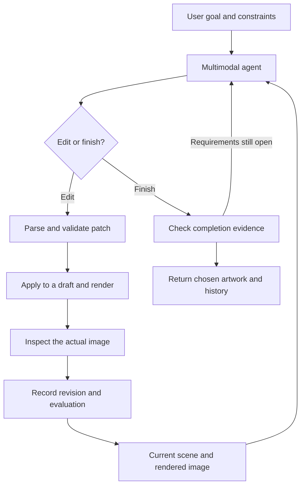
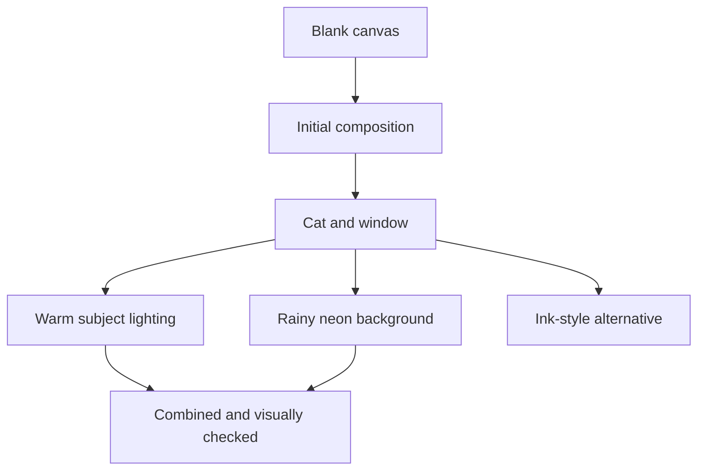

# Imagination: a Gene example project for versioned visual creation

**Status:** implementation design, version 0.2  
**Primary medium:** a structured SVG scene, converted through PDF to PNG for visual feedback  
**Core abstraction:** `Evolution[T]`, a proposed Gene type for inspectable, branching creation  
**First application:** an autonomous drawing agent that observes and edits its own work

## 1. Purpose

Imagination turns a creative request into a sequence of observable, editable states. A user supplies a goal through the web frontend or CLI. A multimodal model writes a small drawing patch in Gene notation. The application applies the patch to the current scene, serializes SVG, converts it to a single-page PDF, rasterizes that PDF into a clean PNG, sends the actual PNG back to the model, and repeats until the result satisfies the goal or an explicit limit stops the run.

Every useful intermediate state remains available. The user can inspect it, continue from it in another direction, restore selected objects from another version, and ask the AI to combine two directions. Combining versions means reconciling structure and creative intent, then checking the rendered result. It is more than overlaying two pictures or merging XML text.

The project demonstrates three Gene ideas together:

1. One node representation can describe artwork, edits, goals, observations, and history.
2. A small, validated interpreter can give an AI precise access to a persistent creative state.
3. Creation history can be a first-class value with domain-aware operations rather than a copy of a source-control program.

The architecture is reusable for documents, music, slides, UI, video, and 3D scenes. This example implements SVG first so that edits, identity, and replay have concrete semantics.

## 2. Scope and decisions

| Area | Decision for the first usable example |
| --- | --- |
| Artwork | Illustrations, posters, icons, diagrams, and stylized scenes built from SVG primitives |
| Authoritative state | A Gene scene tree with stable object IDs and explicit properties |
| Image output | Canonical SVG, single-page PDF, clean observation PNG, and thumbnail |
| Drawing | The model creates and modifies geometry; the renderer draws it |
| Agent | One multimodal model can plan, draw, critique, and propose merge resolutions |
| History | A Gene `Evolution` type with immutable revisions and named lines of development |
| Merge | Structural three-way comparison, explicit conflict handling, and visual verification |
| Storage | A self-contained project directory with a transactional index and immutable blobs |
| Interface | A working web frontend with prompt input, live previews, history, branching, comparison, merge, and restoration; CLI shares its backend |
| Conversion dependencies | Inkscape CLI for SVG to PDF; Poppler `pdftocairo` for PDF to PNG |
| Raster alternative | A separate adapter designed below; SVG is the required first implementation |

The SVG backend does not promise photorealism. It does not interpret “add a cat” as a hidden diffusion call. The AI must construct the cat using groups, paths, shapes, and colors. A later generative-image adapter can have different guarantees without weakening this backend's precision.

The application does not need Git commands, repositories, working-tree tracking, packfiles, or Git-compatible hashes. Project source code may live in an ordinary repository; the user's creative history is owned by `Evolution`.

## 3. Relationship to Gene

### 3.1 Representation and execution boundary

Use Gene's node structure throughout:

```gene
(head ^property value child1 child2)
```

The examples in this document are **serialized domain data**, read by a Gene parser. Their heads are schema tags, not arbitrary functions to execute. Strings containing IDs are intentional: `"cat"` is an object ID; a bare `#cat` would conflict with Gene's comment syntax.

`Evolution[T]`, `Revision[T]`, and `Media[T]` are conceptual type signatures in this design. They are proposed project/library types, not claims about existing generic syntax or built-in VM support. Implement them using the target Gene runtime's documented records, classes, or validated Gene values. Use a runtime media descriptor when compile-time generics are unavailable.

Keep actual application code idiomatic for the pinned Gene checkout. Do not introduce language keywords, require the planned Gene v2 shape/protocol system, or modify the VM just to build the example. A native optimized representation can be considered after the library API is working.

**Never evaluate model output as Gene code.** Parse one domain response, validate it, and dispatch only registered drawing operations. Homoiconicity gives the application a common representation; it does not give model-supplied nodes access to file I/O, imports, networking, macros, or `eval`.

### 3.2 Why a special type is useful

An `Evolution` value is an artwork together with its alternatives and provenance. It is not just a log attached to an otherwise mutable canvas. The public API should make revision-aware access natural:

```text
Evolution.create(media, initial_value, goal) -> Evolution
Evolution.value(revision_id) -> immutable T
Evolution.begin(revision_id) -> Draft[T]
Evolution.publish(draft, line?, expected_head?, review, decision) -> Publication[T]
Evolution.fork(revision_id, name, goal_delta) -> Line
Evolution.compare(left, right) -> Diff[T]
Evolution.plan_merge(left, right, base?, policy) -> MergePlan[T]
Evolution.materialize_merge(plan, resolution) -> Draft[T]
Evolution.restore(target, source, selection) -> Draft[T]
Evolution.replay(source_path, new_base, policy) -> ReplayPlan[T]
```

These signatures specify application behavior, not executable Gene syntax. A Gene implementation can expose equivalent names in an `imagination/evolution` namespace.

`Publication` contains the saved revision, whether a chosen line advanced, and any stale-head conflict. Publication always places a usable candidate on a trial reference; an accepted candidate advances the working reference in the same transaction when its expected head still matches.

## 4. The creative loop



An iteration is a meaningful change such as establishing composition, adding a subject, correcting its silhouette, or refining contrast. It may contain several related primitive operations. It should not contain an uncontrolled rewrite of the entire project.

Separate four things explicitly:

| Item | Meaning |
| --- | --- |
| Goal | What the user wants, including literal requirements and preferences |
| Observation | What the model reports seeing in a particular rendered artifact |
| Patch | Precisely executable changes to an identified scene revision |
| Evaluation | Whether the resulting artifact satisfies requirements and what remains open |

An observation is a concise report, not private chain-of-thought. Save short explanations and decisions that help the user understand the work.

## 5. Core data model

### 5.1 `Evolution[T]`

An evolution contains a media descriptor, a revision DAG, named development lines, goals, and a selected revision. Revisions are immutable; line heads and the user's selection are mutable references.

```gene
(evolution
  ^schema 1
  ^id "evolution-01"
  ^media "svg-scene/v1"
  ^root "r000"
  ^selected "r004"
  (line ^id "main" ^head "r004" ^goal "goal-01")
  (line ^id "watercolor" ^head "r003b" ^goal "goal-02")
  (line ^id "run-07-trials" ^head "r004-trial" ^goal "goal-01"))
```

The serialized value can reference separately stored revisions. A development line is a name pointing to a revision plus its active goal/policy. A fork records its origin without changing the originating line.

Operationally, `Evolution` is a typed handle to one owned history; assigning the handle does not fork it. `Revision` and scene snapshots are immutable values. A fork creates a new line in the same history; an explicit clone creates another history with new history identity. Revision identity is the pair of history ID and revision ID. Scene-content equality is a separate comparison of media identity and canonical snapshot bytes.

### 5.2 `Revision[T]`

Each revision records these layers:

| Layer | Required information |
| --- | --- |
| Materialized state | Complete validated scene snapshot and its content digest |
| Rendered state | SVG, PDF, clean observation PNG, thumbnail, renderer profile, and artifact digests |
| Change | Canonical patch, actual structural diff, and resolved operation effects |
| Meaning | User intent, current goal reference, short plan, and concise explanation |
| Evidence | Post-edit visual evaluation tied to the exact image digest |
| Provenance | Parent IDs, actor, run ID, model configuration reference, and creation time |

```gene
(revision
  ^schema 1
  ^id "r004"
  ^parents ["r003a"]
  ^kind "edit"
  ^goal "goal-01"
  ^scene "sha256:SCENE_DIGEST"
  ^patch "sha256:PATCH_DIGEST"
  ^render "sha256:ARTIFACT_BUNDLE_DIGEST"
  ^evaluation "sha256:EVALUATION_DIGEST"
  ^quality "accepted"
  ^actor "agent"
  ^run "run-07"
  ^created_at "2026-10-02T17:00:00Z"
  (intent "Make the cat readable against the dark city.")
  (summary "Added a warm outline and reduced skyline contrast."))
```

The digest strings above are placeholders, not valid stored hashes. Real artifacts use full digests. Revision IDs are independently generated opaque IDs; they need not be content hashes. Multiple revisions can share one scene digest while carrying different provenance.

A root has no parents. An ordinary edit has one. A merge has two ordered parents, `[left, right]`, and an explicit merge-base reference. The first parent defines the baseline for the stored executable patch; it does not silently win conflicts.

The root stores the initial scene and clean render with an empty creation patch and structural review. Its visual goal checks begin as `unknown`, so the blank root cannot complete a drawing request. Reserve a candidate revision ID before evaluation so the evaluation can bind to that ID; the ID remains unpublished until the storage transaction succeeds.

### 5.3 `Draft[T]` and attempts

A draft is an isolated mutable candidate based on an immutable revision. Model changes never mutate a stored scene. After validation, rendering, and evaluation, publish a new revision or retain a diagnostic attempt.

- A valid, rendered candidate is saved as a revision even when its quality is rejected. Keep it on the run's trial line so users can see the experiment.
- The chosen working line advances only to an accepted candidate, using compare-and-swap on its expected head.
- Invalid patches and render failures are `RunEvent` records with error data. They are not usable scene revisions.
- A valid snapshot whose evaluator timed out can remain a trial revision with `quality = "unreviewed"`; it cannot finish an autonomous run.

Do not rewrite an immutable revision to change its evaluation later. Store additional review events separately, each bound to that revision and artifact digest.

### 5.4 Immutability and identity rules

1. An existing revision never changes its scene, parents, patch, or original evaluation.
2. Appending requires all parents to exist; no operation can introduce an ancestry cycle.
3. Stored scenes are deeply immutable or exposed only as defensive copies.
4. IDs identify the same authored object across revisions; labels and appearances may change.
5. Deleting an object removes it from that scene, not from historical snapshots.
6. A genuinely new replacement receives a new ID and may record `derived_from` provenance.
7. Failed or cancelled runs preserve every already published revision.
8. Selecting, comparing, or exporting a revision does not alter it.

## 6. Goals, constraints, and creative intent

Convert the initial request to a visible goal record. Keep the original text. Distinguish explicit requirements from the agent's interpretation so the latter cannot quietly replace the former.

```gene
(goal
  ^id "goal-01"
  ^request "A cat at a window overlooking a rainy city at night."
  (requirement ^id "subject" ^strength "hard" ^check "visual"
    "Exactly one recognizable cat, sitting near the window.")
  (requirement ^id "window" ^strength "hard" ^check "visual"
    "A window separates the indoor subject from the city.")
  (requirement ^id "setting" ^strength "hard" ^check "visual"
    "The outdoor scene reads as a rainy city at night.")
  (requirement ^id "mood" ^strength "soft" ^check "visual"
    "Quiet and contemplative.")
  (requirement ^id "medium" ^strength "hard" ^check "structural"
    "All visible content uses the supported SVG subset.")
  (preference ^source "agent_interpretation"
    "Use a cool city palette and warm indoor accents."))
```

Literal text requirements also store exact strings and structural checks on text nodes. Visual evidence is still needed for readability, clipping, and overlap. Presence of a node labeled `cat` does not prove that a cat is visible.

Intent attached to a patch answers “what improvement is this meant to achieve?” It cannot authorize changes to protected objects or hard requirements. For example, “increase subject contrast” is useful evidence when merging a white-cat version with a dark-cat version.

A goal change creates a new immutable goal record with its predecessor and user instruction. Preserve the old goal. The effective goal for an agent run is pinned at run start; steering changes the run at a safe iteration boundary.

Support locks as part of the active policy:

```gene
(policy
  (lock ^target "cat" ^scope "identity")
  (lock ^target "title" ^scope "text")
  (limit ^name "max_iterations" ^value 12))
```

`identity` prevents removal, replacement, or reassignment of the object's semantic identity; ordinary geometry edits remain possible. `geometry`, `appearance`, `text`, and `subtree` locks protect the corresponding fields. Enforce them in the interpreter, including indirect changes through ancestors, shared paint resources, or reparenting. A lock is not merely a sentence in a prompt.

## 7. Authoritative SVG scene

### 7.1 Scene structure

The Gene scene is the source of truth. SVG XML is a derived artifact. Do not maintain an independent semantic scene and XML DOM that can drift apart.

```gene
(scene
  ^schema 1
  ^width 1024
  ^height 1024
  ^view_box [0 0 1024 1024]
  ^background "#111827"
  (defs)
  (g ^id "city" ^label "Night skyline" ^role "background"
    (rect ^id "building-01" ^x 80 ^y 160 ^width 200 ^height 520
      ^fill "#25324a"))
  (g ^id "window" ^label "Window frame"
    (rect ^id "frame" ^x 60 ^y 80 ^width 900 ^height 750
      ^fill "none" ^stroke "#d6c6a8" ^stroke_width 24))
  (g ^id "cat" ^label "Sitting cat" ^role "subject"
    ^translate [350 700] ^scale [1 1] ^rotate 0 ^pivot [0 0]
    (ellipse ^id "cat-body" ^cx 0 ^cy 0 ^rx 70 ^ry 110
      ^fill "#c8894b")
    (path ^id "cat-head" ^fill "#d99d5d"
      (M -50 -75) (L -48 -165) (L -15 -140)
      (L 15 -140) (L 48 -165) (L 50 -75) (Z))))
```

This is a schema example, not a claim that the pictured cat already meets the goal. The model must inspect its render.

Only `defs` and renderable top-level children occur under `scene`. SVG-only attributes are normalized into snake_case schema keys and mapped to XML names by the serializer. Labels, roles, intent, and provenance remain semantic fields; emit only optional safe `data-*` metadata, never treat them as drawing instructions.

Every renderable node and every reusable definition has an ID. A semantic object is usually a `g` with named children. The background is an explicit scene field, serialized as a reserved first rectangle. Its generated XML ID is outside the user-ID namespace.

### 7.2 Geometry, coordinates, and paint order

- The canvas origin is the top left; x increases rightward and y downward.
- Canvas coordinates use `view_box` user units. Default output dimensions are 1024 by 1024 pixels; the default view box matches them.
- Primitive geometry is in the local coordinate system of its parent.
- Child order is paint order: later children paint on top. No separate numeric z-index exists.
- A node has decomposed `translate`, `rotate`, `scale`, and `pivot` fields with defaults `[0 0]`, `0`, `[1 1]`, `[0 0]`.
- The local matrix is `T(translate) · T(pivot) · R(rotate) · S(scale) · T(-pivot)`. World matrices multiply ancestors in order. Rotation uses degrees with the SVG y-down convention.
- Setting a transform field replaces that field. A movement sugar changes translation in **parent-local** units. World-space movement requires an explicit conversion through the inverse ancestor matrix.
- Reparenting specifies either `preserve_local` or `preserve_world`. The latter is allowed only if the resulting matrix can be represented without shear in the decomposed transform schema; otherwise return a precise error. General affine matrices can be added in a later schema version.
- Default scale components must be positive. Zero, nonfinite numbers, and singular transforms are invalid. Mirroring is a future explicit operation.

The application provides local bounds, transformed world bounds, and optional raster-visible bounds. They are derived facts, not model-written scene properties. Geometric bounds can overestimate clipped or occluded content; do not claim they prove visibility.

### 7.3 Supported SVG subset

| Feature | Initial support |
| --- | --- |
| Structure | `svg` generated by the serializer, `g`, `defs` |
| Shapes | `rect`, `circle`, `ellipse`, `line`, `polyline`, `polygon`, `path` |
| Paths | Typed `M`, `L`, `C`, `Q`, `Z` commands with absolute local coordinates |
| Paint | Hex colors, `none`, opacity, fill/stroke opacity, stroke width, line cap/join, fill rule |
| Text | One line per `text` node, explicit baseline, bundled font ID, size, weight, anchor |
| Gradients | Linear/radial definitions with explicit user-space coordinates and ordered stops |
| Clipping | `clipPath` definitions referenced by ID; reference graph must be acyclic |
| Effects | A constrained Gaussian blur definition after basic rendering is stable |
| Deferred | Animation, embedded images, external resources, CSS selectors, patterns, arbitrary filters, `use`, and `foreignObject` |

Gradient stops are child values, each with an ID, offset in `[0,1]`, color, and opacity. Blur effects use bounded explicit filter regions. Clip definitions and paint references use schema fields such as `fill_ref` or `clip_ref`; the serializer produces local fragment URLs. A color and its corresponding reference cannot both be set.

Specify per-element attribute allowlists in `scene_schema.gene`. Reject unknown fields, unknown heads, duplicate properties, duplicate IDs, malformed path arity, dangling references, children of noncontainer elements, and nonfinite numbers. Escape all XML and text content. Never concatenate model-authored XML fragments into an SVG.

Do not accept scripts, event handlers, arbitrary URLs, entities, or document-type declarations. Render in a resource-bounded process without network access. These restrictions are part of the executable scene format, not an extra product approval step.

### 7.4 Canonicalization and rendering

Canonical Gene serialization must be versioned. Preserve child order; sort property names; normalize finite numeric values and `-0`; write strings with one specified escaping scheme. Use locale-independent round-trippable number formatting rather than silently rounding geometry. Reject NaN and infinity. Semantic fields remain in the scene digest even if they do not affect pixels.

SVG serialization is likewise deterministic: fixed namespace, fixed root attributes, stable element/attribute ordering, and no timestamps. Model-generated scenes do not use inherited CSS; primitive paint and typography values are explicit so hidden cascades do not complicate diffs.

The default renderer profile is `inkscape-pdf-poppler/v1`: Inkscape converts canonical SVG into PDF, and Poppler rasterizes its first and only page to PNG. Pin both executables and relevant native dependencies. Bundle fonts, record their hashes, isolate font discovery, and fail on missing required fonts rather than accepting system-font substitution. Record output size, color space, transparency handling, conversion flags, and engine versions.

An optional `resvg-direct/v1` profile renders SVG directly to PNG for performance and fidelity comparisons. A direct Inkscape PNG profile can also be used for diagnostic comparison without adding another executable. Switching profiles is explicit; never silently fall back to another renderer while keeping the old profile identity.

Replaying a stored scene reproduces the same canonical SVG exactly. Pixel-identical PNG replay is required only within the same pinned render profile. Generated PDF bytes may contain varying metadata and are not required to be byte-identical across repeated conversions. Store the original PDF with its digest and identify rendered inputs by their actual artifact digests. A renderer upgrade creates new render artifacts and a new profile; it does not silently rewrite the old evidence.

### 7.5 SVG to PDF to PNG: purpose and quality

PNG is the model's visual observation format. Its pixels reveal what was actually drawn: positioning, clipping, overlap, typography, and contrast. Sending SVG source alone only lets the model reason about instructions; it does not close the visual feedback loop.

The PDF intermediate supplies a printable vector artifact and access to a mature PDF rasterizer. It is **not inherently a quality improvement** over direct SVG rasterization. That is an engineering judgment based on the two-stage pipeline, not a guarantee made by the tools. Export can outline text and rasterize unsupported effects before Poppler sees them; quality depends on the exporter, supported SVG subset, fonts, antialiasing, and final pixel dimensions. Compare the same fixtures at the same resolution before claiming one profile is better.

Keep the original scene and SVG authoritative. The PDF is a derived artifact, not a new editable scene. Ordinary vector geometry can remain vector until the PNG stage; rasterized PDF effects cannot regain detail simply by requesting a larger final PNG.

### 7.6 Rendering dependencies and installation

| Dependency | Role | Required for default pipeline? |
| --- | --- | --- |
| Inkscape executable | Headless SVG-to-PDF conversion, font shaping, vector export | Yes |
| Poppler `pdftocairo` | PDF-to-PNG rasterization with explicit dimensions and antialiasing | Yes |
| Poppler `pdfinfo` | Verify page count and PDF page geometry | Yes |
| Bundled font files and isolated font configuration | Stable text layout and glyph availability | Yes when artwork contains text |
| Poppler `pdftoppm` | Alternative PDF rasterizer under a separate profile | Optional |
| resvg | Direct SVG-to-PNG comparison profile | Optional |
| Python 3 plus `Pillow` for the reference PNG helper | Decode/validate dimensions, generate thumbnails, return detail crops | Yes for the reference helper; a native image adapter may replace it |

The default conversion requires no diffusion model or GPU. Invoke the native tools from Gene through a bounded process adapter. Their installation supplies their native dependencies; the application does not need ImageMagick, Ghostscript, or ReportLab for this route. The small Python/Pillow helper performs image decoding/cropping/thumbnail operations only; the scene interpreter, history, agent loop, and merge engine remain in Gene.

Typical installation commands:

```bash
# macOS with Homebrew
brew install --cask inkscape
brew install poppler

# Ubuntu/Debian
sudo apt-get update
sudo apt-get install -y inkscape poppler-utils

# Reference PNG helper, with Python 3 already available
python3 -m venv .venv
.venv/bin/python -m pip install Pillow
```

These are setup instructions for the eventual implementation, not commands the application runs automatically. On macOS, if the cask does not expose an `inkscape` command on PATH, configure `inkscape_path` to the installed app's CLI executable. Verify that executable's availability rather than assuming a symlink exists. Fonts are project dependencies and must be bundled or resolved explicitly on both platforms.

Pin the helper dependency in a requirements/lock file after validating it. Use the configured virtual-environment Python path for host image operations rather than the user's global package installation.

Add `imagination doctor` to check configured paths, tool versions/required flags, font availability, a one-page conversion fixture, PNG decoding, and multimodal image transport. Save successful version/fixture results in the project render-profile manifest. Missing dependencies produce an actionable setup error before a drawing run starts.

### 7.7 Conversion commands and renderer contract

For an illustrative 1024-by-1024 canvas, the default adapter invokes the equivalent of:

```bash
inkscape scene.svg \
  --export-type=pdf \
  --export-area-page \
  --export-text-to-path \
  --export-dpi=300 \
  --export-filename=scene.pdf

pdfinfo scene.pdf

pdftocairo -png -singlefile -f 1 -l 1 \
  -scale-to-x 1024 -scale-to-y 1024 \
  -antialias best \
  scene.pdf observation
```

The PNG is `observation.png`; `-singlefile` avoids a page-number suffix. The examples are human-readable commands. The implementation uses fixed executable paths and argv arrays, a unique staging directory, a controlled font environment, no shell interpolation, bounded subprocesses, and checked exit codes. PDF conversion remains a server operation, not work performed by the frontend browser.

`--export-area-page` preserves the requested canvas, including whitespace. Do not crop to drawing bounds: that changes the frame the model is evaluating. Require one PDF page and an aspect ratio matching the canvas. SVG dimensions are explicit CSS pixels; their conversion into PDF points is verified, while the final PNG dimensions are requested directly. PNG clarity is governed by pixel dimensions rather than a “300 DPI” metadata label.

`--export-text-to-path` outlines text in the derived PDF for stable glyph appearance; it does not change the scene's editable text nodes or canonical SVG. The PDF then need not expose searchable text. If searchable PDF export is later required, use a separately tested profile with embedded fonts.

`--export-dpi=300` controls bitmap/filter rasterization during export, not the final PNG dimensions. Treat it as a configurable starting value. Raise it only when the requested PNG size and effect fixtures justify it, under limits on decoded filter-surface size and process memory. Do not use `--export-ignore-filters` to make a failed conversion appear successful.

Default observation PNGs are opaque, with the scene background explicitly painted. For transparent artwork, save an RGBA PNG using a dedicated profile (`pdftocairo -transp`) and also produce the model's viewing PNG against a named matte color. Record both artifacts and the matte; evaluation binds to the image actually submitted to the model. Do not depend on a provider's unspecified alpha handling.

### 7.8 Artifact bundle and model handoff

`ArtifactBundle` contains canonical SVG, the exact generated PDF, the clean observation PNG, its width/height and digest, a thumbnail, optional detail crops, and a render manifest. The manifest records scene digest, profile/configuration digest, executable versions, font hashes, canvas/PDF geometry, every conversion stage's status, and artifact digests.

Use a default 1024-pixel longest edge for full-image observation, preserving aspect ratio. Allow an explicitly configured 2048-pixel profile for small text or fine detail when supported by the model adapter. Never stretch a rectangular canvas into a square. Calculate positive integer output dimensions once, record the rounding rule, and verify the decoded PNG dimensions. Record the view-box-to-PNG transform, including any `preserveAspectRatio` letterboxing, so detail crop coordinates map correctly. Exact pixel differences are compared only under the same profile and dimensions.

The model adapter reads the saved PNG bytes and submits them as `image/png` through the provider's image-capable API (binary upload or an encoded image payload). A local path or browser URL is not visual input unless the provider explicitly supports and can retrieve that resource. Record the original artifact digest and any preprocessing performed by the adapter. Do not send a browser screenshot with controls, selection handles, or revision thumbnails as the artwork observation.

For detail inspection, provide the full clean image plus a crop with its source artifact digest, canvas-space rectangle, and pixel mapping. Crop from the canonical PNG for ordinary inspection. A new higher-resolution render is a separately identified artifact and must state its render profile. The frontend's “Model view” displays the submitted source image and adapter transformation details; provider-internal resizing may still be outside application control.

### 7.9 Rendering verification

Before accepting the pipeline for the supported SVG subset, verify text, thin strokes, gradients, transparency/matte handling, clipping, transforms, and blur. Compare PDF-derived PNGs against direct SVG export at identical sizes. Inspect visible appearance as well as page/dimension checks; a valid PDF file does not prove faithful artwork.

A small fixture was checked while preparing this revision: Inkscape 1.2.2 exported SVG to a single-page PDF, Poppler `pdftocairo` 24.02.0 produced an 800-by-600 PNG, and direct Inkscape PNG export was inspected alongside it. Both showed the expected text, gradient, clipped shapes, and blur. This confirms the basic command route in that environment; it does not establish universal quality superiority or replace the project's full regression fixtures. Pin tested deployment versions rather than treating these test versions as a recommendation to install old releases.

## 8. Drawing language and interpreter

### 8.1 Patch envelope

The model emits a patch against one exact revision. A patch is an atomic transaction: either every operation succeeds or no scene change is published.

```gene
(patch
  ^schema 1
  ^id "patch-07"
  ^base "r003a"
  ^goal "goal-01"
  (intent "Strengthen the subject without changing the composition.")
  (set ^target "cat-body" ^field ["fill"] ^value "#db9b60")
  (move ^target "cat" ^delta [-24 0] ^space "parent")
  (scale_by ^target "cat" ^factor [1.08 1.08])
  (set ^target "city" ^field ["opacity"] ^value 0.8))
```

The image and its authoritative revision are a pair. Do not apply a patch to a newer scene because the names happen to match. Reject a stale base and request a refreshed proposal or preserve it as a separate historical experiment.

A normal patch has `base` referencing a stored revision. A patch used during merge preparation instead has `base_draft` and `base_scene`, identifying an application-issued draft ID and its current canonical scene digest. Exactly one base form is allowed. A draft patch is accepted only inside its owning operation, against that exact digest; it does not authorize mutation of an arbitrary stored revision.

### 8.2 Operations

| Operation | Required inputs | Semantics |
| --- | --- | --- |
| `add` | parent, placement, one complete node | Insert a new validated subtree; every ID must be new |
| `remove` | target | Remove the target subtree; fail on remaining incoming resource references |
| `set` | target, field path, value | Replace a permitted attribute or semantic field with a typed value |
| `unset` | target, field path | Remove an optional property; required fields and IDs cannot be removed |
| `replace_geometry` | target, geometry | Replace a primitive's geometry, preserving ID, kind, and semantic identity |
| `move` | target, delta, space | Resolve a translation change; default space is parent-local |
| `scale_by` | target, factor | Multiply decomposed scale components; pivot stays fixed |
| `rotate_by` | target, degrees | Add to decomposed rotation; pivot stays fixed |
| `reparent` | target, parent, placement, mode | Move a subtree; reject cycles and unrepresentable transforms |
| `order` | target, placement | Change sibling paint order using stable neighbor IDs |
| `set_canvas` | one permitted canvas field, value | Change dimensions, view box, or background explicitly |

Placement is exactly one of `first`, `last`, `before <sibling-id>`, or `after <sibling-id>`. The neighbor must belong to the requested parent. `set` cannot modify `id`, node kind, parent, child list, or arbitrary fields. Field paths are arrays of property names and optional component indices, such as `["translate" 0]`; do not evaluate them as Gene selectors.

Path command sequences are one atomic geometry field for the first implementation. Concurrent edits to different control points of the same path are therefore a conflict rather than an unsafe index-based merge. Finer topology-aware path merging can be added later.

`replace_geometry` cannot turn an ellipse into a path or silently substitute a different semantic subject. A shape-kind change is an explicit removal/addition with a new ID and provenance. Replacing a semantic object's internal primitives can preserve the group's identity while assigning new IDs to the replacement children.

Example addition:

```gene
(add ^parent "cat" ^placement (last)
  (path ^id "run07-rim" ^fill "none" ^stroke "#ffd49a"
    ^stroke_width 4 ^opacity 0.7
    (M -50 -75) (Q -90 -5 -60 80)))
```

Object IDs supplied by the model must use an allocated project/run prefix for new objects. Reserve the prefix before the model call. Existing objects keep their existing IDs. The application validates uniqueness across the project allocation registry, so two independent forks cannot accidentally create the same identity. Friendly labels can repeat.

Two runtime-owned mechanisms complement model `add`: `attach_snapshot` imports a validated subtree from a pinned source revision with proven lineage, and exact replay reuses an original patch's allocation record. These mechanisms allow historical restoration and importing B's additions into a merge based on A. They still pass the same scene, lock, reference, and transaction checks. They are not accepted in ordinary model responses. An ID may be absent from the target scene while already belonging to the same historical object; this is different from allocating a new identity.

### 8.3 Normalized effects and dependency footprints

Resolve convenience operations into absolute effects at application time. For example, a movement stores the before/after translation and coordinate conversion used. A normalized patch is applicable to its exact base; it is not automatically portable to another geometry.

For every operation, record:

```gene
(effect
  ^operation_index 1
  ^target "cat"
  ^field ["translate"]
  ^before [350 700]
  ^after [326 700]
  ^reads ["cat.translate" "cat.parent"]
  ^writes ["cat.translate"])
```

Real footprints use structured keys, not dotted strings. Include hierarchy, sibling order, resource references, and relevant ancestor transforms. The runtime computes these sets; model-supplied declarations are advisory only.

Store both the original operation and its normalized effect. The original expresses intent useful for adaptive replay; the normalized effect supports exact replay and verification. Also compute an actual before/after structural diff to detect unexpected implementation behavior.

### 8.4 Interpreter sequence

1. Parse exactly one allowed node, with limits on bytes, nesting, children, and string length. Reject executable reader extensions and duplicate properties.
2. Validate the envelope, revision, goal, operation count, and new-ID allocation prefix.
3. Obtain an isolated draft from the exact base snapshot.
4. Apply operations in order, resolving each against the current draft. Later operations may reference nodes added earlier in the same transaction.
5. Validate field types and locks before each write. Validate the complete scene, all references, and resource limits after the batch.
6. Canonicalize, compute the scene digest and structural diff, serialize SVG, and rasterize.
7. Evaluate the actual resulting image or mark the candidate unreviewed if evaluation fails.
8. Publish the immutable revision and atomically advance only the permitted line references.

A batch may temporarily have unresolved references that are repaired before step 5 finishes. It cannot bypass locks or read a missing object. Removing referenced resources requires removing or changing their consumers in the same batch.

Return typed errors with operation index, target, field, and expected condition. Do not partially publish a batch or ask the model to infer a failure from a generic error string.

## 9. Multimodal agent protocol

### 9.1 Input package

Every drawing decision receives:

- Original user request, effective goal, active locks, and iteration/cost limits.
- Exact current revision ID and complete canonical image digest.
- The current full PNG, rendered without inspection labels or UI overlays.
- A bounded scene summary listing IDs, kinds, roles, positions, important text, and resources.
- Relevant scene subtrees when more geometry is needed.
- The previous patch and evaluation, unresolved issues, and a short history summary.
- The operation schema and the allocated prefix for new IDs.

For a large scene, retrieve subtrees by ID through an application-controlled inspection request or include them in the next input. Inspection is read-only and does not create an artwork revision. Use full canonical scene text while it fits; switch to bounded summaries before overflowing context.

The model must receive actual pixels through the configured provider's supported multimodal transport, not only the SVG source or a filename. An adapter incapable of sending images fails startup validation. When output is larger than the standard preview, inspect requested detail crops as well as the full composition.

An optional labeled inspection image can help map pixels to IDs. It is a separate artifact clearly identified as an overlay and can never replace the clean image used to judge the artwork.

### 9.2 Output package

```gene
(agent_response
  ^schema 1
  ^observed_revision "r003a"
  ^observed_image "sha256:IMAGE_DIGEST"
  ^action "edit"
  (observation
    (issue ^target "cat" ^severity "major"
      "The cat silhouette blends into the skyline."))
  (plan "Increase subject contrast with a small geometry-preserving edit.")
  (patch
    ^schema 1 ^id "patch-07" ^base "r003a" ^goal "goal-01"
    (intent "Keep the night mood while making the cat readable.")
    (set ^target "cat-body" ^field ["fill"] ^value "#db9b60")))
```

Allow a small discriminated union:

| Action | Payload | Runtime behavior |
| --- | --- | --- |
| `edit` | Observation, concise plan, patch | Validate and execute a candidate |
| `inspect` | Object IDs or crop rectangles | Return bounded scene/crop data; no artwork mutation |
| `done` | Evaluation evidence, summary | Independently enforce completion rules |
| `blocked` | Concrete issue and remaining requirements | Stop with the best available revision and an honest status |

Only one action appears in a response. The observed revision and image digest must match the input. Reject unknown nodes and surplus executable content. If structured model output is available, it may transport this union, but the canonical saved representation remains Gene data.

### 9.3 Prompt contract

The application prompt should say, in substance:

> You are drawing through the supplied operation schema. Inspect the clean image and compare it with the user's requirements. State only the visible issues relevant to the next decision. Prefer a small coherent edit. Preserve stable IDs, protected fields, and already satisfied requirements. Produce one valid response node. Labels and intent do not prove visual success. Request inspection when information is missing. Finish only when the current rendered image satisfies every hard requirement. If the medium or budget prevents completion, report that limitation.

Keep the operation reference machine-generated from the same schema used by the interpreter. Prompts, validation, and documentation should not maintain three divergent lists of allowed fields.

### 9.4 Provider boundary

Define a narrow injected adapter:

```text
VisionAgent.decide(input_bundle, response_schema, budget) -> AgentResponse
VisionAgent.evaluate(image_bundle, goal, prior_evaluation?) -> Evaluation
VisionAgent.resolve_merge(merge_bundle, response_schema) -> MergeResolution
```

One configured multimodal model may implement all three. An independent evaluator is an optional quality improvement, not a requirement. Never imply that two calls to the same model constitute independent verification.

The adapter owns authentication, image transport, bounded retries, timeouts, and usage accounting. Gene owns the creative loop, state, validation, and merge policy. Use host bridges for transport or rasterization where needed; they must not own a second hidden history or mutate scenes behind Gene's back.

## 10. Evaluation, acceptance, and stopping

### 10.1 Evaluation record

```gene
(evaluation
  ^schema 1
  ^revision "r004"
  ^image "sha256:IMAGE_DIGEST"
  ^goal "goal-01"
  ^render_profile "inkscape-pdf-poppler/v1"
  ^structural_valid true
  (check ^requirement "subject" ^result "pass"
    ^evidence "One sitting cat is visible in the foreground.")
  (check ^requirement "window" ^result "pass"
    ^evidence "The frame separates the interior from the city.")
  (check ^requirement "setting" ^result "pass"
    ^evidence "Dark buildings and diagonal rain marks read as a rainy night.")
  (check ^requirement "medium" ^result "pass"
    ^evidence "The scene passes svg-scene/v1 validation.")
  (check ^requirement "mood" ^result "partial"
    ^evidence "The bright city signs still dominate attention.")
  (issue ^severity "minor" ^target "city"
    "Reduce visual competition from the skyline.")
  (summary "The core scene is complete; the atmosphere could be quieter."))
```

Results are `pass`, `partial`, `fail`, or `unknown`. Structural checks are computed by the application. Visual checks are judgments with cited visible evidence, not calibrated probabilities. Optional numeric quality scores support ranking experiments but cannot establish a hard requirement by themselves.

### 10.2 Candidate acceptance

During construction, an incomplete candidate may be accepted if it makes meaningful progress, introduces no new hard failure in an already satisfied requirement, and respects locks. Compare with the preceding accepted state. Use an explicit quality policy and save the decision explanation.

If a candidate regresses, save it as a trial and continue from the previous accepted revision. Permit a deliberate temporary regression only under a bounded multi-step plan that the policy allows; do not let the agent excuse indefinite deterioration.

There can be aesthetic alternatives with no total ordering. Keep a small set of non-dominated candidates and let the user compare them. The default loop keeps one chosen working candidate for simplicity.

### 10.3 Completion rule

`done` is accepted only when:

1. The exact current render has a successful structural validation and completed visual evaluation.
2. Every hard requirement passes; `unknown` is not a pass.
3. No unresolved major issue, merge conflict, stale goal, or protected-field violation exists.
4. Soft preferences meet the configured target or the result explicitly reports the remaining shortfall.
5. The completion evaluation is bound to the selected revision, image digest, effective goal, and render profile.

A `done` response can serve as the final visual evaluation if it contains the complete schema and the adapter actually received that exact image. Otherwise request a separate final evaluation. Do not call a model repeatedly solely to obtain agreement with an earlier claim.

Budget exhaustion is not success. Distinguish `complete`, `partial`, `no_progress`, `cancelled`, and `failed`. Return the best saved image, remaining issues, and stop reason for every terminal outcome.

### 10.4 Default budgets and progress detection

Start with configurable defaults: 12 edit iterations, 3 consecutive rejected/no-op candidates, 2 repair responses per invalid proposal, 4 consecutive inspection actions, 50 operations per patch, and one active drawing run per development line. Also configure total model usage, wall time, renderer timeout, maximum scene complexity, and output bytes.

Hashing detects exact no-ops and repeated scene states. Evaluation detects unresolved recurring issues. Stop or deliberately fork a new direction when the agent oscillates between a small set of states. A rejected render still consumes budget.

Persist run progress after every published revision. On resume, use saved artifacts and run state; do not silently repeat completed model calls or pretend a cancelled call completed.

### 10.5 Loop pseudocode

```text
run = start_run(line, pinned_goal, budgets)
current = load(line.head)
best = choose_best_saved_candidate(current, pinned_goal)

while run.has_budget() and not run.cancelled:
    decision = agent.decide(bundle(current, run))
    verify_observed_artifact(decision, current)

    if decision.action == inspect:
        supply_bounded_inspection(decision)
        continue
    if decision.action == blocked:
        return finish(run, best, partial, decision.issue)
    if decision.action == done:
        review = final_review(current, decision)
        if completion_passes(review):
            return finish(run, current, complete, review)
        give_feedback(review)
        continue

    candidate = validate_apply_and_render(current, decision.patch)
    review = agent.evaluate(candidate.image, pinned_goal)
    accepted = accept_candidate(current, candidate, review, pinned_goal)
    publication = publish_candidate(
        current, candidate, review, run, line,
        expected_head=current.id, accepted=accepted)
    if publication.stale_head:
        return finish(run, best, partial, "Working line changed during the run")
    if publication.line_advanced:
        current = publication.revision
        best = update_best(best, current, pinned_goal)
    else:
        give_feedback(review)

return finish(run, best, actual_stop_status(run), remaining_issues(best))
```

An exhausted repair budget or render failure is handled by typed error paths around the candidate stage. A visual evaluation timeout produces an unreviewed trial. If a line-head compare-and-swap fails, stop advancing that line and preserve the candidate; restart from the new head only after obtaining a fresh decision.

## 11. Inspecting and continuing history

### 11.1 History view

Display the revision DAG with thumbnails. Selecting a node reveals its clean image, goal, short intent, operations, actual diff, evaluation, and parent relationships. Show rejected trials as optional exploration nodes rather than quietly deleting them.

Use ordinary creative language in the UI:

| User action | Evolution operation |
| --- | --- |
| See this step | Read a revision and its artifacts |
| Continue from here | Fork at that revision and start a new run |
| Try another direction | Fork with a new goal record |
| Compare | Structural diff plus visual comparison |
| Combine these versions | Plan and verify a semantic merge |
| Restore this part | Create a new revision using selected source fields/subtrees |
| Apply later improvements here | Adaptive replay from a corrected base |



Clicking an older revision changes the viewing selection, not a working line. Continuing from an older revision creates a new line by default, so future work on the existing line remains visible. Undo/redo can move the viewer through history; resuming edits from an earlier step follows the same fork rule.

### 11.2 Visual and structural diff

A `Diff` contains changes grouped by stable ID and field: additions, removals, attribute changes, geometry changes, reparenting, and paint-order changes. Include semantic metadata changes separately from pixel-affecting changes.

Render side-by-side images and an optional slider/heat map. Compare pixels under the same output profile; otherwise flag the profile difference and rerender comparison artifacts without replacing originals. A heat map is a diagnostic, not evidence that the semantic meaning changed.

The AI can explain the diff using images and computed structure: “The cat moved 24 canvas units left, became 8% larger, and gained a warmer outline.” Attribute exact numbers to the interpreter. Do not present a visual estimate as an exact structural measurement.

## 12. Three-way semantic merge

### 12.1 Merge inputs and base selection

Merge takes left revision `A`, right revision `B`, and common base `O`. Compute `diff(O, A)` and `diff(O, B)` from full snapshots, not just edit-message summaries. An intent can describe an attempted change that did not actually occur.

Find maximal common ancestors in the revision DAG. If exactly one exists, use it. If there are several incomparable bases, return `ambiguous_base`; the initial implementation requires an explicit chosen base or a reviewed synthesized base. Do not select whichever ID sorts first. If histories are unrelated, use a separately named composition/transplant operation with explicit object mapping; do not pretend it is an ordinary three-way merge.

```gene
(merge_request
  ^left "r003a"
  ^right "r003b"
  ^base "r002"
  ^goal "goal-merge-01"
  (instruction
    "Keep A's readable cat and B's rainy night atmosphere."))
```

The effective merge goal includes current explicit user requirements and selected branch intentions. If branch goals disagree on a hard requirement, record a goal conflict before drawing. An agent-created compromise cannot override a user's explicit “white cat” requirement.

### 12.2 Structural merge rules

Use an explicit missing-value marker internally. A missing field differs from a field containing `nil` or an empty string. For a mergeable atomic field, apply:

| Relative to base | Resolution |
| --- | --- |
| Neither side changed | Keep base |
| Only A changed | Take A |
| Only B changed | Take B |
| Both changed to the same canonical value | Take that value |
| Both changed differently | Record conflict |

Additional rules:

- Delete/delete resolves to deletion. Delete versus an unchanged subtree resolves to deletion.
- Delete versus any edit, new descendant, reparenting, or new incoming reference is a conflict.
- Concurrent additions with different globally allocated IDs can coexist, subject to ordering and visual review.
- A duplicated ID with divergent lineage is an identity conflict, never proof of object equivalence.
- Distinct fields may combine, but cross-field invariants still require validation.
- Path geometry is atomic in v1. Transform components can merge separately, subject to parent-space dependency conflicts.
- An ancestor transform or reparenting on one side plus dependent descendant geometry edits on the other is marked for semantic review even if the immediate field keys differ.
- Resource deletion/modification versus new consumers, and edits to locked effective appearance through a resource, require conflict/dependency handling.

For ordering, represent actual reordered IDs with before/after relations derived from stable anchors. Merge only changed order constraints plus unchanged base constraints not explicitly displaced by either side. Topologically sort the resulting sibling constraints, using base order and then stable new-ID order only for unconstrained ties. A cycle or incompatible parent assignment is a conflict. Record tie choices, since paint order can affect appearance even when the ordering graph is satisfiable.

This produces an initial merged scene, a conflict list, and a dependency/visual-risk list. Structural nonconflict does not prove visual independence.

For a preview, unresolved atomic conflicts temporarily retain the left value and are visibly marked as unresolved in the plan, never as a final resolution. If hierarchy/resource conflicts prevent any valid provisional scene, send base/A/B images without a provisional render and resolve those conflicts first. Render only validated drafts. Reserve fresh ID allocation for synthesized additions before each model call.

### 12.3 Conflict record and merge plan

```gene
(merge_plan
  ^schema 1
  ^id "merge-plan-01"
  ^base "r002" ^left "r003a" ^right "r003b"
  ^goal "goal-merge-01"
  ^status "needs_resolution"
  (take ^source "left" ^target "cat" ^scope "geometry")
  (take ^source "right" ^target "city" ^scope "subtree")
  (conflict
    ^id "conflict-01" ^kind "field"
    ^target "cat-body" ^field ["fill"]
    ^base "#c8894b" ^left "#f7edd8" ^right "#161c2c"
    (left_intent "Make the subject readable against the dark background.")
    (right_intent "Preserve a mysterious night silhouette.")))
```

Every conflict has stable ID, kind, affected objects/fields, base/left/right values or snapshot references, dependencies, relevant locks/requirements, and proposed resolutions. A plan is reviewable data; it is not a completed merge revision.

### 12.4 AI resolution

Give the model the clean base, A, B, provisional merge image, computed diffs, conflict records, relevant subtrees, intentions, and effective goal. Label each image explicitly. The model returns a constrained `merge_resolution` with a decision for every conflict and an optional patch against the provisional scene digest.

```gene
(merge_resolution
  ^schema 1 ^plan "merge-plan-01"
  ^draft "merge-draft-01" ^scene "sha256:PROVISIONAL_SCENE_DIGEST"
  (resolve ^conflict "conflict-01" ^decision "synthesize" ^operations [0 1 2]
    (explanation "Keep a dark silhouette and recover readability with an outline."))
  (patch
    ^schema 1 ^id "merge-patch-01"
    ^base_draft "merge-draft-01" ^base_scene "sha256:PROVISIONAL_SCENE_DIGEST"
    ^goal "goal-merge-01"
    (intent "Preserve atmosphere and subject readability.")
    (set ^target "cat-body" ^field ["fill"] ^value "#161c2c")
    (set ^target "cat-body" ^field ["stroke"] ^value "#9ac8ef")
    (set ^target "cat-body" ^field ["stroke_width"] ^value 4)))
```

Bind a synthesis decision to its affected operations; an explanation without an executable value/change does not resolve a conflict. Validate the plan ID, draft digest, complete conflict coverage, and each operation's scope. Additional coherence edits can affect other unlocked fields only when explicitly listed and justified in the merge plan.

Allowed decisions are `take_left`, `take_right`, `take_base`, `synthesize`, or `defer`. A synthesis must state which intentions it preserves and which it sacrifices. The interpreter validates all generated operations, checks locks, and recomputes the actual change. Never let free-form merge commentary bypass the ordinary drawing interpreter.

For the cat-color example, the model may synthesize a dark cat with a brighter outline. That can preserve B's atmosphere and A's readability if color itself is not a hard requirement. It is a new artistic choice, not an exact preservation of both source appearances.

When goals are ambiguous or incompatible, preserve the unresolved plan and optionally create alternative candidate revisions. Ask for the user's creative choice through the UI rather than inventing a preference. Obvious independent changes can be automatically combined and checked without interrupting the user.

### 12.5 Materialization and verification

1. Apply deterministic field resolutions and resolved ordering.
2. Apply validated AI synthesis operations; track source provenance per object/field.
3. Validate the complete scene and reference graph.
4. Render the merge and inspect it against the effective goal and preservation obligations.
5. If needed, perform at most a configured number of repair edits on the provisional merge, preserving the selected source decisions.
6. Publish a merge revision only when all structural conflicts are resolved. A valid unresolved preview can be saved as an ordinary trial revision based on A with a merge-plan reference. A structurally resolved but visually poor combination can be a two-parent trial merge.
7. Advance the target line only when the result passes its acceptance policy.

The merge revision stores `[A, B]` as parents, `O` as merge base, the resolution record, source-selection/synthesis provenance, and the executable normalized patch **from A to the final merged snapshot**. Verify applying that patch to A reproduces the saved scene digest. Also store `diff(B, merged)` for comparison; do not claim one patch is executable against both parents.

If repair edits occur before publication, keep their drafts and run events; optionally expose them as trial revisions. The final merge revision remains a truthful two-parent combination. Subsequent ordinary refinements have the merge revision as their single parent.

### 12.6 What merge must not claim

A renderer can combine fields exactly. AI evaluation can still be wrong about visual coherence. Use statuses that distinguish structurally merged, visually reviewed, and user accepted. Do not claim intentions were preserved merely because both intent strings were copied into metadata.

An exact field conflict is not the only problem. Independently added objects can overlap, a background can reduce subject contrast, and a new composition can break typography. These issues are detected by dependency analysis and the rendered-image loop.

## 13. Partial restoration and transplantation

“Keep this version, but restore the cat from an earlier step” creates a new revision based on the current target. It does not change either source revision.

Selections are explicit: an object's complete subtree, geometry, appearance, text, transform, or a list of field paths. Expand referenced gradients, clips, and other required definitions into a dependency closure. Record the exact expansion so “restore appearance” cannot silently import an unrelated background.

```gene
(restore_request
  ^target_revision "r010"
  ^source_revision "r007"
  ^target_object "cat"
  ^source_object "cat"
  ^scope "geometry"
  ^placement_policy "keep_target_transform")
```

An object that existed in both revisions preserves its identity. A subtree resurrected from history reuses its historical IDs if those IDs are absent from the target. A copied independent duplicate receives freshly allocated IDs and an explicit mapping. Never equate unrelated objects only because both have the label “cat.”

Geometry restoration keeps the current transform by default. Complete-subtree restoration explicitly chooses source-local, source-world, or target-placement behavior. If the selected geometry/resource references cannot be installed safely, return a conflict and request a resolution.

Finish with the same render/evaluate loop as other edits. A source cat may look excellent in its original composition and poor in the target composition.

Selecting the character from A, the background from B, and the composition from C is a multi-source transplant. Store the selected sources and dependency mapping as provenance. In v1, the resulting revision has the target as its sole parent and source revision references in its derivation record; it is not mislabeled as a two-parent merge. More general multi-parent revision semantics can be introduced later.

## 14. Replay and adapting later improvements

Distinguish three operations:

| Operation | Guarantee |
| --- | --- |
| Exact replay | Reapply stored normalized operations to their exact recorded bases, without a model call |
| Re-evaluate | Inspect a saved artifact with a new reviewer; do not alter its scene/history |
| Adaptive replay | Reapply the intentions of later edits onto a different base, potentially generating new geometry |

Exact replay verifies scene digests at every step. It never calls the model, even if the model name and seed were saved. Model calls are not guaranteed to reproduce the same output later.

For adaptive replay, the user chooses a linear source path and a new base. For each source edit, compare its old preconditions with the new current state. Apply its original operation only if its dependency footprint and goal remain compatible; otherwise propose a new patch using the saved intent, old before/after images, and new image. Render and evaluate each new state.

For example, after correcting the cat's proportions at an early revision, reapply the later “add sunset” and “add birds” intentions to the corrected scene. Do not blindly reuse the old outline coordinates if the cat's size has changed.

Each adaptive result has the new previous revision as its parent and records `replayed_from`, original intent, adaptations, and source-path choice. Keep the original line intact. If the source path crosses a merge, require an explicit first-parent path or named parent choice; do not replay both parent patches as if they were sequential.

Stop and preserve the last usable new revision when a source object no longer exists or intentions conflict with the new goal. The first release may implement exact replay and expose adaptive replay as an explicit later milestone.

## 15. A generic media protocol

The reusable part is typed evolution of creative state. The SVG implementation supplies the meaning of geometry, rendering, diff, and visual dependencies.

```text
Media[T]:
    descriptor() -> versioned media/schema identity
    validate(value, policy) -> ValidationReport
    canonicalize(value) -> bytes
    decode_snapshot(bytes) -> immutable T
    apply(value, patch, policy) -> Candidate[T, normalized_effects]
    compare(base, changed) -> Diff[T]
    merge_structure(base, left, right, policy) -> MergePlan[T]
    dependencies(value, selection) -> DependencyClosure
    render(value, profile) -> ArtifactBundle
    summarize(value, selection, limit) -> bounded Gene data
    evaluation_inputs(artifacts, goal) -> multimodal input bundle
```

The `Evolution` type handles ancestry, publication, reference updates, persistence, and provenance. The media adapter handles domain structure. The agent handles proposed artistic decisions. Do not put SVG-specific property rules into the generic history engine.

| Future domain | Authoritative state | Domain-specific merge dependencies |
| --- | --- | --- |
| Document | Sections, paragraphs, citations, style roles | Cross-references, numbering, argument consistency |
| Slides/UI | Component tree and layout constraints | Layout, typography, state transitions |
| Music | Tracks, notes/events, instrument state | Timing, harmony, tempo, phrase boundaries |
| Video | Shot/clip graph, timeline, effect parameters | Time alignment, continuity, linked audio |
| 3D | Scene graph, geometry/material references | Coordinate frames, topology, lighting |

These are extension points, not promised implementations. A domain may need audio or video perception instead of a still-image observer. Its replay and merge guarantees must be declared separately.

## 16. Optional textual raster backend

### 16.1 Why not make a flattened text bitmap the main state?

A plain text list of every pixel is easy to specify but expensive for a model to edit and poor at preserving object identity. A flattened bitmap can be an export format; it should not replace layered editable state when history and semantic merge are core features.

If raster work becomes necessary, implement `RasterScene` behind the same `Media` interface. Use stable layers, integer coordinates, bounded drawing operations, and immutable tile payloads. The model writes a compact drawing program; the runtime materializes pixels.

### 16.2 Suggested data format

```gene
(raster_scene
  ^schema 1 ^width 256 ^height 256 ^color_space "srgb"
  ^background "#101827ff"
  (palette
    (color ^id "ink" ^rgba "#111827ff")
    (color ^id "light" ^rgba "#f4d4a5ff"))
  (layer ^id "background" ^blend "source_over" ^opacity 1
    (tile ^x 0 ^y 0 ^width 32 ^height 32 ^encoding "row_rle"
      ^blob "sha256:TILE_DIGEST"))
  (layer ^id "cat" ^label "Sitting cat" ^blend "source_over" ^opacity 1))
```

Tile blobs are immutable pixel data, encoded as bounded row runs of palette entries or RGBA values. Empty tiles mean transparent pixels. Every row must decode to the declared width and every tile to its declared height. Do not allow overlapping tiles within a layer or unbounded compressed expansion.

Operations include `fill_rect`, `draw_line`, `fill_polygon`, `paint_span`, `replace_tile`, `clear_region`, and layer translation/order. Each materialized scene references complete current tile contents. Keep operation history outside the snapshot to avoid needing to replay thousands of strokes just to view one revision.

Choose one color/compositing specification before implementation: palette colors are encoded sRGB, operations convert to linear premultiplied RGBA for source-over blending, and PNG export converts back to straight encoded sRGB. Define pixel-center sampling, line rasterization, rounding, clipping, and antialiasing as versioned rules. Limit v1 to integer-aligned, non-antialiased primitives and integer translations to make replay precise.

Raster three-way merge operates by layer identity and changed tile regions. Distinct layers can combine structurally; overlapping changes within a tile require a conservative conflict or an explicit pixel-mask resolution. A model can propose synthesis by issuing raster operations. It cannot infer exact object ownership from a flattened PNG.

Start with small pixel art if this backend is added. SVG remains the first example's complete and required route.

## 17. Persistence and transactions

### 17.1 Project layout

Use a self-contained folder with these logical entries:

| Path | Contents |
| --- | --- |
| `project.gene` | Project ID, schema version, media identity, renderer profile, configuration references |
| `index.sqlite` | Revisions, lines, selected reference, runs, goals, conflicts, and audit/event references |
| `objects/<digest>` | Immutable canonical scenes, patches, evaluations, and provenance records |
| `renders/<digest>/` | Canonical SVG, generated PDF, clean observation PNG, thumbnail, and render manifest |
| `staging/` | Unpublished temporary outputs owned by an active operation |
| `exports/` | Explicit user exports; reproducible from saved revisions |

The paths are illustrative and application-controlled. Persist payloads in Gene notation where practical. SQLite is a replaceable host persistence adapter; it offers atomic reference updates without making the example implement a database. It is not a second history system.

A database-free backend may implement the same transaction interface with an append-only journal and crash-safe manifests, but do not build both for the first example. Export/import should operate on the `Evolution` schema rather than SQLite table details.

### 17.2 Publication transaction

1. Validate and render into a unique staging directory.
2. Compute payload digests and write immutable files with temporary names; flush them and atomically rename them into their final paths.
3. Ensure every referenced artifact exists and matches its digest.
4. Open an index transaction; insert the revision, required metadata, trial reference, and run progress.
5. If advancing a working line, update it only when its existing head equals the expected parent. Selection changes occur in this same transaction when appropriate.
6. Commit the index transaction. Only then expose the revision as published.

Write and flush blobs before the index references them. A crash can leave unreferenced blobs, but cannot publish a revision whose artifact was only in staging. Startup cleans abandoned staging and reports missing referenced artifacts as corruption instead of silently recreating evidence with a new model call.

If the expected working head changed, commit the candidate only to its trial reference and return a stale-head result. Do not advance the working line, selection, or accepted-current run pointer. Normal acceptance publication updates the revision, trial reference, working head, and run pointer in one transaction.

### 17.3 Retention, configuration, and export

Keep every published revision and its clean observation image by default. Thumbnails and derived comparison overlays can be regenerated. Optional pruning must preserve all revisions reachable from named lines, bookmarks, merge plans, selected output, and explicit provenance references. Do not implement destructive pruning in the first release.

Store model provider/name, parameters, prompt-template version, actual submitted input digests, usage totals, and relevant responses. Record nondeterministic behavior honestly. Do not store credentials in scenes, prompts, revision metadata, or exported bundles; use the host's secret/configuration facility.

An export of a selected revision can include SVG, PDF, PNG, and an optional history bundle. A history bundle contains the selected reachable DAG, goal/patch/evaluation records, media schemas, font files or resolvable licensed font references, and render-profile manifest. Validate IDs, schemas, digests, and resource limits on import. Exporting does not publish artwork to an external service.

## 18. Example-project module structure

Place the implementation under the Gene checkout's example-project convention, for example `example-projects/imagination/`.

| Module or directory | Responsibility |
| --- | --- |
| `main.gene` | CLI entrypoint and operation routing |
| `types.gene` | Evolution, revision, draft, goal, run, and merge schemas |
| `scene.gene` | Immutable SVG scene values, IDs, traversal, bounds, dependencies |
| `scene_schema.gene` | Element/field/operation registry used by validation and prompts |
| `patch.gene` | Atomic operation interpreter, normalization, effects, locks |
| `svg.gene` | Canonical XML serialization |
| `evolution.gene` | DAG operations, named lines, fork, references, publication rules |
| `diff.gene` | ID-based snapshot comparison and explainable change records |
| `merge.gene` | Base selection, structural plans, conflicts, resolution validation |
| `restore.gene` | Selections, dependency closure, identity mapping, transplantation |
| `replay.gene` | Exact replay; later adaptive replay planning |
| `agent.gene` | Input bundles, response parsing, loop, acceptance, completion |
| `evaluation.gene` | Structural checks and visual-review records |
| `store.gene` | Transaction interface, immutable blob references, recovery |
| `render.gene` | SVG/PDF/PNG stage orchestration, profiles, manifests, PNG handoff |
| `server.gene` | Versioned HTTP API, static frontend assets, artifact access |
| `jobs.gene` | Run/merge jobs, cancellation, persisted progress, event publication |
| `adapters/` | Model transport, Inkscape, Poppler, PNG helpers, SQLite, bounded process/file and optional HTTP transport services |
| `prompts/` | Versioned agent/evaluator/merge templates generated from schemas |
| `web/` | React/TypeScript frontend, Vite config, locked npm dependencies, revision graph and workbench |
| `web/src/api.ts` | Typed browser requests, job events, artifact URLs, error handling |
| `web/src/components/` | Prompt composer, canvas, history graph, comparison, merge and restoration panels |
| `fixtures/` | Small scenes, patches, conflicts, and saved model responses |
| `tests/` | Meaningful invariants and end-to-end acceptance fixtures |

The design logic belongs in Gene. Host adapters may be native extensions or narrow subprocess bridges depending on the target checkout. Do not build the main agent in Python and leave Gene as a decorative wrapper.

Before implementation, pin the Gene revision, read its applicable `AGENTS.md`, and confirm parser, file I/O, async/error handling, and bridge support. Adapt concrete constructors and imports to that checkout. The data schema above is independent of speculative future type syntax.

## 19. Web frontend and CLI

### 19.1 Shared application service and CLI

The web frontend is a required part of the example. It is a local-first web application served alongside the Gene application API. The CLI calls the same application operations, so edits made through either interface produce the same history and artifacts. A remote deployment is a separate extension; it requires an explicit hosting/authentication design.

The command names below are the example application's contract, not claims about existing Gene CLI subcommands. The initial launcher can be a wrapper around the runtime's documented program invocation.

```bash
imagination create cat-window --prompt "A cat at a rainy city window at night"
imagination run cat-window --line main
imagination history cat-window
imagination show cat-window --revision r002
imagination continue cat-window --from r002 --line ink --prompt "Try an ink illustration"
imagination compare cat-window --left r003a --right r003b
imagination merge cat-window --left r003a --right r003b --line combined \
  --instruction "Keep A's cat and B's night atmosphere"
imagination restore cat-window --onto r010 --from r007 --object cat --scope geometry
imagination replay cat-window --path r002:r004 --onto corrected --mode adaptive
imagination export cat-window --revision r004 --format svg
imagination export cat-window --revision r004 --format pdf
imagination doctor
imagination serve cat-window
```

Implement only commands whose milestone is complete; report unsupported adaptive replay explicitly until it exists. Never route an unsupported command to a text-only simulation that claims to have changed an image.

`imagination serve` loads a project, checks dependencies, starts the application API, and serves the prebuilt frontend on a loopback address. Choose an available port and print the actual URL. During development, Vite can proxy `/api` to the Gene service; the packaged app serves static assets and API from one origin.

### 19.2 Frontend stack and dependencies

| Dependency | Purpose |
| --- | --- |
| `react` and `react-dom` | Interactive workbench components and state |
| TypeScript | Typed frontend state and API contracts |
| `vite` and the React plugin from its `react-ts` template | Local development and static asset build |
| `@xyflow/react` | Revision DAG with thumbnail nodes, parent edges, pan/zoom, and selection |
| Browser `fetch` and `EventSource` | API calls and server-sent job progress; no separate client transport library |
| Node.js compatible with the pinned Vite release | Build tooling; not required merely to run prebuilt frontend assets |

Use React state/context for the initial app rather than adding a state-management dependency immediately. Lay out history nodes in topological depth rows with a small deterministic layout function. React Flow displays the graph; it does not supply the evolution semantics or authorize new ancestry connections. Disable interactive edge creation/deletion. If large histories later require sophisticated layout, add a dedicated layout library as a separate decision.

Initial scaffolding, run once while implementing the project:

```bash
npm create vite@latest web -- --template react-ts
npm --prefix web install @xyflow/react
npm --prefix web run build
```

After scaffolding, pin supported dependency versions, commit the lockfile, and use `npm ci` for reproducible builds. Select a supported Node LTS compatible with that pinned Vite release; the current Vite documentation specifies Node 20.19+ or 22.12+, with some templates requiring more. A packaged installation can ship `web/dist` so users do not need npm to open the app.

### 19.3 Workbench layout and actions

| Area | Content and behavior |
| --- | --- |
| Project header | Project/line selection, active goal, run status, create/open, export |
| Prompt composer | Initial drawing request; follow-up instructions attached to an explicit revision and line |
| Main canvas | Clean observation PNG, fit/zoom, revision label, optional vector preview |
| History graph | Thumbnails, accepted/trial status, branch labels, merge ancestry, click to inspect |
| Detail inspector | User intent, concise plan/observation, exact edit diff, evaluation, render profile |
| Run controls | Start, cancel, resume where supported, budget usage, phase and last accepted step |
| Compare panel | Side-by-side images/slider, computed field changes, AI explanation on request |
| Merge panel | Left/right/base previews, source intentions, conflicts, proposed resolutions, result preview |
| Restore panel | Source revision/object, fields/subtree selection, placement policy, dependency summary |
| Model view | Exact submitted source PNG, input digest, resolution, crop references and adapter preprocessing |

The initial frontend edits through natural-language instructions and validated selections. A freehand editor, raw XML editor, and draggable scene-object geometry are optional later additions; they are not necessary to demonstrate autonomous drawing or history operations.

Clicking a history node inspects it without changing any working line. “Continue from here” forks explicitly. “Combine these versions” starts a merge job, defaulting to a new result line. Independent compatible changes can be combined automatically; ambiguous goal conflicts display choices. “Restore this part” previews the selection and its dependency closure, then creates a new revision through the ordinary validated application operation.

While a run is active, an optional follow-live mode shows the latest accepted preview. If the user selects an older revision, turn follow-live off and preserve that inspection view; new progress must not unexpectedly replace it. Display every intermediate revision and allow trials to be toggled. Graph node positions are UI layout, not SVG object positions, and dragging a history node does not edit artwork.

Keep controls and inspection labels outside the artwork bitmap. The default canvas and Model view use the saved observation PNG. Optional vector preview can differ slightly because a browser uses its own renderer/fonts; label it accordingly and do not use it as the agent's canonical visual feedback.

### 19.4 Backend API contract

Use a versioned JSON projection of Gene domain values for the browser. Gene snapshots and validated patch nodes remain authoritative. JSON encoding must preserve IDs, missing-value semantics, and media/schema versions; it is a transport view, not another editable source of truth.

| Endpoint under `/api/v1` | Behavior |
| --- | --- |
| `GET /projects` and `POST /projects` | List or create configured projects |
| `GET /projects/{p}` | Project metadata, lines, chosen result, active goal, version tokens |
| `GET /projects/{p}/history?cursor=...` | Paginated DAG nodes/edges, thumbnails and quality status |
| `GET /projects/{p}/revisions/{r}` | Revision metadata, goal, evaluation and artifact references |
| `GET /projects/{p}/revisions/{r}/scene?selection=...` | Bounded structured scene inspection |
| `POST /projects/{p}/lines` | Fork from a specified revision with name and optional goal change |
| `POST /projects/{p}/runs` | Start a drawing run against a pinned revision/line head |
| `POST /projects/{p}/selection` | Choose a saved final result against a metadata version; separate from thumbnail navigation |
| `GET /projects/{p}/diff?left=...&right=...` | Computed structural diff and comparison artifacts |
| `POST /projects/{p}/merges` | Create a merge job/plan with explicit parents and instruction |
| `POST /projects/{p}/merge-plans/{m}/resolve` | Submit validated conflict choices against a plan version |
| `POST /projects/{p}/restores` | Create a partial restoration/transplant job |
| `POST /projects/{p}/replays` | Exact/adaptive replay when the corresponding milestone exists |
| `GET /projects/{p}/exports?revision=...&format=...` | Download saved SVG/PDF/PNG or generate a bounded export bundle |
| `GET /projects/{p}/artifacts/{digest}/{kind}` | Serve an allowlisted immutable artifact, such as `observation.png` |
| `GET /jobs/{j}` and `POST /jobs/{j}/cancel` | Inspect persisted job state or request cancellation |
| `POST /jobs/{j}/steer` | Record a goal/policy instruction for the next safe iteration boundary |
| `GET /projects/{p}/events` | Server-sent project/job events |

All mutation requests specify source revision, target line when applicable, expected head/version, and an idempotency key. A long task returns `202` with a job ID; the UI immediately opens progress and obtains the completed revision through events or job polling. Repeated HTTP requests with the same idempotency key must not create duplicate runs, lines, revisions, or merge jobs.

Return typed errors such as `stale_head`, `invalid_selection`, `unresolved_goal_conflict`, `renderer_failed`, and `missing_dependency`. A stale write returns `409` and the current head so the UI can refresh or offer to continue from the originally selected revision on a new line. It must not rewrite the user's request to fit another base silently.

Artifact URLs resolve through project-owned IDs and allowlisted kinds, never arbitrary filesystem paths. Immutable artifacts use digest-based ETags. Preserve a revision's original evidence when caching or generating thumbnails.

### 19.5 Live progress and browser state

Persist jobs with their phase, source/accepted revision, effective goal, budgets, last error, and terminal status. Publish short events such as `run_started`, `phase_changed`, `revision_published`, `line_head_changed`, `merge_conflict`, and `run_finished`. Include project ID, job ID, revision where relevant, and a monotonically increasing event sequence.

Emit history/reference events only after their transaction commits. Use a transactional outbox or an equivalent durable event record so crashes do not leave the frontend reporting an unpublished revision. SSE reconnect supports `Last-Event-ID`; if retained events are unavailable, tell the client to fetch a fresh project/job snapshot. Reconnection does not restart a job.

Long runs expose phase, iteration, clean preview, last accepted step, active line, and remaining budget. Cancellation stops before another model/edit step and preserves published history. Human steering becomes a new goal/policy event at the next safe boundary. Do not stream private model reasoning; the UI shows concise plans, observations, edits, and results.

Keep viewed revision, compare selections, graph zoom, and panel layout in frontend state. Store only harmless display preferences locally. Active runs, goals, line heads, conflicts, and revision data come from the server and survive browser refresh. Choosing a final result is a distinct backend metadata operation; clicking a thumbnail is only navigation.

### 19.6 Server responsibility and boundaries

The Gene backend owns `Evolution`, jobs, patches, goals, merges, renderer invocation, model calls, credentials, and persistence. If the pinned runtime lacks a suitable HTTP/SSE implementation, use a narrow host transport adapter which forwards typed requests/events; do not relocate the creative engine into JavaScript or maintain a second history in the browser.

The packaged service binds to loopback by default and serves same-origin assets/API. Validate the host/origin for local mutation requests and use a session/CSRF boundary appropriate to that transport. Remote accounts, sharing, TLS, and public hosting are later explicit features.

Render imported descriptions as text. Show canonical SVG using a safe image resource or isolated preview; do not insert arbitrary SVG/XML through `dangerouslySetInnerHTML`. Browser requests cannot evaluate Gene code, submit shell commands, choose executable flags, or read arbitrary files. These are implementation boundaries, not additional approval steps in the user flow.

## 20. Resource limits and failure behavior

These are starting defaults to tune with fixtures, not performance promises:

| Resource | Suggested initial limit |
| --- | --- |
| Canonical model response | 256 KiB |
| Operations per edit | 50 |
| Nodes in a scene | 2,000 |
| Nested node/group depth | 32 |
| Path commands in a scene | 20,000 |
| Scene snapshot | 4 MiB |
| Raster render dimensions | At most 2048 by 2048 for the initial renderer profile |
| Conversion wall time | 10 seconds per native stage and 25 seconds for the complete render pipeline |
| Model repair responses | 2 per invalid proposal |
| Merge repair iterations | 3 after structural resolution |

Limit filter regions, geometric magnitudes, decoded filter-surface pixels, process memory, total decoded assets, and text length as well. Dimensions and scene complexity are separate limits. PDF effect rasterization can allocate larger surfaces than the final observation PNG; budget that stage separately. Enforce limits before expensive processing wherever possible.

| Failure | Required behavior |
| --- | --- |
| Invalid node or field | Return a bounded schema error; no scene mutation |
| Stale model response | Preserve proposal as a diagnostic; obtain fresh input or fork deliberately |
| SVG/PDF/PNG stage timeout or invalid output | Identify the failed stage, retain attempt details, and leave the accepted line unchanged |
| Model transport failure | Bounded retry under run budget; resume from saved state |
| Evaluation unavailable | Save valid render as an unreviewed trial; do not mark complete |
| Semantic merge unresolved | Save the plan/conflicts; keep both source versions intact |
| Disk/transaction failure | Do not advance references; recover staging on restart |
| Corrupt digest/reference | Stop access to the corrupt item and report it precisely |
| Cancellation or exhausted budget | Return best saved revision with accurate terminal status |

Treat scene text, imported labels, and descriptions as artwork data, not additional instructions to the agent. Preserve the hierarchy between explicit user requests, application rules, and untrusted content carried inside an image/project.

## 21. Implementation milestones

### Milestone 1: deterministic drawing without an AI

Implement the scene schema, parser boundary, validated patch operations, ID allocation, canonicalization, SVG serializer, Inkscape/Poppler conversion adapters, PNG helper, render manifests, and dependency checks. Apply handwritten patches to a blank scene and export SVG, PDF, and clean PNG artifacts.

**Exit condition:** recorded normalized patches reproduce the saved scene/SVG digests; failed batches leave the base unchanged; the supported text/shape/effect fixtures render correctly through the PDF route; page count, dimensions, and model-view PNG identity are verified.

### Milestone 2: `Evolution` as a reusable Gene type

Implement immutable revisions, snapshots, named lines, compare-and-swap publication, persistence/recovery, history reading, forking, and exact replay. Build the React/TypeScript web shell, serve it alongside the Gene API, and display persisted revision graphs, previews, and comparison panels.

**Exit condition:** branch from an early revision, develop both alternatives, inspect every intermediate image in the browser, refresh/restart the application, and obtain the same scene history and selected artifacts.

### Milestone 3: the multimodal drawing loop

Implement a real image-capable model adapter, PNG input packaging, allowed response union, evaluation, budgets, rejection handling, and completion statuses. Connect the web prompt composer, run/cancel controls, SSE progress, and follow-live/model-view displays. First verify orchestration with saved response fixtures; then run bounded live drawing examples.

**Exit condition:** submit a prompt in the browser, draw a recognizable simple illustration from a blank canvas through multiple patches, show intermediate previews, send the clean PNG bytes to the observer, retain results across refresh, and stop with truthful completion/partial status.

### Milestone 4: structural and AI-assisted semantic merge

Implement common-base discovery, three-way field/tree/order rules, dependency conflicts, reviewable merge plans, AI resolution, and visual verification. Add partial restoration with dependency closure and working merge/restore panels in the web frontend.

**Exit condition:** combine independent subject/background improvements; resolve a conflicting subject appearance while honoring requirements; preserve both parents and reproduce the final snapshot from the first-parent merge patch.

### Milestone 5: adaptive replay and richer exploration

Implement correcting an early scene and adapting later intentions onto it, multi-source transplantation, goal steering, alternative resolution candidates, and richer viewer interactions.

**Exit condition:** a geometry correction does not get undone by later reused coordinates, all new revisions record derivation, and the original line remains available.

### Optional milestone: textual raster media

Add `RasterScene` only after the SVG example demonstrates the full loop and merge. Verify the generic evolution engine does not need SVG-specific changes.

## 22. Acceptance scenarios and meaningful tests

### 22.1 Deterministic and history invariants

- Apply a mixed valid/invalid patch; assert the original snapshot, line head, and published revision count remain unchanged.
- Replay a saved path without a model adapter; compare canonical scene and SVG digests at every step.
- Fork from an old revision; changes on either new line must not mutate any existing revision.
- Attempt duplicate IDs, dangling paint references, hierarchy cycles, malformed paths, nonfinite numbers, unknown operations, and oversized payloads; verify bounded errors.
- Attempt an indirect lock violation through an ancestor transform, reparent, or shared gradient; enforce the same protection as a direct edit.
- Simulate a crash after blob publication but before index commit; ensure no incomplete revision becomes visible. Simulate two line-head updates; exactly one compare-and-swap succeeds.

### 22.2 Merge fixtures

| Fixture | Expected result |
| --- | --- |
| A changes cat geometry; B changes city colors | Deterministic combination followed by visual review |
| Both set the same fill value | One canonical value, no field conflict |
| A removes cat; B changes its pose | Delete/edit conflict |
| A changes parent transform; B edits child coordinates | Dependency review, even with distinct field keys |
| A removes a gradient; B adds a consumer | Resource conflict |
| Branches impose incompatible sibling order | Ordering conflict, no arbitrary silent choice |
| Independently added objects overlap | Structural merge may pass; visual review must flag the overlap |
| Several incomparable common bases exist | Explicit ambiguous-base status |
| A wants white for contrast; B wants dark for mood | Optional synthesis if no hard color requirement exists |
| User explicitly requires white cat | Synthesis cannot quietly produce a black cat |

For the independent-edit fixture, also assert two-parent ancestry, stored base, provenance, and first-parent patch replay. Test a restore operation that pulls a referenced resource and a transplant that requires fresh ID mapping.

### 22.3 Agent protocol fixtures

Use deterministic saved model responses to exercise edit, inspect, done, blocked, malformed output, wrong image digest, stale revision, repeated no-op, rejected candidate, evaluator timeout, and cancellation. Assert the fake multimodal adapter received the actual PNG bytes/artifact payload, not just a string path.

Test that a node labeled “cat” cannot satisfy a visual check by a structural label match alone. Test that reaching an iteration limit returns `partial` or `no_progress`, not `complete`. Test a goal change invalidates a previous completion review for the new goal.

### 22.4 Bounded live examples

Start with these small tasks:

1. A landscape with one tree, a river, and a setting sun.
2. A poster with an exact headline and readable contrast.
3. A stylized cat beside a rainy city window.
4. Two branches from example 3: improve the cat in one and the city atmosphere in the other; combine them.
5. A correction to an early subject proportion followed by adaptive replay of later decorative edits.

Assess goal satisfaction, visible improvement, iterations/cost, retained identity, successful replay, merge conflicts, and preservation of chosen source features. Include human review for aesthetic quality. Do not promise that model self-evaluation predicts user satisfaction.

The essential demonstration is not just a final image. It is a project in which a person can see how it was made, choose a better intermediate direction, and combine alternatives without losing the originals.

### 22.5 PDF/PNG rendering fixtures

- Verify one PDF page, expected page aspect ratio, exact decoded PNG dimensions, clean framing, and recorded SVG/PDF/PNG digests.
- Render supported text, thin strokes, gradients, clipping, transforms, and blur through the default route. Compare direct SVG export at the same size and inspect visible differences; do not set a universal pixel-equality threshold across engines.
- Verify text outlines preserve visible wording while the canonical scene/SVG keeps editable text. Missing bundled glyphs/fonts must fail validation rather than silently substituting another font.
- Exercise rectangular canvases and view boxes with different aspect ratios. Test the crop mapping against the recorded view-box-to-PNG transform, including letterboxing.
- Exercise transparent artwork and explicit observation mattes. Confirm the model receives the declared viewing PNG rather than an RGBA image with unspecified interpretation.
- Fail the SVG-to-PDF stage, return a multi-page/invalid PDF, fail PDF-to-PNG, and exceed an effect-surface limit. In each case report the stage and leave the accepted line unchanged.
- Assert the PNG digest displayed in Model view matches the adapter's actual submitted source bytes. UI overlays and thumbnails must never be substituted for the clean observation.

### 22.6 Web acceptance scenarios

Use browser integration tests against a deterministic model fixture adapter, then one bounded live smoke test:

1. Submit a prompt, observe stage progress and accepted PNGs, refresh during a run, and recover the same job/history without duplicate execution.
2. Click an older thumbnail during live generation; preserve the inspection view until the user enables follow-live again.
3. Fork from that thumbnail, run a new direction, and verify both lines remain visible with truthful ancestry.
4. Compare two versions, combine them on a new line, resolve a surfaced conflict, and inspect the reviewed result and both parents.
5. Restore selected geometry from an older revision and verify its dependency/provenance record.
6. Cancel a running job, retain all published steps, and display the actual terminal status. Repeat a mutation request with the same idempotency key and verify only one job exists.
7. Reconnect the SSE stream, deduplicate sequence IDs, and refresh a snapshot after an event gap. A stale-head response must offer explicit refresh/fork behavior.
8. Download SVG, PDF, and PNG for the chosen revision. Confirm the PNG is the reviewed observation and the PDF corresponds to the stored conversion artifact.

For large history fixtures, paginate nodes and lazy-load thumbnails while preserving merge edges and selection. Keyboard navigation and clear status labels must make the main flow usable without relying on color alone.

## 23. Ready-to-implement decisions and deferred questions

The initial implementation should proceed with the SVG scene as authoritative state, explicit primitive operations, Inkscape-to-PDF plus Poppler-to-PNG rendering, one multimodal model that receives actual clean PNGs, an application/library `Evolution` type, complete snapshots per revision, SQLite-backed atomic references, structural merge plus bounded AI resolution, and a React/TypeScript web frontend backed by the Gene application service.

Defer VM-level native history support, distributed collaboration, real-time concurrent editing, arbitrary imported SVG, rich filters, photorealistic generation, cross-media merge, and destructive history pruning. These are separate extensions, not prerequisites for the example.

Before making `Evolution` a general Gene standard-library type, review which parts are truly domain-independent: revision identity, ancestry, immutable snapshot access, named references, transaction boundaries, and derivation metadata. Keep artistic scoring, object geometry, and conflict synthesis in adapters. An eventual native type should preserve the same visible semantics and serialized schema.

## 24. Source and syntax notes

This document specifies a proposed example project. The creative architecture, type/API names, schemas, and merge policies are design choices made here; the notes below are grounding for the existing language and chosen medium.

- [Gene repository README](https://github.com/gene-lang/gene): the existing node representation combines a head, properties, and children. That representation is sufficient for the serialized DSL in this design.
- [Gene feature status](https://github.com/gene-lang/gene/blob/master/docs/feature-status.md): consult the target checkout's current implementation boundary before choosing concrete type constructors, imports, or host bridges. A newer Gene implementation can use the same domain schema through its own type API.
- [W3C SVG document structure](https://www.w3.org/TR/SVG2/struct.html): standard structure, grouping, IDs, definitions, and reusable resources inform the SVG mapping. The application intentionally supports a smaller, explicit subset.
- [W3C SVG coordinates](https://www.w3.org/TR/SVG2/coords.html): the serializer uses an explicit view box and transform semantics. The decomposed field schema and replay rules are application choices.
- [Inkscape command-line guide](https://wiki.inkscape.org/wiki/Using_the_Command_Line): headless export and SVG-to-PDF routing. Check the deployed executable's `--help`/manual for flags; the conversion commands in this revision were also exercised locally.
- [Poppler](https://poppler.freedesktop.org/): PDF rendering tools. The locally installed `pdftocairo` help/manual supplied the dimension, antialiasing, single-file, and transparency options used in the design.
- [Homebrew Inkscape cask](https://formulae.brew.sh/cask/inkscape) and [Poppler formula](https://formulae.brew.sh/formula/poppler): macOS installation commands and supplied executables.
- [Pillow PNG documentation](https://pillow.readthedocs.io/en/stable/handbook/image-file-formats.html#png): the reference image helper handles PNG decoding and derived inspection artifacts.
- [Vite guide](https://vite.dev/guide/): React/TypeScript scaffolding, build tooling, and Node compatibility. Pin the chosen implementation versions instead of relying on moving latest versions at runtime.
- [React Flow quick start](https://reactflow.dev/learn): `@xyflow/react` provides graph display and interaction. Creative history, ordering/layout policy, and immutable ancestry remain application responsibilities.
