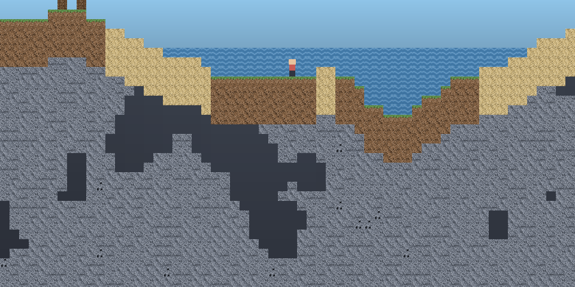

# New World

A side-view Minecraft-like — dig, build, explore — where the world generation,
physics, collision, mining, **and the HTML page itself** are written in Gene.
JavaScript is the host boundary and nothing else: canvas calls, the keyboard,
and the arrays Gene writes into.



Design and direction live in [`docs/design.md`](docs/design.md). Read Part I
first — it records what is being built and why. Part II (§0–§14) is a deferred
design for a much larger game and is **not** what this code is.

---

## Build and run

Requires **Node** (any recent version) and a built `bin/gene`.

```sh
cd <repo root>
nimble build                       # once, produces bin/gene

cd examples/new_world
./build.sh                         # assets + Gene -> JS + index.html
python3 -m http.server 8000        # any static server will do
```

Then open <http://localhost:8000/>. It must be served over HTTP — the page uses
ES modules, which `file://` will not load.

### Controls

| | |
|---|---|
| <kbd>A</kbd> <kbd>D</kbd> or arrows | move |
| <kbd>Space</kbd> / <kbd>W</kbd> | jump |
| left-click | mine |
| right-click | place |
| <kbd>1</kbd>–<kbd>9</kbd> or scroll | select block |
| <kbd>N</kbd> | new world (random seed) |
| <kbd>S</kbd> / <kbd>L</kbd> | save / load (`localStorage`) |

You can only place what you have mined. Coal is shallow, iron is deeper, gold
is deeper still.

### Checks

```sh
node tools/test.mjs                # 41 headless checks, no browser needed
node tools/screenshot.mjs [seed]   # composite a real viewport to a PNG
```

`tools/test.mjs` asserts the properties that matter rather than pixel output:
generation is deterministic for a seed, the surface never steps more than three
tiles (or the world is unwalkable however good it looks), ore rarity is ordered,
the player lands and comes to rest without drifting, a jump leaves the ground
and returns, and you cannot mine out of reach or seal yourself inside a wall.
For `src/shell.gene` it round-trips all 98,304 tiles through the save encoder,
because a wrong pair count would silently truncate somebody's world.

`tools/screenshot.mjs` renders through the same atlas and the same `src/world.gene`
the browser runs, so the world can be reviewed — and regressions caught — from a
terminal with no browser open. It is how the cave-backdrop and tile-repetition
problems were found.

---

## What is written in what

Gene reaches the browser by **two different routes**, and the difference matters:

| File | Runs | How |
|---|---|---|
| `src/world.gene` | in the browser | compiled to TypeScript/ESM by the **`web` profile** (`gene build --target web`) |
| `src/shell.gene` | in the browser | same route — camera, spawn, save encoding, hotbar |
| `src/page.gene` | at build time | on the **VM**, emitting `index.html` via `gene/html` + `gene/css` |
| `host.mjs` | in the browser | hand-written JS — the canvas boundary |
| `main.mjs` | in the browser | hand-written JS — DOM wiring and the rAF loop |

**JavaScript is only what the profile cannot reach.** `host.mjs` exists because
`js/fn` binds to a real JS module and the profile's DOM subset has no canvas;
`main.mjs` exists because something must own the keyboard, `localStorage`, and
the frame callback. Everything that was arithmetic or an array walk moved to
`src/shell.gene`, including the save encoding — so the format of a saved world
is decided in Gene, not in the shell that stores it.

`src/world.gene` holds **no state at all**. The web profile rejects top-level `var`,
so the world is a flat `(List F64)` that `main.mjs` owns and hands back on every
call. That is a real constraint, not a stylistic choice, and it shapes the whole
module.

`src/page.gene` is an ordinary VM module, so it *can* hold top-level `var` — which is
why the palette lives in named bindings there (`ink`, `accent`, `panel`) instead
of the same hex literal appearing in five rules. The two Gene files in this
project sit on opposite sides of that restriction, which makes them a decent
illustration of what the profile costs and where it does not apply.

### Everything hot is `F64`

[`transpile.md`](../../docs/proposals/transpile.md) §4.5 lowers Gene's `Int` to JavaScript **`bigint`** and `F64` to
`number`. BigInt arithmetic is roughly an order of magnitude slower, throws when
mixed with `number`, and cannot cross into a canvas call — so **every hot value
in `src/world.gene` is `F64`**, including loop counters and tile ids.

This is the single most important thing to know before editing the Gene. An
innocuous `(var i 0)` instead of `(var i 0.0)` puts a bigint on the hot path.

---

## Layout

This is a Gene package (`gene/new_world`), so all Gene source lives under
`src/` and `package.gene` is the manifest. Everything else is host-side
JavaScript, tooling, or build output.

```
package.gene          manifest: name, version, source_dir, main_module
src/world.gene        terrain, physics, collision, mining, render walk
src/shell.gene        camera, spawn, save encoding, hotbar
src/page.gene         the HTML page, as gene/html + gene/css node data
src/png.gene          a PNG encoder in Gene: CRC32, zlib, chunks
host.mjs              canvas externs — the boundary Gene calls out through
main.mjs              DOM wiring: keyboard, localStorage, the rAF loop
build.sh              assets -> Gene -> index.html
tools/test.mjs        41 headless checks
tools/gen_atlas.mjs   generates assets/tiles.png (and an 8x review blow-up)
tools/screenshot.mjs  composites a viewport to PNG, headless
spike/                the D5 performance spike — its own nested package
assets/               generated atlas + screenshots
dist/                 generated JS/TS — gitignored, never edit
index.html            generated — gitignored, never edit
```

Only `host.mjs` and `main.mjs` ship to the browser; everything under `tools/`
is build- and test-time.

**The `tools/` scripts are still JavaScript, but no longer because they have
to be.** Both original blockers are fixed:

- *No math library* — `gene/math` (design.md §7.8) now provides floor, sqrt,
  sin and the rest on both backends. `src/world.gene` dropped three of its
  seven `js/fn` externs; the four that remain are canvas calls, the genuine
  boundary.
- *No binary output* — `gene/bit`, `gene/binary`, and `fs/write_bytes`
  (§7.9) make a PNG writable in Gene. `src/png.gene` is the worked encoder:
  CRC32, Adler-32, zlib stream, chunk layout, no host help.

What remains is porting the two PNG tools' *drawing* code onto `src/png.gene`,
which is ordinary work rather than a missing capability.

Both are recorded as resolved in [`docs/design.md`](docs/design.md) §D5.2,
along with four Gene gotchas that writing the encoder turned up — `0x…` is a
Bytes literal rather than a hex Int, `//` is the remainder because `%` is
unquote, `while` shares one scope across iterations, and an empty `[]` needs a
type annotation.

`gene pkg show` reports the resolved manifest. `main_module` is `world`
because that is the substantive module — the one a dependent importing
`from "."` would want — even though `page` is the only module you `gene run`.

The spike carries its own `package.gene` (`gene/new_world_spike`) rather than
living in this package's `src/`. It is a measurement rig, not part of the game,
and a nested manifest is a real package boundary: discovery stops at the
nearest one, so `gene build` on a spike file selects the spike package from any
working directory.

### Assets are generated, not drawn

`tools/gen_atlas.mjs` writes `assets/tiles.png` from a named palette and a
seeded hash, using its own PNG encoder — no image editor and no binary blob
whose source nobody has. Re-tune the art by editing numbers and re-running.

Two things about the atlas are load-bearing:

- **Tile order is the ABI.** `src/world.gene`'s `t_*` functions index into it
  positionally. Inserting a tile mid-array silently renumbers everything after
  it — that bug shipped once and rendered stone as dirt.
- **Ids 12–14 are render-only variants.** The world stores stone as `t_stone`
  so mining and inventory stay simple; `render_variant` picks among three stone
  and two dirt stamps by position hash, so a cliff face is not one 16px stamp
  repeated three hundred times.

---

## The performance spike

`spike/` answers the question that gated this whole project: can a Gene program
compiled by the [`web` profile](../../docs/proposals/transpile.md) hold 60 fps?

```sh
cd spike
../../../bin/gene build --target web src/sprites.gene --out-dir dist
cp canvas.mjs dist/
node tools/bench.mjs [sprites] [frames]
```

**Result: 10,000 moving sprites cost 4.5% of a 60 fps frame**, with headroom
around 300,000. Zero bigint on the hot path. The harness checksums the
transpiled sim against a hand-written JS one and asserts they agree, so the
timings compare two programs that provably compute the same thing.

Gene is ~32× slower than hand-written JS on that loop, which is irrelevant at
this workload but is the number that decides where the ceiling is.
`docs/design.md` §D5.2 records what the spike found in the compiler, including a
miscompilation it turned up (`if`/`while` evaluated their condition twice) and
the field-access optimisation it motivated.

---

## Known gaps

No crafting, mobs, day/night, water flow, or multiplayer. Water is decorative —
it does not spread and you cannot swim in it, only fall through it. The world is
a fixed 512×192 and does not stream, so it all generates up front (14 ms) and
lives in memory.

The open question is the one in `docs/design.md` D2: **is this fun for twenty
minutes?** Nothing downstream is worth building until that has an answer, and
the only way to get one is to play it.
